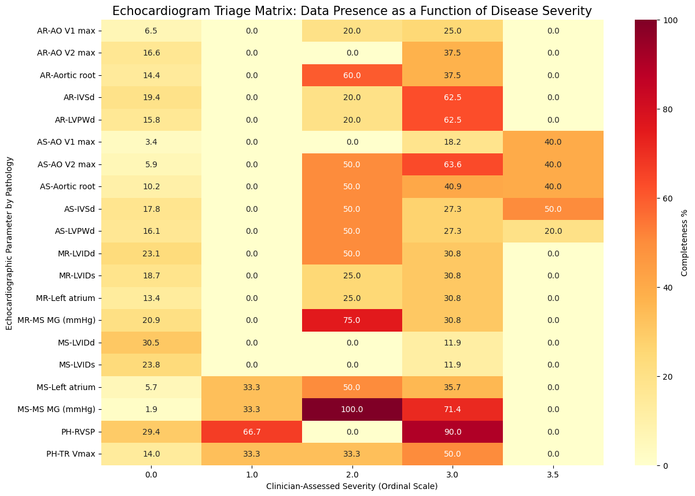
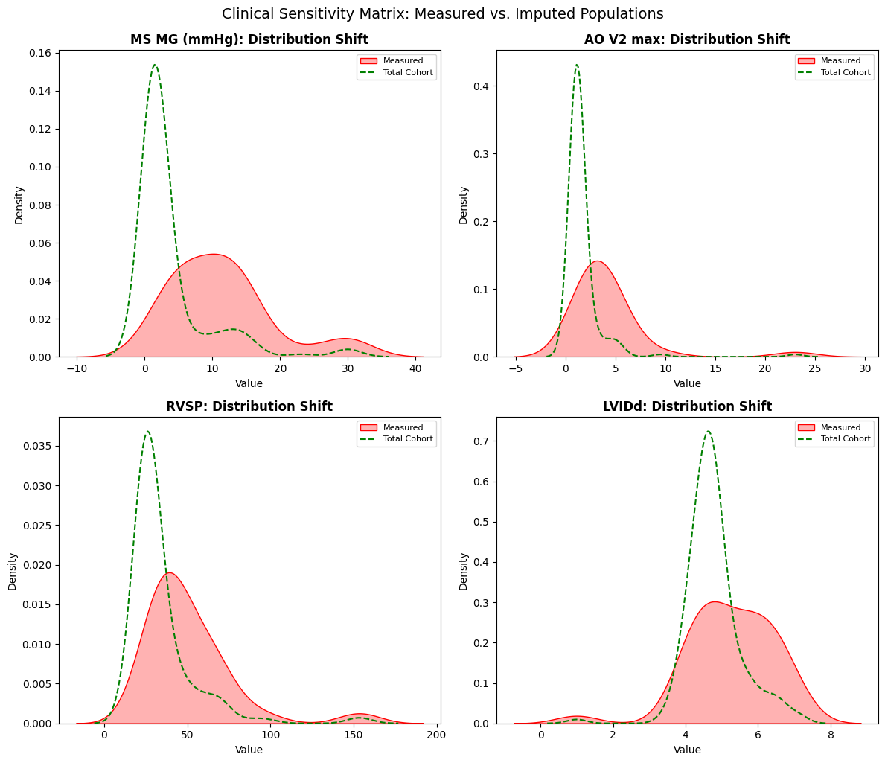
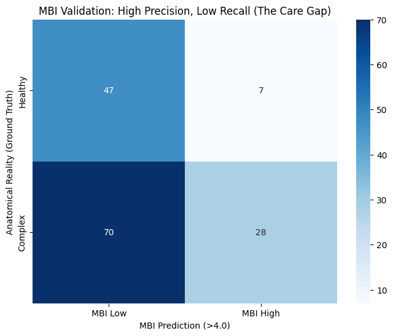

```python
# 1. IMPORTS
# ==========================================
# %matplotlib inline
import pandas as pd
import numpy as np
import plotly.express as px
import matplotlib.pyplot as plt
import statsmodels.api as sm
from statsmodels.stats.outliers_influence import variance_inflation_factor
from sklearn.metrics import roc_curve, auc, f1_score, precision_score, recall_score, confusion_matrix
import seaborn as sns
import re
import missingno as msno
import os
from IPython.display import display, Markdown, HTML
```


```python
# 2. DICTIONARIES AND LISTS
# ==========================================

# * These dictionaries and lists act as the "Medical Brain" of the script. 

# Separating logic from data allows non-coders to update clinical criteria easily.
class ClinicalConfig:
    """
    Centralized configuration object acting as the 'Medical Brain'.
    Encapsulates all clinical dictionaries, regex patterns, decision boundaries,
    and biological sanity checks.
    """
    def __init__(self):
        # 1. Variable Categorization
        self.categories = {
            "Demographics/Vitals": ['Age', 'Gender', 'Weight', 'Height', 'OSat', 'SBP R', 'DBP R', 'Heart rate'],
            "Medications": ['Medications'],
            "Clinical Context": ['Pre-procedure diagnosis', 'Post-procedure diagnosis', 'Year(s) since procedure'],
            "Structural Echo (Dimensions)": ['IVSd', 'LVIDd', 'LVPWd', 'LVIDs', 'Aortic root', 'Left atrium measure', 'Left atrium'],
            "Functional Echo (Hemodynamics)": ['LVEF (categorical)', 'RVSP', 'TR Vmax', 'AO V1 max', 'AO V2 max', 'MS MG (mmHg)']
        }

        # 2. Severity & Scoring Maps
        self.severity = {
            'critical': 3.5, 'severe to critical': 3.25, 'severe': 3.0,
            'moderate to severe': 2.5, 'moderate': 2.0, 'mild to moderate': 1.5,
            'mild': 1.0, 'none': 0.0
        }
        
        self.lvef_values = {
            'Hyperdynamic': 70.0, 'Normal': 60.0, 'Borderline': 50.0,
            'Moderately reduced': 40.0, 'Reduced': 25.0
        }
        
        self.echo_severity = {'trace': 15.0, 'mild': 20.0, 'none': 10.0}

        # 3. Pattern Recognition (Regex Targets)
        self.procedures = {
            "Surgical" : ['replacement', 'repair', 'patch', 'graft'],
            "Percutaneous" : ['percutaneous valvuloplasty', 'closure', 'stent', 'ablation']
        }

        self.pathology_patterns = {
            'MS': ['mitral stenosis'],
            'MR': ['mitral regurgitation'],
            'AS':  ['aortic stenosis'],
            'AR': ['aortic regurgitation'],
            'PH': ['pulmonary hypertension'],
            'Septal': ['Secundum atrial septal defect', 'Perimembranous ventricular septal defect', 
                       'Ventricular septal defect', 'Incomplete atrioventricular septal defect', 'Sinus venosus atrial septal defect']
        }
        
        self.la_patterns = {
            4.0: r'(?:huge|severely|severe)',
            2.5: r'(?:moderately|moderate)',
            1.0: r'(?:mild)'
        }

        # 4. Pharmacological Knowledge Base
        self.medication_classes = {
            'Beta_Blockers': ['Carvedilol', 'Bisoprolol', 'Propranolol', 'Metoprolol', 'Atenolol'],
            'RAAS_Inhibitors': ['Enalapril', 'Lisinopril', 'Losartan', 'Valsartan', 'Irbesartan', 'Captopril', 'Sacubitril-valsartan'],
            'Diuretics_Loop': ['Furosemide'],
            'Diuretics_Other': ['Spironolactone', 'Espironolactone', 'Hydrochlorothiazide'],
            'Anticoagulants_Antiplatelets': ['Warfarin', 'Warfarine', 'Rivaroxaban', 'Apixaban', 'Aspirin', 'Clopidogrel'],
            'Rate_Rhythm_Control': ['Digoxin', 'Amiodarone'],
            'Calcium_Channel_Blockers': ['Nifedipine', 'Amlodipine'],
            'SGLT2_Inhibitors': ['Dapaglifozin', 'Empaglifozin'],
            'Pulmonary_Vasodilators': ['Sildenafil', 'Tadalafil'],
            'Lipid_Lowering': ['Simvastatin', 'Rosuvastatin', 'Rosuvastatine', 'Gemfibrozil', 'Ciprofibrate'],
            'Anti_Ischemic_Other': ['Trimetazidine', 'Ranolazine'],
            'Metabolic_Endocrine': ['Levothyroxine', 'Metformin']
        }

        self.freq_day = {'qd': 1, 'bid': 2, 'tid': 3, 'qid': 4}

        self.max_doses = {
            'Sacubitril-valsartan': 400.0, 'Enalapril': 40.0, 'Lisinopril': 40.0, 'Losartan': 100.0,
            'Valsartan': 320.0, 'Irbesartan': 300.0, 'Captopril': 150.0, 'Carvedilol': 50.0,
            'Bisoprolol': 10.0, 'Metoprolol': 200.0, 'Atenolol': 100.0, 'Propranolol': 160.0,
            'Furosemide': 80.0, 'Spironolactone': 50.0, 'Hydrochlorothiazide': 25.0,
            'Sildenafil': 60.0, 'Tadalafil': 40.0, 'Digoxin': 0.25, 'Amiodarone': 400.0,
            'Warfarin': 5.0, 'Rivaroxaban': 20.0, 'Apixaban': 10.0, 'Aspirin': 100.0,
            'Clopidogrel': 75.0, 'Nifedipine': 90.0, 'Amlodipine': 10.0, 'Trimetazidine': 70.0,
            'Ranolazine': 1000.0, 'Dapaglifozin': 10.0, 'Empaglifozin': 25.0, 'Metformin': 2000.0,
            'Levothyroxine': 0.2, 'Simvastatin': 40.0, 'Rosuvastatin': 40.0, 'Gemfibrozil': 1200.0,
            'Ciprofibrate': 100.0
        }

        self.class_weights = {
            'Diuretics_Loop': 3.0, 'Pulmonary_Vasodilators': 3.0, 'RAAS_Inhibitors': 2.0,
            'SGLT2_Inhibitors': 2.0, 'Diuretics_Other': 2.0, 'Beta_Blockers': 2.0,
            'Rate_Rhythm_Control': 1.0, 'Anticoagulants_Antiplatelets': 1.0,
            'Calcium_Channel_Blockers': 1.0, 'Anti_Ischemic_Other': 1.0,
            'Lipid_Lowering': 0.5, 'Metabolic_Endocrine': 0.5
        }

        # 5. Analysis Groupings
        self.echo_groups = {
            "Mitral": {"Parameters": ['MS MG (mmHg)', 'Left atrium', 'LVIDd', 'LVIDs'], "Severity_Cols": ['Sev_MS', 'Sev_MR']},
            "Aortic": {"Parameters": ['AO V1 max', 'AO V2 max', 'Aortic root', 'IVSd', 'LVPWd'], "Severity_Cols": ['Sev_AS', 'Sev_AR']},
            "PH": {"Parameters": ['RVSP', 'TR Vmax'], "Severity_Cols": ['Sev_PH']}
        }

        # 6. Statistical Baselines & Sanity Checks
        self.normal_variables = {
            'MS MG (mmHg)': (1.5, 0.5),
            'AO V2 max': (1.1, 0.2),
            'RVSP': (25.0, 4.0),
            'LVIDd': (4.6, 0.4)
        }

        self.echo_vars = ['MS MG (mmHg)', 'AO V2 max', 'RVSP', 'Left atrium', 'LVIDd', 'LVEF (categorical)']
        self.echo_missing = ['MS MG (mmHg)', 'AO V2 max', 'RVSP', 'LVIDd']
        self.clinical_markers = ['Mixed_Mitral', 'Mixed_Aortic', 'Multi_Valve', 'PH_Significant', 'AFib_Present']
        self.lesions_anatomic = ['Sev_MS','Sev_MR','Sev_AS','Sev_AR', 'Sev_PH']
        self.regression_echo = ['RVSP_Imputed', 'LVIDd_Imputed', 'AO V2 max_Imputed', 'MS MG (mmHg)_Imputed', 'LA_Size_Score', 'LVEF_Score']
        self.regression_demographics = ['Age', 'Weight', 'Gender_Male', 'SBP R', 'DBP R', 'Heart rate']
        self.regression_lesions = ['Mitral_Mixed_Score', 'Aortic_Mixed_Score', 'Multi_Valve', 'Sev_PH', 'AFib_Present']
```


```python
# 3. CLASSES AND FUNCTIONS
# ==========================================

class Auditor:
    """
    Acts as the 'Quality Control' station. 
    Before any analysis, we must identify 'Missing Not At Random' (MNAR) patterns 
    often caused by limited time during medical brigades.
    """
    def __init__(self, dataframe, config):
        self.df = dataframe
        self.config = config

    def report(self):
        """
        Generates a 3-part audit: 
        1. Technical metadata.
        2. Clinical category missingness (shows which exam parts were skipped).
        3. Lexicon extraction (identifies unique raw strings for manual review).
        """
        audit = []
        for col in self.df.columns:
            audit.append({
                'Column': col,
                'Inferred dtype': self.df[col].dtype,
                'Null Count': self.df[col].isnull().sum(),
                'Sample Values': self.df[col].dropna().unique()[:3].tolist()
            })
            
        # Clinical NLP: Extracting the vocabulary used by the doctors in the field.
        all_diagnoses = pd.concat([
            self.df['Pre-procedure diagnosis'],
            self.df['Post-procedure diagnosis']
        ]).str.split(',').explode().str.strip().dropna().unique()

        all_medications = self.df['Medications'].str.split('|').explode().str.strip().dropna()
        medications_unique = all_medications.str.split(' ').str[0].str.capitalize().unique()

        # Reporting Missingness by Clinical Grouping
        print(f"Current columns by category:\n{'-'*40}")
        for category, cols in self.config.categories.items():
            print(f"{category}: {cols}")

        group_report = {}
        missing_from_categories = []

        for group, cols in self.config.categories.items():
            # Checks if our expected columns actually exist in the CSV header
            not_found = [c for c in cols if c not in self.df.columns]
            found = [c for c in cols if c in self.df.columns]

            # This logs missing columns
            if not_found:
                missing_from_categories.extend(not_found)
                print(f"\nWarning in {group}: Missing from CSV: {not_found}")
                
            # This calculates mean missingness for found columns
            if found:
                avg_miss = self.df[found].isnull().mean().mean() * 100
                group_report[group] = f"{avg_miss:.2f}% missing"
            else:
                group_report[group] = "N/A - No columns found"

        print("\nMean missingness by category (%):")
        print(f"{'-'*40}")
        print(pd.Series(group_report))

        # Persistence: Ensuring we have an 'Audit Trail' for clinical accountability.
        audit_df = pd.DataFrame(audit)
        pd.DataFrame({'All_diagnoses_list': all_diagnoses}).to_csv('all_diagnoses_report.csv', index=False)
        pd.DataFrame({'All_medications_list': medications_unique}).to_csv('all_medications_report.csv', index=False)
        audit_df.to_csv('dataset_audit_report.csv', index=False)

        print('\nAudit report generated:\n' + f"{'-'*40}")
        print('Technical metadata file generated: dataset_audit_report.csv. ')
        print('All unique diagnoses list generated: all_diagnoses_report.csv.')
        print('All medications list generated: all_medications_report.csv.')
        return audit_df
        
    def echo_missingness(self):
        """
        Forensic Data Audit: 
        Calculates completion rates (%) per column, stratified by 
        disease severity and clinical grouping.
        """
        results = []
        
        # Access the injected echo_groups_dict
        for unit, groups in self.config.echo_groups.items():
            for sev_col in groups["Severity_Cols"]: 
                if sev_col not in self.df.columns:
                    continue
                
                for sev_level in sorted(self.df[sev_col].unique()):
                    subset = self.df[self.df[sev_col] == sev_level]
                    if subset.empty: continue
                    
                    for param in groups["Parameters"]:
                        if param in self.df.columns:
                            completeness = (1 - subset[param].isnull().mean()) * 100
                            results.append({
                                'Pathology': sev_col.replace('Sev_', ''),
                                'Severity': sev_level,
                                'Parameter': param,
                                'Completeness_Pct': round(completeness, 2),
                                'N': len(subset)
                            })
                            
        missings_stratified = pd.DataFrame(results)

        # Pivot for 'Missingness Matrix' visualization. 
        pivot_audit = missings_stratified.pivot_table(
            index=['Pathology', 'Parameter'], 
            columns='Severity', 
            values='Completeness_Pct' 
        )
        
        print("Missingness pivot table" + "\n" + "-"*40)
        print("Rows: Pathology-Parameter pairs")
        print("Columns: Clinical Severity (0.0 to 3.5)\n")
        return pivot_audit

class Extractor:
    """
    The 'Refinery'. Transforms messy clinical strings into 'Tidy' structured data.
    Key philosophy: Do not oversimplify. Preserve mixed valvular disease signatures.
    """
    def __init__(self, dataframe, config):
        self.df = dataframe
        self.config = config
        self.severities = list(self.config.severity.keys())
        # Regex to strip intensity
        self.strip_pattern = r'\b(' + '|'.join(self.severities) + r')\b'

    def _get_expanded_diag(self, col_name):
        """Handles comma-separated lists in a single cell."""
        return self.df[col_name].str.lower().str.split(',').explode().str.strip().dropna()

    def _clean_column(self, col):
        """Standardizes anatomy by removing qualitative noise and surgical terms."""
        s = self._get_expanded_diag(col)
        cleaned = s.str.replace(self.strip_pattern, '', regex=True) \
            .str.replace(r'\s+', ' ', regex=True) \
            .str.strip() \
            .str.capitalize()
        
        # Group back to original rows to maintain 1:1 patient mapping.
        return cleaned.groupby(level=0).agg(lambda x: ', '.join(x.unique()) if x.any() else np.nan)

    def _parse_meds(self, med_string, drug_list):
        """
        Pharmacological Parser:
        Identifies drug, extracts base dose, and applies frequency multipliers (e.g., bid=x2).
        """
        if pd.isna(med_string) or med_string == "":
            return "None", 0.0
            
        individual_meds = [m.strip().lower() for m in str(med_string).split('|')]
        
        for med_entry in individual_meds:
            matched_drug = next((d for d in drug_list if d.lower() in med_entry), None)
            
            if matched_drug:
                # Extract dose number (handles decimals like 6.25)
                dose_match = re.search(r'(\d+\.?\d*)', med_entry)
                base_dose = float(dose_match.group(1)) if dose_match else 0.0
                
                # Determine frequency multiplier
                multiplier = 1 
                for freq, value in self.config.freq_day.items():
                    if f" {freq}" in f" {med_entry}":
                        multiplier = value
                        break
                
                return matched_drug.capitalize(), base_dose * multiplier
                
        return "None", 0.0

    def transform(self):
        """
        Main orchestration of the feature engineering process.
        Creates a multidimensional lesion matrix (e.g., separate columns for MS and MR severity).
        """
        # 1. Anatomy Extraction (The 'What' is involved)
        self.df['Anatomy_Pre'] = self._clean_column('Pre-procedure diagnosis')
        self.df['Anatomy_Post'] = self._clean_column('Post-procedure diagnosis')

        # 2. Multidimensional Severity Mapping (The 'How Bad' is it?)
        def severity_score(text_series, path_regex):
            entries = str(text_series).lower().split(',')
            for entry in entries:
                if re.search(path_regex, entry):
                    for label, score in self.config.severity.items():
                        if label in entry: return score
            return 0.0

        for lesion, keywords in self.config.pathology_patterns.items():
            col_name = f'Sev_{lesion}'
            pattern = '|'.join(keywords) 
            self.df[col_name] = self.df['Pre-procedure diagnosis'].fillna('').apply(
                lambda x: severity_score(x, pattern)
            )

        # 3. Procedural Classification (The 'Approach')
        self.df['Approach'] = 'Native'
        post_exploded = self._get_expanded_diag('Post-procedure diagnosis')
        
        for group, keywords in self.config.procedures.items():
            pattern = '|'.join(keywords)
            idx = post_exploded[post_exploded.str.contains(pattern, regex=True, na=False)].index
            self.df.loc[idx, 'Approach'] = group

        # 4. Pharmacological Quantification
        for category, drugs in self.config.medication_classes.items():
            name_col = f"{category}_name"
            dose_col = f"{category}_tdd"
            
            # Use the internal _parse_meds method with injected freq_day
            self.df[[name_col, dose_col]] = self.df['Medications'].apply(
                lambda x: pd.Series(self._parse_meds(x, drugs))
            )

        # 5. Left Atrium Size Scoring
        self.df['LA_Size_Score'] = 0.0
        self.df['LA_Thrombus'] = 0.0
        self.df['LA_Mass'] = 0.0
        
        for score, pattern in self.config.la_patterns.items():
            # Only update if current score is lower (preserves the highest severity found)
            mask = self.df['Left atrium'].str.contains(pattern, case=False, na=False, regex=True)
            self.df.loc[mask, 'LA_Size_Score'] = np.maximum(self.df.loc[mask, 'LA_Size_Score'], score)

        # 6. Pathological Findings (Flags)
        # Thrombus/Clot/Smoke (Spontaneous Echo Contrast)
        self.df['LA_Thrombus'] = self.df['Left atrium'].str.contains(r'(?:thrombus)', case=False, na=False, regex=True).astype(int)

        # Masses (Myxomas)
        self.df['LA_Mass'] = self.df['Left atrium'].str.contains(r'(?:myxoma)', case=False, na=False, regex=True).astype(int)
        
        # 6. Normalization of echo 
        for col in self.config.echo_missing:
            if col in self.df.columns:
                # 1. Convert to string and handle whitespace
                # We use .str.strip() to catch hidden spaces like " 25 "
                s = self.df[col].astype(str).str.lower().str.strip()
                
                # 2. Replace qualitative terms (trace, mild) with your dictionary
                s = s.replace(self.config.echo_severity)
                
                # 3. Final Coercion
                # If a value was "45mm", pd.to_numeric turns it to NaN. 
                # If your data has "mm" in it, we must strip it first.
                s = s.str.extract(r'(\d+\.?\d*)')[0] # Remove all non-numeric chars
                
                self.df[col] = pd.to_numeric(s, errors='coerce').round(1)

        # 7. LVEF Numerical Mapping
        # We use .str.title() to match 'Normal', 'Reduced', etc. 
        if 'LVEF (categorical)' in self.df.columns:
            self.df['LVEF_Score'] = self.df['LVEF (categorical)'].str.strip().str.title().map(self.config.lvef_values)
            
            # Clinical Safety Check: If "Moderately reduced" has a lowercase 'r', 
            # title() makes it "Moderately Reduced". We adjust the map or use a lambda.
            # Best practice: 
            self.df['LVEF_Score'] = self.df['LVEF (categorical)'].str.strip().map(
                {k: v for k, v in self.config.lvef_values.items()} # Direct map
            ).fillna(self.df['LVEF (categorical)'].str.strip().str.capitalize().map(self.config.lvef_values))
            
        return self.df

    def baseline(self):
        """
        Generates a Table of demographics and vitals.
        Calculates Mean ± SD for continuous and N (%) for categorical.
        """
        stats = []
        vitals = self.config.categories.get("Demographics/Vitals", [])

        print("Baseline characteristics\n" + '-'*40)

        for col in vitals:
            if col in self.df.columns:
                # Handles numeric columns (Age, Weight, Vitals)
                if pd.api.types.is_numeric_dtype(self.df[col]):
                    mean_val = self.df[col].mean()
                    std_val = self.df[col].std()
                    null_pct = self.df[col].isnull().mean() * 100
                    stats.append({
                        "Characteristic": col,
                        "Value": f"{mean_val:.1f} ± {std_val:.1f}",
                        "Completeness": f"{100 - null_pct:.1f}%",
                        "Type": "Continuous"
                    })
                # Handles categorical (Gender)
                else:
                    top_val = self.df[col].mode()[0] if not self.df[col].mode().empty else "N/A"
                    count = (self.df[col] == top_val).sum()
                    pct = (count / len(self.df)) * 100
                    stats.append({
                        "Characteristic": col,
                        "Value": f"Mode: {top_val} ({pct:.1f}%)",
                        "Completeness": f"{100 - (self.df[col].isnull().mean()*100):.1f}%",
                        "Type": "Categorical"
                    })
                
        return display(pd.DataFrame(stats).set_index("Characteristic"))

    def diagnoses_prevalence(self):
        """Standardizes and counts the global disease burden in the cohort."""
        # Note: transform() must be called before this method to generate Anatomy_Pre
        if 'Anatomy_Pre' not in self.df.columns:
             raise ValueError("Please run transform() first.")
        
        pre = self.df['Anatomy_Pre'].str.split(', ').explode()
        post = self.df['Anatomy_Post'].str.split(', ').explode()
        
        # Combines them and remove 'nan' strings or empty entries
        combined = pd.concat([pre, post])
        combined = combined[~combined.isin(['nan', '', 'None', 'None, None'])]
        
        # Calculate Counts
        counts = combined.value_counts()
        
        # Creates the final Table
        prevalence_df = pd.DataFrame({
            'Patient Count': counts,
            'Prevalence (%)': (counts / len(self.df) * 100).round(1)
        })
        
        prevalence_df.index.name = 'Diagnosis'

        return prevalence_df

    def disease_profiler(self):
        '''
        Identifies complex interactions: Mixed Lesions, Shunts, and Rhythm Confounders.
        '''
        if 'Sev_MS' not in self.df.columns:
             raise ValueError("Please run transform() with required dictionaries before running disease_profiler()")

        # 1. Mixed Valvular Disease (Same-valve: Stenosis + Regurgitation)
        self.df['Mixed_Mitral'] = ((self.df['Sev_MS'] > 0) & (self.df['Sev_MR'] > 0)).astype(int)
        self.df['Mixed_Aortic'] = ((self.df['Sev_AS'] > 0) & (self.df['Sev_AR'] > 0)).astype(int)

        # 2. Multi-Valvular Disease (Cross-valve: Mitral unit AND Aortic unit)
        mitral_any = (self.df['Sev_MS'] > 0) | (self.df['Sev_MR'] > 0)
        aortic_any = (self.df['Sev_AS'] > 0) | (self.df['Sev_AR'] > 0)
        self.df['Multi_Valve'] = (mitral_any & aortic_any).astype(int)

        # 3. Pulmonary Hypertension (Explicit Flag)
        # Defined here as any PH mention (Severity > 0)
        self.df['PH_Present'] = (self.df['Sev_PH'] > 0).astype(int)
        self.df['PH_Significant'] = (self.df['Sev_PH'] >= 2.0).astype(int)

        # 4. Shunts (Septal Defects)
        shunt_pattern = '|'.join(self.config.pathology_patterns['Septal'])
        self.df['Has_Shunt'] = self.df['Pre-procedure diagnosis'].str.contains(
            shunt_pattern, case=False, na=False, regex=True
        ).astype(int)

        # 5. Rhythm Confounders (AFib)
        self.df['AFib_Present'] = self.df['Pre-procedure diagnosis'].str.contains(
            'Atrial fibrillation', case=False, na=False, regex=True
        ).astype(int)

        # 6. Global Complexity Score 
        # Summing binary flags. Note: For PH, we only count it as a 'Complexity Point' 
        # if it is Moderate or worse (>= 2.0), as Mild PH is very common.
        self.df['Complexity_Score'] = (
            self.df['Mixed_Mitral'] + 
            self.df['Mixed_Aortic'] + 
            self.df['Multi_Valve'] + 
            self.df['AFib_Present'] + 
            self.df['PH_Significant']
        )

        # Accurate Prevalence Reporting
        self.complexity_stats = {
            "Total Patients": len(self.df),
            "Mixed Mitral": self.df['Mixed_Mitral'].sum(),
            "Mixed Aortic": self.df['Mixed_Aortic'].sum(),
            "Multi-Valvular": self.df['Multi_Valve'].sum(),
            "Significant PH (>=2.0)": self.df['PH_Significant'].sum(),
            "AFib Present": self.df['AFib_Present'].sum()
        }
        
        return self.df
        
    def complexity_report(self):
        """
        Returns the stats as a clean Pandas Series for easy display or export.
        """
        print("Complex cases\n" + '-'*40)
        print("Cases that have either mixed, multiple valvular disease and/or other conditions\n")
        if hasattr(self, 'complexity_stats'):
            return pd.Series(self.complexity_stats, name="Prevalence")
        else:
            return "Profiler has not been run yet."

class Calculator:
    def __init__(self, dataframe, config):
        self.df = dataframe
        self.config = config

    def medication_index(self):
        """
        Computes the Medication Burden Index (MBI).
        MBI = Sum(Class_Weight * (Actual_TDD / Max_TDD))
        """
        self.df['MBI'] = 0.0
        
        for category, weight in self.config.class_weights.items():
            name_col = f"{category}_name"
            dose_col = f"{category}_tdd"
            
            if name_col in self.df.columns:
                # Vectorized calculation for each class
                # Uses 1.0 as a fallback intensity for fixed-dose meds (like Aspirin)
                intensity = self.df.apply(
                    lambda x: x[dose_col] / self.config.max_doses.get(x[name_col], x[dose_col]) 
                    if x[dose_col] > 0 else 0, axis=1
                )
                
                # Clips intensity at 1.0 (to avoid outliers from rare supra-therapeutic doses)
                self.df['MBI'] += (intensity.clip(upper=1.0) * weight)
                
        return self.df
    
class Visualizer:
    def __init__(self, dataframe, config):
        self.df = dataframe
        self.config = config
        
    def patient_nullity(self):
        # Forensic Audit: Visualizing data deserts to evaluate mission-specific documentation constraints.
        available_keys = [v for v in self.config.echo_vars if v in self.df.columns]

        # Uses a temporary theme context to ensure the 'Matrix' is readable

        # We use a context manager to temporarily ignore the 'whitegrid' theme
        # which can interfere with missingno's rendering.
        print("Missingness visualizations\n" + '-' *40)
        with plt.style.context('default'):
            plt.figure(figsize=(10, 6))
            msno.matrix(self.df[available_keys], 
                        sparkline=False, 
                        color=(0.1, 0.3, 0.5), # Your dark blue
                        fontsize=10)
            plt.title("Nullity Matrix: Data Presence (Dark) vs Missing (White)", fontsize=14)
            plt.show()

        print("Note: Correlation of Missingness (1.0 = Always missing together):")
        # Heatmap usually works better with a standard context too
        with plt.style.context('default'):
            msno.heatmap(self.df[available_keys], cmap='GnBu')
            plt.title("Missingness Correlation")
            plt.show()

    def echo_matrix(self, table):
        # Triage Efficiency: Quantifying which physiological parameters are deemed 'Critical Path' by the field team.
        print("\nEchocardiogram Triage Matrix notes:" + "\n" + "-"*40)
        print("A 'Hot' cell (High %) indicates a parameter the cardiologist deemed mandatory for triage.")
        
        plt.figure(figsize=(14, 10))
        # Using a sequential colormap (YlOrRd) to highlight 'Data Deserts' vs 'Data Oases'.
        sns.heatmap(table.fillna(0), annot=True, fmt=".1f", cmap="YlOrRd", cbar_kws={'label': 'Completeness %'})
        plt.title("Echocardiogram Triage Matrix: Data Presence as a Function of Disease Severity", fontsize=15)
        plt.xlabel("Clinician-Assessed Severity (Ordinal Scale)")
        plt.ylabel("Echocardiographic Parameter by Pathology")
        plt.show()

    def complexity_frequency(self):
        """
        Visualizes the phenotypic burden of the cohort.
        """
        plt.figure(figsize=(10, 6))
        
        # Count frequencies of each score
        counts = self.df['Complexity_Score'].value_counts().sort_index()
        
        # Create a bar plot
        sns.barplot(x=counts.index, y=counts.values, hue=counts.index, palette="YlOrRd", legend=False)
        
        plt.title("Distribution of Patient Complexity Scores", fontsize=15)
        plt.xlabel("Complexity Score (0 = Simple, 5+ = Highly Complex)", fontsize=12)
        plt.ylabel("Number of Patients", fontsize=12)
        
        # Add labels on top of bars
        for i, val in enumerate(counts.values):
            plt.text(i, val + 0.5, str(val), ha='center', fontsize=11, fontweight='bold')
            
        plt.grid(axis='y', linestyle='--', alpha=0.7)
        plt.show()

    def complexity_markers(self):
        """
        Shows the prevalence of specific complexity markers.
        """
        prevalence = self.df[self.config.clinical_markers].sum().sort_values(ascending=False)
        
        plt.figure(figsize=(10, 6))
        prevalence.plot(kind='barh', color='#e34a33')
        plt.title("Prevalence of Complexity Markers", fontsize=15)
        plt.xlabel("Patient Count", fontsize=12)
        plt.gca().invert_yaxis()
        plt.show()

    def complexity_heatmap(self):
        # Interaction Analysis: Identifying 'Syndromic Clusters' where multiple pathologies co-exist, increasing clinical risk.
        
        # Calculate the correlation (co-occurrence)
        # We use 'pearson' here to see how strongly one predicts the other
        interaction_matrix = self.df[self.config.clinical_markers].corr()

        plt.figure(figsize=(10, 8))
        sns.heatmap(interaction_matrix, annot=True, cmap='RdBu_r', center=0, fmt=".2f")
        
        plt.title("Clinical Interaction Heatmap: Pathological Clustering", fontsize=15)
        plt.tight_layout()
        plt.show()

    def sensitivity_grid(self):
        """
        Generates a 2x2 matrix of KDE plots comparing Measured vs. Imputed data.
        """
        # Identify variables to plot
        plot_vars = [v for v in self.config.echo_missing if v in self.df.columns]
        
        # Create the 2x2 figure (4 subplots)
        fig, axes = plt.subplots(2, 2, figsize=(12, 10))
        axes = axes.flatten()

        for i, var in enumerate(plot_vars):
            if i >= 4: break # Limit to 4x4 grid
            
            ax = axes[i]
            imp_col = f"{var}_Imputed"
            
            if imp_col in self.df.columns:
                # Measured Data (The "Sick" Triage Group)
                sns.kdeplot(self.df[var].dropna(), ax=ax, color='red', fill=True, 
                            label='Measured', alpha=0.3)
                
                # Total Cohort (The "Natural Normal" Imputation)
                sns.kdeplot(self.df[imp_col], ax=ax, color='green', linestyle='--', 
                            label='Total Cohort')
                
                ax.set_title(f"{var}: Distribution Shift", fontsize=12, fontweight='bold')
                ax.set_xlabel("Value")
                ax.set_ylabel("Density")
                ax.legend(fontsize=8)
            else:
                ax.text(0.5, 0.5, f"No Data for {var}", ha='center')

        # Clean up empty subplots if fewer than 4 variables exist
        for j in range(len(plot_vars), 4):
            fig.delaxes(axes[j])

        plt.tight_layout()
        plt.suptitle("Clinical Sensitivity Matrix: Measured vs. Imputed Populations", 
                    fontsize=14, y=1.02)
        plt.show()

    def validate_vis(self, matrix, x_label, y_label, title):
        plt.figure(figsize=(8,6))
        sns.heatmap(matrix, annot=True, fmt='d', cmap='Blues', 
                    xticklabels=['MBI Low', 'MBI High'], 
                    yticklabels=['Healthy', 'Complex'])
        plt.xlabel(x_label)
        plt.ylabel(y_label)
        plt.title(title)
        print("\nConfusion matrix visualization\n" + '-'*40)
        plt.show()

    def predictor_decomposition(self):
        """
        Generates an interactive horizontal stacked bar chart.
        Shows granular drug dominance and internal percentages.
        """
        composition_data = []

        # 1. Calculation Logic (Parsed from Category/TDD structure)
        for category, weight in self.config.class_weights.items():
            name_col = f"{category}_name"
            dose_col = f"{category}_tdd"
            
            if name_col in self.df.columns and dose_col in self.df.columns:
                valid_rows = self.df[self.df[name_col] != "None"]
                max_doses = valid_rows[name_col].map(self.config.max_doses).fillna(0)
                intensities = (valid_rows[dose_col] / max_doses).clip(upper=1.0)
                burdens = intensities * weight
                
                drug_sums = burdens.groupby(valid_rows[name_col]).sum()
                category_total = drug_sums.sum()

                for drug, burden in drug_sums.items():
                    composition_data.append({
                        'Medication_Class': category,
                        'Specific_Drug': drug,
                        'Burden_Score': burden,
                        'Clinical_Weight': weight,
                        'Percentage_of_Class': (burden / category_total * 100) if category_total > 0 else 0
                    })

        df_comp = pd.DataFrame(composition_data)
        df_comp = df_comp.sort_values(['Clinical_Weight', 'Medication_Class'], ascending=[False, True])

        # 2. Interactive Figure (Colored by Weight with Legend)
        fig = px.bar(
            df_comp, 
            y="Medication_Class", 
            x="Burden_Score", 
            color="Clinical_Weight",  # This creates the Weight-based Legend
            color_continuous_scale=px.colors.diverging.RdBu_r,
            orientation='h',
            title=f"Global MBI Architecture by Clinical Priority (n={len(self.df)})",
            hover_data={
                'Specific_Drug': True,
                'Percentage_of_Class': ':.1f',
                'Burden_Score': ':.2f',
                'Clinical_Weight': True,
                'Medication_Class': False 
            },
            labels={
                'Burden_Score': 'Weighted Burden Contribution',
                'Clinical_Weight': 'Medical Weight Tier'
            },
            template="plotly_white"
        )

        fig.update_layout(
            barmode='stack', 
            height=800,
            yaxis={'categoryorder': 'total ascending'},
            )
        
        print("Global MBI burden, stratified by medication classes\n" + '-'*40)
        display(Markdown("Bars represent **aggregate population burden**    \nColor indicate **clinical priority** weights"))
        fig.show()

        # 3. Automated Key Findings Summary
        self._print_mbi_summary(df_comp)
        
        return df_comp
    
    def _print_mbi_summary(self, df_comp):
        total_mbi = df_comp['Burden_Score'].sum()
    
        # Get Top 3 Classes by total burden
        class_totals = df_comp.groupby('Medication_Class')['Burden_Score'].sum().sort_values(ascending=False).head(3)
        
        print(f"\n{'='*60}\nKEY MBI FINDINGS SUMMARY: PHARMACOLOGICAL DRIVERS\n{'='*60}")
        print(f"Total Cohort Burden Score: {total_mbi:.1f}")
        
        print(f"\nTOP 3 CLINICAL DRIVERS:")
        for i, (category, total) in enumerate(class_totals.items(), 1):
            # Identify the most used medication within this specific class
            class_meds = df_comp[df_comp['Medication_Class'] == category]
            dominant_med = class_meds.loc[class_meds['Burden_Score'].idxmax()]
            
            # Calculate class contribution to global MBI
            global_pct = (total / total_mbi) * 100
            
            print(f"{i}. {category:25} | Burden: {total:5.1f} ({global_pct:4.1f}%)")
            print(f"   - Dominant Medication: {dominant_med['Specific_Drug']} "
                f"({dominant_med['Percentage_of_Class']:.1f}% of class)")
        
        # Gap analysis
        gap_classes = df_comp[df_comp['Burden_Score'] == 0]['Medication_Class'].unique()
        if len(gap_classes) > 0:
            print(f"\nIdentified Care Gaps: No utilization in {len(gap_classes)} high-weight categories.")
        print(f"{'='*60}\n")

    # def hemodynamic_failure(self):
    #     # Plotting RVSP vs MBI to show the 'Refractory Slope'
    #     fig = px.scatter(
    #         self.df[self.df['Approach'] == 'Native'], 
    #         x='MBI', 
    #         y='RVSP_Imputed',
    #         trendline="ols",
    #         marginal_y="violin", 
    #         marginal_x="box",
    #         title="Hemodynamic Failure: RVSP Escaping Medical Control",
    #         labels={'MBI': 'Medication Burden Index', 'RVSP_Imputed': 'Pulmonary Pressure (mmHg)'},
    #         template='plotly_white',
    #         color_discrete_sequence=['#d62728'] # Surgical Red
    #     )
        
    #     # Add a 'High Risk' Threshold line at RVSP = 50
    #     fig.add_hline(y=50, line_dash="dot", line_color="orange", annotation_text="Pulmonary HTN Threshold")
        
    #     fig.show()

class Statistics:
    def __init__(self, dataframe, config):
        self.df = dataframe
        self.config = config

    def impute_normal(self, target_col):
        """
        Implements 'Brigade Logic': Missing values are assumed normal, 
        but filled with Gaussian noise to preserve dataset variance.
        """
        temp_df = self.df.copy()
        temp_df[target_col] = pd.to_numeric(temp_df[target_col], errors='coerce')
        
        mask = temp_df[target_col].isnull()
        num_missing = mask.sum()
        
        mean, std = self.config.normal_variables.get(target_col, (0, 1))
        simulated_normals = np.random.normal(mean, std, size=num_missing).round(1)
        temp_df.loc[mask, target_col] = np.clip(simulated_normals, 0, 150)
                
        return temp_df[target_col]

    def apply_imputation(self):
        for var in self.config.echo_missing:
            if var in self.df.columns:
                # Use 'Natural Normal' to respect Brigade Logic while keeping variance
                self.df[f'{var}_Imputed'] = self.impute_normal(var)
                print(f"Handled {var} using 'Natural Normal' distribution.")

        return self.df
    
    def sensitivity_report(self):
        """
        Creates a succinct summary comparing Measured (Sick) vs. Imputed (Cohort) data.
        """
        summary_data = []
        
        # We only look at variables that were actually imputed
        for var in self.config.echo_missing:
            imp_col = f"{var}_Imputed"
            
            if var in self.df.columns and imp_col in self.df.columns:
                # Data for patients who actually had measurements (The "Red" group)
                measured = self.df[var].dropna()
                
                # Data for the whole cohort after imputation (The "Green" group)
                cohort = self.df[imp_col]
                
                if len(measured) > 0:
                    m_mean = measured.mean()
                    c_mean = cohort.mean()
                    delta = c_mean - m_mean
                    
                    # Clinical Interpretation Logic
                    # If the shift is more than 10% of the measured value, we flag it.
                    bias_status = "Significant Shift" if abs(delta) > (m_mean * 0.1) else "Stable"
                    
                    summary_data.append({
                        "Clinical Parameter": var,
                        "Measured Mean": round(m_mean, 1),
                        "Cohort Mean": round(c_mean, 1),
                        "Delta (Shift)": round(delta, 1),
                        "Triage Bias": bias_status,
                        "Sample Size (n)": len(measured)
                        })

        # Create DataFrame
        report_df = pd.DataFrame(summary_data).set_index("Clinical Parameter")
        return report_df
    
    def roc(self, predictor_col='MBI'):
        """
        Generalized ROC analysis.
        Tests how well a chosen column (predictor_col) predicts Clinical Complexity.
        """
        # Ensures the column exists to avoid a KeyError
        if predictor_col not in self.df.columns:
            print(f"Error: {predictor_col} not found in dataframe.")
            return

        # Redefining Target: Capturing 'Rising Risk' (Score 1 or higher)
        self.df['Is_Complex_Case'] = (self.df['Complexity_Score'] >= 1).astype(int)

        # Recalculate ROC Metrics
        # We drop NAs for the specific predictor to prevent the roc_curve function from failing
        temp_df = self.df[['Is_Complex_Case', predictor_col]].dropna()
        
        fpr, tpr, thresholds = roc_curve(temp_df['Is_Complex_Case'], temp_df[predictor_col])
        roc_auc = auc(fpr, tpr)

        # Finding the Optimal Cutoff using Youden's J statistic
        j_scores = tpr - fpr
        best_idx = np.argmax(j_scores)
        best_cutoff = thresholds[best_idx]

        # Visualization
        print(f"ROC visualization for {predictor_col}\n" + '-'*40)
        plt.figure(figsize=(10, 7))
        plt.plot(fpr, tpr, color='#e34a33', lw=3, label=f'ROC curve (AUC = {roc_auc:.2f})')
        plt.plot([0, 1], [0, 1], color='#bdbdbd', linestyle='--', label='Random Classifier')
        
        # Dynamic Label for the Scatter Point
        plt.scatter(fpr[best_idx], tpr[best_idx], color='black', s=100, zorder=5,
                    label=f'Optimal {predictor_col} Cutoff: {best_cutoff:.2f}')

        plt.xlabel('False Positive Rate (1 - Specificity)')
        plt.ylabel('True Positive Rate (Sensitivity)')
        
        # Dynamic Title
        plt.title(f'Predictive Power: {predictor_col} vs. Clinical Complexity', fontsize=14)
        plt.legend(loc='lower right')
        plt.grid(alpha=0.3)
        plt.show()

        print(f"Analysis Complete: A value of {predictor_col} above {best_cutoff:.2f} is the best predictor of patient complexity.\n")

    def validate_predictor(self, threshold):
        """
        Calculates the F1-Score to validate if MBI > 4.0 
        is a reliable proxy for Anatomical Complexity >= 2.0.
        """
        y_true = self.df['Is_Complex_Anatomic']
        y_pred = self.df['MBI_Predicted_High']
        
        f1 = f1_score(y_true, y_pred)
        precision = precision_score(y_true, y_pred)
        recall = recall_score(y_true, y_pred)
        
        # Portfolio-ready output
        print(f"MBI Threshold Validation (> {threshold})\n" + '-'*40)
        print(f"F1-Score:  {f1:.3f}")
        print(f"Precision: {precision:.3f} (Reliability: When MBI is high, is the patient actually sick?)")
        print(f"Recall:    {recall:.3f} (Sensitivity: Does MBI catch all the sick patients?)")
        cm = confusion_matrix(y_true, y_pred)
        
        return cm 
    
    def _prepare_regression_features(self, df_to_fix):
        # We perform operations on the passed dataframe and return it
        df_to_fix['Gender_Male'] = (df_to_fix['Gender'].str.lower() == 'male').astype(int)
        df_to_fix['Mitral_Mixed_Score'] = df_to_fix['Sev_MS'] * df_to_fix['Sev_MR']
        df_to_fix['Aortic_Mixed_Score'] = df_to_fix['Sev_AS'] * df_to_fix['Sev_AR']
        return df_to_fix

    def run_regression(self, y_var, strata=None):
        """
        Modular engine to execute stratified regressions.
        :param y_var: The dependent variable (e.g., 'MBI' or 'RVSP_Imputed')
        :param feature_list: List of predictors to include
        :param strata: Specific 'Approach' to run (e.g., 'Native'). If None, loops all.
        """
        working_df = self.df.copy()

        # 1. Prepare features ONLY on the working copy
        working_df = self._prepare_regression_features(working_df)

        # 2. Ternary switch for strata list
        target_approaches = [strata] if strata else ['Native', 'Percutaneous', 'Surgical']

        # 3. Determine if we are doing a deep dive (single strata selected)
        is_deep_dive = len(target_approaches) == 1   
        
        # 4. Expand the feature list
        demographics = self.config.regression_demographics
        lesions = self.config.regression_lesions
        echo = self.config.regression_echo
        
        features = demographics + lesions + echo
        
        # 5. Stratification Logic
        status_results = []
        all_subs = []
        for status in target_approaches:
            # Slices a deep copy for the specific cohort
            sub_df = working_df[working_df['Approach'] == status].copy()
            current_features = [f for f in features if f in self.df.columns and f != y_var]
            
            # Isolate the group
            sub_df = sub_df.dropna(subset=current_features + [y_var])
            
            if len(sub_df) < 15: # Minimum threshold to avoid running on low statistical power
                print(f"\n[!] Stratum '{status}' skipped: Insufficient data (n={len(sub_df)})")
                continue
            
            # Fit Model
            X = sm.add_constant(sub_df[current_features])
            y = sub_df[y_var]
            model = sm.OLS(y, X).fit()
            
            # Attach residuals only to the temporary slice
            sub_df[f'{y_var}_Residual'] = model.resid

            # Store full results for the report
            status_results.append({'status': status, 'model': model, 'n': len(sub_df)})
            all_subs.append(sub_df)

        # Pass the 'status_results' list instead of a single 'status' string
        # Move outside the loop so the Overview can consolidate all results
        if status_results:
            self._print_clinical_report(status_results, y_var, is_deep_dive)

        return pd.concat(all_subs) if all_subs else pd.DataFrame()

    def _print_clinical_report(self, status_results, y_var, is_deep_dive):
        """
        Internal helper to toggle between a clean table and a full summary.
        """
        if is_deep_dive:
            res = status_results[0]
            print(f"\n{'='*40}\nDEEP DIVE: {res['status'].upper()} (n={res['n']})\n{'='*40}")
            print(res['model'].summary())
        else:
            # 2. OVERVIEW: Build a Master Comparison Table
            print(f"\n{'='*40}\nCROSS-STRATA COMPARISON: {y_var}\n{'='*40}")

            all_cols = []
            for item in status_results:
                # Extract Params and P-Values
                df_res = pd.concat([item['model'].params, item['model'].pvalues], axis=1)
                df_res.columns = [f"{item['status']} Coef", f"{item['status']} P"]
                
                # Add Significance Stars to the Coef column for readability
                df_res[f"{item['status']} Coef"] = df_res.apply(
                    lambda row: f"{row.iloc[0]:.3f} " + 
                    ('***' if row.iloc[1] < 0.01 else ('**' if row.iloc[1] < 0.05 else '* ' if row.iloc[1] < 0.1 else '')),
                    axis=1
                )
                all_cols.append(df_res[[f"{item['status']} Coef"]]) # Keep only the starred Coef for the table

            # Join all strata columns together
            master_table = pd.concat(all_cols, axis=1).fillna('-')
            
            # Display as a pretty HTML table
            display(HTML(f"<h3>Cohort Coefficient Comparison: {y_var}</h3>"))
            display(master_table)

# --- DRAFT ---

    # def native_deep_dive(self):
    #     # 1. Isolate Native Cohort
    #     native_df = self.df[self.df['Approach'] == 'Native'].copy()
        
    #     # 2. Define Features (Demographics + Vitals + Echo + Interactions)
    #     demographics = self.config.regression_demographics
    #     lesions = self.config.regression_lesions
    #     echo = self.config.regression_echo
        
    #     features = demographics + lesions + echo

    #     # 3. Clean and Fit
    #     df_clean = native_df.dropna(subset=features + ['MBI'])
    #     X = sm.add_constant(df_clean[features])
    #     y = df_clean['MBI']
        
    #     model = sm.OLS(y, X).fit()
        
    #     # 4. Professional Detailed Report
    #     print(f"\n{'='*60}\nDETAILED CLINICAL AUDIT: NATIVE COHORT (n={len(df_clean)})\n{'='*60}")
    #     print(model.summary())
    #     return model
    
    # def calculate_residuals(self):
    #     demographics = self.config.regression_demographics
    #     lesions = self.config.regression_lesions
    #     echo = self.config.regression_echo
        
    #     features = demographics + lesions + echo

    #     results = []
    #     for approach in ['Native', 'Surgical', 'Percutaneous']:
    #         sub = self.df[self.df['Approach'] == approach].dropna(subset=features + ['MBI']).copy()
    #         if len(sub) > 10:
    #             X = sm.add_constant(sub[features])
    #             model = sm.OLS(sub['MBI'], X).fit()
    #             sub['MBI_Mismatch'] = model.resid
    #             results.append(sub)
        
    #     return pd.concat(results)
    
    # def rvsp_hemodynamics(self):
    #     # Focusing on the Native Cohort where the mismatch is highest
    #     native_df = self.df[self.df['Approach'] == 'Native'].copy()
        
    #     # We want to see if MBI acts as a 'Pressure Lowering' force
    #     features_alt_a = [
    #         'MBI', 'Age', 'Weight', 'MS MG (mmHg)_Imputed', 
    #         'AO V2 max_Imputed', 'LVEF_Score', 'LA_Size_Score', 
    #         'Mitral_Mixed_Score', 'Aortic_Mixed_Score'
    #     ]
        
    #     df_clean = native_df.dropna(subset=features_alt_a + ['RVSP_Imputed'])
    #     X = sm.add_constant(df_clean[features_alt_a])
    #     y = df_clean['RVSP_Imputed']
        
    #     model = sm.OLS(y, X).fit()
        
    #     print(f"\n{'='*60}\nHEMODYNAMIC AUDIT: RVSP AS TARGET (Native n={len(df_clean)})\n{'='*60}")
    #     print(model.summary())
    #     return model
```


```python
# 4. EXECUTION
# ==========================================
# Setup 
config = ClinicalConfig()
load = pd.read_csv('phl_2025.csv')
all_cols = [col for sublist in config.categories.values() for col in sublist]
df = load[load.columns.intersection(all_cols)].copy()

auditor = Auditor(df, config)
extractor = Extractor(df, config)
stats = Statistics(df, config)
calc = Calculator(df, config)
viz = Visualizer(df, config)
```


```python
# PHASE 1: Baseline Integrity Audit
# ==========================================
print(f"PHASE 1: Baseline Integrity Audit\n{'='*40}")
audit_report = auditor.report()
extractor.transform()
# df[['Sev_AS', 'Sev_AR', 'Sev_MS', 'Sev_MR']]
```

    PHASE 1: Baseline Integrity Audit
    ========================================
    Current columns by category:
    ----------------------------------------
    Demographics/Vitals: ['Age', 'Gender', 'Weight', 'Height', 'OSat', 'SBP R', 'DBP R', 'Heart rate']
    Medications: ['Medications']
    Clinical Context: ['Pre-procedure diagnosis', 'Post-procedure diagnosis', 'Year(s) since procedure']
    Structural Echo (Dimensions): ['IVSd', 'LVIDd', 'LVPWd', 'LVIDs', 'Aortic root', 'Left atrium measure', 'Left atrium']
    Functional Echo (Hemodynamics): ['LVEF (categorical)', 'RVSP', 'TR Vmax', 'AO V1 max', 'AO V2 max', 'MS MG (mmHg)']
    
    Mean missingness by category (%):
    ----------------------------------------
    Demographics/Vitals                0.58% missing
    Medications                        8.55% missing
    Clinical Context                  46.05% missing
    Structural Echo (Dimensions)      81.77% missing
    Functional Echo (Hemodynamics)    66.89% missing
    dtype: object
    
    Audit report generated:
    ----------------------------------------
    Technical metadata file generated: dataset_audit_report.csv. 
    All unique diagnoses list generated: all_diagnoses_report.csv.
    All medications list generated: all_medications_report.csv.
    


<div>
<style scoped>
    .dataframe tbody tr th:only-of-type {
        vertical-align: middle;
    }

    .dataframe tbody tr th {
        vertical-align: top;
    }

    .dataframe thead th {
        text-align: right;
    }
</style>
<table border="1" class="dataframe">
  <thead>
    <tr style="text-align: right;">
      <th></th>
      <th>Age</th>
      <th>Gender</th>
      <th>Pre-procedure diagnosis</th>
      <th>Post-procedure diagnosis</th>
      <th>Year(s) since procedure</th>
      <th>Medications</th>
      <th>SBP R</th>
      <th>DBP R</th>
      <th>Heart rate</th>
      <th>OSat</th>
      <th>...</th>
      <th>Lipid_Lowering_name</th>
      <th>Lipid_Lowering_tdd</th>
      <th>Anti_Ischemic_Other_name</th>
      <th>Anti_Ischemic_Other_tdd</th>
      <th>Metabolic_Endocrine_name</th>
      <th>Metabolic_Endocrine_tdd</th>
      <th>LA_Size_Score</th>
      <th>LA_Thrombus</th>
      <th>LA_Mass</th>
      <th>LVEF_Score</th>
    </tr>
  </thead>
  <tbody>
    <tr>
      <th>0</th>
      <td>30</td>
      <td>Male</td>
      <td>Bicuspid aortic valve, Secundum atrial septal ...</td>
      <td>NaN</td>
      <td>NaN</td>
      <td>Tadalafil 20 mg QD | Metoprolol 50 mg QD | Spi...</td>
      <td>98</td>
      <td>63</td>
      <td>67</td>
      <td>97.0</td>
      <td>...</td>
      <td>None</td>
      <td>0.0</td>
      <td>None</td>
      <td>0.0</td>
      <td>None</td>
      <td>0.0</td>
      <td>0.0</td>
      <td>0</td>
      <td>0</td>
      <td>60.0</td>
    </tr>
    <tr>
      <th>1</th>
      <td>20</td>
      <td>Female</td>
      <td>Secundum atrial septal defect</td>
      <td>NaN</td>
      <td>NaN</td>
      <td>Aspirin 100 mg QD</td>
      <td>118</td>
      <td>68</td>
      <td>58</td>
      <td>99.0</td>
      <td>...</td>
      <td>None</td>
      <td>0.0</td>
      <td>None</td>
      <td>0.0</td>
      <td>None</td>
      <td>0.0</td>
      <td>0.0</td>
      <td>0</td>
      <td>0</td>
      <td>60.0</td>
    </tr>
    <tr>
      <th>2</th>
      <td>73</td>
      <td>Female</td>
      <td>Left atrium thrombus, Moderate tricuspid regur...</td>
      <td>NaN</td>
      <td>NaN</td>
      <td>Irbesartan 159 mg QD | Carvedilol 6.25 mg QD |...</td>
      <td>144</td>
      <td>93</td>
      <td>63</td>
      <td>89.0</td>
      <td>...</td>
      <td>None</td>
      <td>0.0</td>
      <td>None</td>
      <td>0.0</td>
      <td>None</td>
      <td>0.0</td>
      <td>0.0</td>
      <td>0</td>
      <td>0</td>
      <td>60.0</td>
    </tr>
    <tr>
      <th>3</th>
      <td>15</td>
      <td>Female</td>
      <td>Arrhythmogenic right ventricle dysplasia, Prim...</td>
      <td>NaN</td>
      <td>NaN</td>
      <td>Sildenafil 25 mg BID</td>
      <td>105</td>
      <td>70</td>
      <td>105</td>
      <td>93.0</td>
      <td>...</td>
      <td>None</td>
      <td>0.0</td>
      <td>None</td>
      <td>0.0</td>
      <td>None</td>
      <td>0.0</td>
      <td>0.0</td>
      <td>0</td>
      <td>0</td>
      <td>60.0</td>
    </tr>
    <tr>
      <th>4</th>
      <td>18</td>
      <td>Male</td>
      <td>Mild intracavitary right ventricle muscle bund...</td>
      <td>NaN</td>
      <td>NaN</td>
      <td>NaN</td>
      <td>132</td>
      <td>78</td>
      <td>99</td>
      <td>98.0</td>
      <td>...</td>
      <td>None</td>
      <td>0.0</td>
      <td>None</td>
      <td>0.0</td>
      <td>None</td>
      <td>0.0</td>
      <td>0.0</td>
      <td>0</td>
      <td>0</td>
      <td>60.0</td>
    </tr>
    <tr>
      <th>...</th>
      <td>...</td>
      <td>...</td>
      <td>...</td>
      <td>...</td>
      <td>...</td>
      <td>...</td>
      <td>...</td>
      <td>...</td>
      <td>...</td>
      <td>...</td>
      <td>...</td>
      <td>...</td>
      <td>...</td>
      <td>...</td>
      <td>...</td>
      <td>...</td>
      <td>...</td>
      <td>...</td>
      <td>...</td>
      <td>...</td>
      <td>...</td>
    </tr>
    <tr>
      <th>147</th>
      <td>68</td>
      <td>Female</td>
      <td>Ascending aorta aneurysm, Bicuspid aortic valv...</td>
      <td>Graft for ascending aorta, Surgical aortic val...</td>
      <td>1.0</td>
      <td>Aspirin 81 mg QD | Carvedilol 25 mg QD | Trime...</td>
      <td>139</td>
      <td>81</td>
      <td>75</td>
      <td>96.0</td>
      <td>...</td>
      <td>None</td>
      <td>0.0</td>
      <td>Trimetazidine</td>
      <td>80.0</td>
      <td>None</td>
      <td>0.0</td>
      <td>0.0</td>
      <td>0</td>
      <td>0</td>
      <td>60.0</td>
    </tr>
    <tr>
      <th>148</th>
      <td>56</td>
      <td>Female</td>
      <td>Severe aortic stenosis</td>
      <td>Surgical aortic valve replacement</td>
      <td>1.0</td>
      <td>Aspirin 100 mg QD | Losartan 100 mg QD | Carve...</td>
      <td>152</td>
      <td>84</td>
      <td>73</td>
      <td>98.0</td>
      <td>...</td>
      <td>None</td>
      <td>0.0</td>
      <td>None</td>
      <td>0.0</td>
      <td>None</td>
      <td>0.0</td>
      <td>0.0</td>
      <td>0</td>
      <td>0</td>
      <td>60.0</td>
    </tr>
    <tr>
      <th>149</th>
      <td>68</td>
      <td>Male</td>
      <td>Severe aortic stenosis</td>
      <td>Surgical aortic valve replacement</td>
      <td>1.0</td>
      <td>Enalapril 10 mg QD | Aspirin 100 mg QD</td>
      <td>139</td>
      <td>70</td>
      <td>73</td>
      <td>97.0</td>
      <td>...</td>
      <td>None</td>
      <td>0.0</td>
      <td>None</td>
      <td>0.0</td>
      <td>None</td>
      <td>0.0</td>
      <td>0.0</td>
      <td>0</td>
      <td>0</td>
      <td>60.0</td>
    </tr>
    <tr>
      <th>150</th>
      <td>33</td>
      <td>Female</td>
      <td>Bicuspid aortic valve, Critical aortic stenosi...</td>
      <td>Surgical aortic valve replacement</td>
      <td>1.0</td>
      <td>Warfarin 2.5 mg QD</td>
      <td>106</td>
      <td>78</td>
      <td>93</td>
      <td>97.0</td>
      <td>...</td>
      <td>None</td>
      <td>0.0</td>
      <td>None</td>
      <td>0.0</td>
      <td>None</td>
      <td>0.0</td>
      <td>0.0</td>
      <td>0</td>
      <td>0</td>
      <td>60.0</td>
    </tr>
    <tr>
      <th>151</th>
      <td>35</td>
      <td>Female</td>
      <td>Severe mitral stenosis</td>
      <td>Mild aortic regurgitation, Mild to moderate mi...</td>
      <td>1.0</td>
      <td>Spironolactone 6.25 mg QD | Captopril 50 mg BI...</td>
      <td>133</td>
      <td>89</td>
      <td>59</td>
      <td>99.0</td>
      <td>...</td>
      <td>Simvastatin</td>
      <td>20.0</td>
      <td>None</td>
      <td>0.0</td>
      <td>None</td>
      <td>0.0</td>
      <td>2.5</td>
      <td>0</td>
      <td>0</td>
      <td>50.0</td>
    </tr>
  </tbody>
</table>
<p>152 rows × 62 columns</p>
</div>


```python
# Sync Auditor and Print Full Triage Matrix
missingness_matrix = auditor.echo_missingness() 
display(missingness_matrix)

viz.patient_nullity()
viz.echo_matrix(missingness_matrix)
```

    Missingness pivot table
    ----------------------------------------
    Rows: Pathology-Parameter pairs
    Columns: Clinical Severity (0.0 to 3.5)
    
    


<div>
<style scoped>
    .dataframe tbody tr th:only-of-type {
        vertical-align: middle;
    }

    .dataframe tbody tr th {
        vertical-align: top;
    }

    .dataframe thead th {
        text-align: right;
    }
</style>
<table border="1" class="dataframe">
  <thead>
    <tr style="text-align: right;">
      <th></th>
      <th>Severity</th>
      <th>0.0</th>
      <th>1.0</th>
      <th>2.0</th>
      <th>3.0</th>
      <th>3.5</th>
    </tr>
    <tr>
      <th>Pathology</th>
      <th>Parameter</th>
      <th></th>
      <th></th>
      <th></th>
      <th></th>
      <th></th>
    </tr>
  </thead>
  <tbody>
    <tr>
      <th rowspan="5" valign="top">AR</th>
      <th>AO V1 max</th>
      <td>6.47</td>
      <td>NaN</td>
      <td>20.00</td>
      <td>25.00</td>
      <td>NaN</td>
    </tr>
    <tr>
      <th>AO V2 max</th>
      <td>16.55</td>
      <td>NaN</td>
      <td>0.00</td>
      <td>37.50</td>
      <td>NaN</td>
    </tr>
    <tr>
      <th>Aortic root</th>
      <td>14.39</td>
      <td>NaN</td>
      <td>60.00</td>
      <td>37.50</td>
      <td>NaN</td>
    </tr>
    <tr>
      <th>IVSd</th>
      <td>19.42</td>
      <td>NaN</td>
      <td>20.00</td>
      <td>62.50</td>
      <td>NaN</td>
    </tr>
    <tr>
      <th>LVPWd</th>
      <td>15.83</td>
      <td>NaN</td>
      <td>20.00</td>
      <td>62.50</td>
      <td>NaN</td>
    </tr>
    <tr>
      <th rowspan="5" valign="top">AS</th>
      <th>AO V1 max</th>
      <td>3.39</td>
      <td>NaN</td>
      <td>0.00</td>
      <td>18.18</td>
      <td>40.0</td>
    </tr>
    <tr>
      <th>AO V2 max</th>
      <td>5.93</td>
      <td>NaN</td>
      <td>50.00</td>
      <td>63.64</td>
      <td>40.0</td>
    </tr>
    <tr>
      <th>Aortic root</th>
      <td>10.17</td>
      <td>NaN</td>
      <td>50.00</td>
      <td>40.91</td>
      <td>40.0</td>
    </tr>
    <tr>
      <th>IVSd</th>
      <td>17.80</td>
      <td>NaN</td>
      <td>50.00</td>
      <td>27.27</td>
      <td>50.0</td>
    </tr>
    <tr>
      <th>LVPWd</th>
      <td>16.10</td>
      <td>NaN</td>
      <td>50.00</td>
      <td>27.27</td>
      <td>20.0</td>
    </tr>
    <tr>
      <th rowspan="4" valign="top">MR</th>
      <th>LVIDd</th>
      <td>23.13</td>
      <td>0.00</td>
      <td>50.00</td>
      <td>30.77</td>
      <td>NaN</td>
    </tr>
    <tr>
      <th>LVIDs</th>
      <td>18.66</td>
      <td>0.00</td>
      <td>25.00</td>
      <td>30.77</td>
      <td>NaN</td>
    </tr>
    <tr>
      <th>Left atrium</th>
      <td>13.43</td>
      <td>0.00</td>
      <td>25.00</td>
      <td>30.77</td>
      <td>NaN</td>
    </tr>
    <tr>
      <th>MS MG (mmHg)</th>
      <td>20.90</td>
      <td>0.00</td>
      <td>75.00</td>
      <td>30.77</td>
      <td>NaN</td>
    </tr>
    <tr>
      <th rowspan="4" valign="top">MS</th>
      <th>LVIDd</th>
      <td>30.48</td>
      <td>0.00</td>
      <td>0.00</td>
      <td>11.90</td>
      <td>NaN</td>
    </tr>
    <tr>
      <th>LVIDs</th>
      <td>23.81</td>
      <td>0.00</td>
      <td>0.00</td>
      <td>11.90</td>
      <td>NaN</td>
    </tr>
    <tr>
      <th>Left atrium</th>
      <td>5.71</td>
      <td>33.33</td>
      <td>50.00</td>
      <td>35.71</td>
      <td>NaN</td>
    </tr>
    <tr>
      <th>MS MG (mmHg)</th>
      <td>1.90</td>
      <td>33.33</td>
      <td>100.00</td>
      <td>71.43</td>
      <td>NaN</td>
    </tr>
    <tr>
      <th rowspan="2" valign="top">PH</th>
      <th>RVSP</th>
      <td>29.41</td>
      <td>66.67</td>
      <td>0.00</td>
      <td>90.00</td>
      <td>NaN</td>
    </tr>
    <tr>
      <th>TR Vmax</th>
      <td>13.97</td>
      <td>33.33</td>
      <td>33.33</td>
      <td>50.00</td>
      <td>NaN</td>
    </tr>
  </tbody>
</table>
</div>


    Missingness visualizations
    ----------------------------------------
    


    <Figure size 1000x600 with 0 Axes>


    

    


    Note: Correlation of Missingness (1.0 = Always missing together):
    


    

    


    
    Echocardiogram Triage Matrix notes:
    ----------------------------------------
    A 'Hot' cell (High %) indicates a parameter the cardiologist deemed mandatory for triage.
    


    

    


```python
# PHASE 2: Clinical Baseline & Prevalence
# ==========================================
print(f"PHASE 2: Clinical baseline & prevalence\n{'='*40}")
extractor.baseline()
extractor.disease_profiler()

print(f"\nDisease prevalence: (n={len(df)})\n" + '-'*40)
prevalence = extractor.diagnoses_prevalence()
display(prevalence.head(10))

print("\nDisease complexity\n" + '-'*40)
for key, value in extractor.complexity_stats.items():
    print(f"{key}:  {value}")
```

    PHASE 2: Clinical baseline & prevalence
    ========================================
    Baseline characteristics
    ----------------------------------------
    


<div>
<style scoped>
    .dataframe tbody tr th:only-of-type {
        vertical-align: middle;
    }

    .dataframe tbody tr th {
        vertical-align: top;
    }

    .dataframe thead th {
        text-align: right;
    }
</style>
<table border="1" class="dataframe">
  <thead>
    <tr style="text-align: right;">
      <th></th>
      <th>Value</th>
      <th>Completeness</th>
      <th>Type</th>
    </tr>
    <tr>
      <th>Characteristic</th>
      <th></th>
      <th></th>
      <th></th>
    </tr>
  </thead>
  <tbody>
    <tr>
      <th>Age</th>
      <td>47.1 ± 15.7</td>
      <td>100.0%</td>
      <td>Continuous</td>
    </tr>
    <tr>
      <th>Gender</th>
      <td>Mode: Female (64.5%)</td>
      <td>100.0%</td>
      <td>Categorical</td>
    </tr>
    <tr>
      <th>Weight</th>
      <td>71.6 ± 16.2</td>
      <td>98.0%</td>
      <td>Continuous</td>
    </tr>
    <tr>
      <th>Height</th>
      <td>4.0 ± 15.5</td>
      <td>98.0%</td>
      <td>Continuous</td>
    </tr>
    <tr>
      <th>OSat</th>
      <td>94.9 ± 9.6</td>
      <td>99.3%</td>
      <td>Continuous</td>
    </tr>
    <tr>
      <th>SBP R</th>
      <td>124.6 ± 18.7</td>
      <td>100.0%</td>
      <td>Continuous</td>
    </tr>
    <tr>
      <th>DBP R</th>
      <td>76.7 ± 12.5</td>
      <td>100.0%</td>
      <td>Continuous</td>
    </tr>
    <tr>
      <th>Heart rate</th>
      <td>76.6 ± 14.1</td>
      <td>100.0%</td>
      <td>Continuous</td>
    </tr>
  </tbody>
</table>
</div>


    
    Disease prevalence: (n=152)
    ----------------------------------------
    


<div>
<style scoped>
    .dataframe tbody tr th:only-of-type {
        vertical-align: middle;
    }

    .dataframe tbody tr th {
        vertical-align: top;
    }

    .dataframe thead th {
        text-align: right;
    }
</style>
<table border="1" class="dataframe">
  <thead>
    <tr style="text-align: right;">
      <th></th>
      <th>Patient Count</th>
      <th>Prevalence (%)</th>
    </tr>
    <tr>
      <th>Diagnosis</th>
      <th></th>
      <th></th>
    </tr>
  </thead>
  <tbody>
    <tr>
      <th>Mitral stenosis</th>
      <td>49</td>
      <td>32.2</td>
    </tr>
    <tr>
      <th>Aortic stenosis</th>
      <td>34</td>
      <td>22.4</td>
    </tr>
    <tr>
      <th>Secundum atrial septal defect</th>
      <td>22</td>
      <td>14.5</td>
    </tr>
    <tr>
      <th>Mitral regurgitation</th>
      <td>19</td>
      <td>12.5</td>
    </tr>
    <tr>
      <th>Pulmonary hypertension</th>
      <td>15</td>
      <td>9.9</td>
    </tr>
    <tr>
      <th>Aortic regurgitation</th>
      <td>15</td>
      <td>9.9</td>
    </tr>
    <tr>
      <th>Surgical aortic valve replacement</th>
      <td>14</td>
      <td>9.2</td>
    </tr>
    <tr>
      <th>Bicuspid aortic valve</th>
      <td>12</td>
      <td>7.9</td>
    </tr>
    <tr>
      <th>Mitral valve percutaneous valvuloplasty</th>
      <td>11</td>
      <td>7.2</td>
    </tr>
    <tr>
      <th>Atrial fibrillation</th>
      <td>9</td>
      <td>5.9</td>
    </tr>
  </tbody>
</table>
</div>


    
    Disease complexity
    ----------------------------------------
    Total Patients:  152
    Mixed Mitral:  7
    Mixed Aortic:  1
    Multi-Valvular:  8
    Significant PH (>=2.0):  13
    AFib Present:  7
    


```python
# PHASE 3: Statistical Imputation & MBI
# ==========================================
print(f"\nPHASE 3: Statistical Imputation & MBI\n{'='*40}")
stats.apply_imputation()
calc.medication_index().head(5)
```

    
    PHASE 3: Statistical Imputation & MBI
    ========================================
    Handled MS MG (mmHg) using 'Natural Normal' distribution.
    Handled AO V2 max using 'Natural Normal' distribution.
    Handled RVSP using 'Natural Normal' distribution.
    Handled LVIDd using 'Natural Normal' distribution.
    


<div>
<style scoped>
    .dataframe tbody tr th:only-of-type {
        vertical-align: middle;
    }

    .dataframe tbody tr th {
        vertical-align: top;
    }

    .dataframe thead th {
        text-align: right;
    }
</style>
<table border="1" class="dataframe">
  <thead>
    <tr style="text-align: right;">
      <th></th>
      <th>Age</th>
      <th>Gender</th>
      <th>Pre-procedure diagnosis</th>
      <th>Post-procedure diagnosis</th>
      <th>Year(s) since procedure</th>
      <th>Medications</th>
      <th>SBP R</th>
      <th>DBP R</th>
      <th>Heart rate</th>
      <th>OSat</th>
      <th>...</th>
      <th>PH_Present</th>
      <th>PH_Significant</th>
      <th>Has_Shunt</th>
      <th>AFib_Present</th>
      <th>Complexity_Score</th>
      <th>MS MG (mmHg)_Imputed</th>
      <th>AO V2 max_Imputed</th>
      <th>RVSP_Imputed</th>
      <th>LVIDd_Imputed</th>
      <th>MBI</th>
    </tr>
  </thead>
  <tbody>
    <tr>
      <th>0</th>
      <td>30</td>
      <td>Male</td>
      <td>Bicuspid aortic valve, Secundum atrial septal ...</td>
      <td>NaN</td>
      <td>NaN</td>
      <td>Tadalafil 20 mg QD | Metoprolol 50 mg QD | Spi...</td>
      <td>98</td>
      <td>63</td>
      <td>67</td>
      <td>97.0</td>
      <td>...</td>
      <td>0</td>
      <td>0</td>
      <td>1</td>
      <td>0</td>
      <td>0</td>
      <td>1.7</td>
      <td>1.2</td>
      <td>40.0</td>
      <td>4.8</td>
      <td>2.00</td>
    </tr>
    <tr>
      <th>1</th>
      <td>20</td>
      <td>Female</td>
      <td>Secundum atrial septal defect</td>
      <td>NaN</td>
      <td>NaN</td>
      <td>Aspirin 100 mg QD</td>
      <td>118</td>
      <td>68</td>
      <td>58</td>
      <td>99.0</td>
      <td>...</td>
      <td>0</td>
      <td>0</td>
      <td>1</td>
      <td>0</td>
      <td>0</td>
      <td>1.9</td>
      <td>1.1</td>
      <td>24.2</td>
      <td>5.0</td>
      <td>1.00</td>
    </tr>
    <tr>
      <th>2</th>
      <td>73</td>
      <td>Female</td>
      <td>Left atrium thrombus, Moderate tricuspid regur...</td>
      <td>NaN</td>
      <td>NaN</td>
      <td>Irbesartan 159 mg QD | Carvedilol 6.25 mg QD |...</td>
      <td>144</td>
      <td>93</td>
      <td>63</td>
      <td>89.0</td>
      <td>...</td>
      <td>0</td>
      <td>0</td>
      <td>0</td>
      <td>0</td>
      <td>0</td>
      <td>1.8</td>
      <td>1.3</td>
      <td>72.0</td>
      <td>4.5</td>
      <td>2.31</td>
    </tr>
    <tr>
      <th>3</th>
      <td>15</td>
      <td>Female</td>
      <td>Arrhythmogenic right ventricle dysplasia, Prim...</td>
      <td>NaN</td>
      <td>NaN</td>
      <td>Sildenafil 25 mg BID</td>
      <td>105</td>
      <td>70</td>
      <td>105</td>
      <td>93.0</td>
      <td>...</td>
      <td>1</td>
      <td>1</td>
      <td>0</td>
      <td>0</td>
      <td>1</td>
      <td>2.0</td>
      <td>1.1</td>
      <td>27.3</td>
      <td>4.2</td>
      <td>2.50</td>
    </tr>
    <tr>
      <th>4</th>
      <td>18</td>
      <td>Male</td>
      <td>Mild intracavitary right ventricle muscle bund...</td>
      <td>NaN</td>
      <td>NaN</td>
      <td>NaN</td>
      <td>132</td>
      <td>78</td>
      <td>99</td>
      <td>98.0</td>
      <td>...</td>
      <td>0</td>
      <td>0</td>
      <td>0</td>
      <td>0</td>
      <td>0</td>
      <td>2.8</td>
      <td>1.1</td>
      <td>28.8</td>
      <td>5.0</td>
      <td>0.00</td>
    </tr>
  </tbody>
</table>
<p>5 rows × 75 columns</p>
</div>


```python
# PHASE 4: Visualizing Clinical Complexity, Imputation Data and MBI validity
# ==========================================
print(f"PHASE 4: Visualizing clinical complexity and imputation Data\n{'='*40}")

viz = Visualizer(df, config)
stats.df = df

# Complexity Analysis
print("\nComplexity frequency and stratification\n" + '-'*40)
viz.complexity_frequency()
viz.complexity_markers()
print("Echo parameters heatmap interaction\n" + '-'*40)
viz.complexity_heatmap()

# Sensitivity analysis
print("Sensitivity analysis for the Stochastic Imputation\n" + '-'*40)
viz.sensitivity_grid()
sensitivity_table = stats.sensitivity_report()
display(sensitivity_table)

# ROC analysis
stats.roc(predictor_col='MBI')

# Validation of the MBI threshold
# 2.0 for a moderate cutoff
anatomical_threshold = 2.0 
df['Is_Complex_Anatomic'] = (df[config.lesions_anatomic].max(axis=1) >= anatomical_threshold).astype(int)

# Apply the MBI Cutoff (The Predictor)
mbi_cutoff = 4.0
df['MBI_Predicted_High'] = (df['MBI'] > mbi_cutoff).astype(int)
matrix = stats.validate_predictor(mbi_cutoff)
viz.validate_vis(matrix, 
                 'MBI Prediction (>4.0)', 'Anatomical Reality (Ground Truth)', 
                 'MBI Validation: High Precision, Low Recall (The Care Gap)'
)
mbi_decomposed = viz.predictor_decomposition()
```

    PHASE 4: Visualizing clinical complexity and imputation Data
    ========================================
    
    Complexity frequency and stratification
    ----------------------------------------
    


    

    


    

    


    Echo parameters heatmap interaction
    ----------------------------------------
    


    

    


    Sensitivity analysis for the Stochastic Imputation
    ----------------------------------------
    


    

    


<div>
<style scoped>
    .dataframe tbody tr th:only-of-type {
        vertical-align: middle;
    }

    .dataframe tbody tr th {
        vertical-align: top;
    }

    .dataframe thead th {
        text-align: right;
    }
</style>
<table border="1" class="dataframe">
  <thead>
    <tr style="text-align: right;">
      <th></th>
      <th>Measured Mean</th>
      <th>Cohort Mean</th>
      <th>Delta (Shift)</th>
      <th>Triage Bias</th>
      <th>Sample Size (n)</th>
    </tr>
    <tr>
      <th>Clinical Parameter</th>
      <th></th>
      <th></th>
      <th></th>
      <th></th>
      <th></th>
    </tr>
  </thead>
  <tbody>
    <tr>
      <th>MS MG (mmHg)</th>
      <td>11.4</td>
      <td>3.8</td>
      <td>-7.5</td>
      <td>Significant Shift</td>
      <td>35</td>
    </tr>
    <tr>
      <th>AO V2 max</th>
      <td>4.3</td>
      <td>1.7</td>
      <td>-2.6</td>
      <td>Significant Shift</td>
      <td>26</td>
    </tr>
    <tr>
      <th>RVSP</th>
      <td>51.0</td>
      <td>33.5</td>
      <td>-17.5</td>
      <td>Significant Shift</td>
      <td>51</td>
    </tr>
    <tr>
      <th>LVIDd</th>
      <td>5.2</td>
      <td>4.8</td>
      <td>-0.4</td>
      <td>Stable</td>
      <td>37</td>
    </tr>
  </tbody>
</table>
</div>


    ROC visualization for MBI
    ----------------------------------------
    


    

    


    Analysis Complete: A value of MBI above 4.00 is the best predictor of patient complexity.
    
    MBI Threshold Validation (> 4.0)
    ----------------------------------------
    F1-Score:  0.421
    Precision: 0.800 (Reliability: When MBI is high, is the patient actually sick?)
    Recall:    0.286 (Sensitivity: Does MBI catch all the sick patients?)
    
    Confusion matrix visualization
    ----------------------------------------
    


    

    


    Global MBI burden, stratified by medication classes
    ----------------------------------------
    


Bars represent **aggregate population burden**    
Color indicate **clinical priority** weights


    
    ============================================================
    KEY MBI FINDINGS SUMMARY: PHARMACOLOGICAL DRIVERS
    ============================================================
    Total Cohort Burden Score: 434.9
    
    TOP 3 CLINICAL DRIVERS:
    1. Anticoagulants_Antiplatelets | Burden:  90.5 (20.8%)
       - Dominant Medication: Aspirin (47.5% of class)
    2. RAAS_Inhibitors           | Burden:  69.2 (15.9%)
       - Dominant Medication: Losartan (55.3% of class)
    3. Beta_Blockers             | Burden:  68.3 (15.7%)
       - Dominant Medication: Carvedilol (49.1% of class)
    ============================================================
    
    


```python
# PHASE 5: Regression for mismatches
# ==========================================
# df.columns.tolist()
# stats.match_regression()

mbi_mismatch = stats.run_regression(y_var='MBI')
```

    
    ========================================
    CROSS-STRATA COMPARISON: MBI
    ========================================
    


<h3>Cohort Coefficient Comparison: MBI</h3>


<div>
<style scoped>
    .dataframe tbody tr th:only-of-type {
        vertical-align: middle;
    }

    .dataframe tbody tr th {
        vertical-align: top;
    }

    .dataframe thead th {
        text-align: right;
    }
</style>
<table border="1" class="dataframe">
  <thead>
    <tr style="text-align: right;">
      <th></th>
      <th>Native Coef</th>
      <th>Percutaneous Coef</th>
      <th>Surgical Coef</th>
    </tr>
  </thead>
  <tbody>
    <tr>
      <th>const</th>
      <td>-0.622</td>
      <td>3.088</td>
      <td>-</td>
    </tr>
    <tr>
      <th>Age</th>
      <td>0.028 **</td>
      <td>0.108</td>
      <td>0.032</td>
    </tr>
    <tr>
      <th>Weight</th>
      <td>0.040 ***</td>
      <td>-0.031</td>
      <td>-0.034</td>
    </tr>
    <tr>
      <th>SBP R</th>
      <td>-0.023 **</td>
      <td>0.041</td>
      <td>0.019</td>
    </tr>
    <tr>
      <th>DBP R</th>
      <td>0.002</td>
      <td>-0.102</td>
      <td>-0.012</td>
    </tr>
    <tr>
      <th>Heart rate</th>
      <td>-0.003</td>
      <td>0.006</td>
      <td>-0.002</td>
    </tr>
    <tr>
      <th>Multi_Valve</th>
      <td>0.352</td>
      <td>0.000</td>
      <td>0.385</td>
    </tr>
    <tr>
      <th>Sev_PH</th>
      <td>0.622 **</td>
      <td>0.000</td>
      <td>0.000</td>
    </tr>
    <tr>
      <th>AFib_Present</th>
      <td>1.531 *</td>
      <td>0.000</td>
      <td>1.922</td>
    </tr>
    <tr>
      <th>RVSP_Imputed</th>
      <td>0.027 ***</td>
      <td>-0.006</td>
      <td>-0.046</td>
    </tr>
    <tr>
      <th>LVIDd_Imputed</th>
      <td>0.365</td>
      <td>2.787</td>
      <td>-1.229</td>
    </tr>
    <tr>
      <th>AO V2 max_Imputed</th>
      <td>-0.128</td>
      <td>0.263</td>
      <td>0.160</td>
    </tr>
    <tr>
      <th>MS MG (mmHg)_Imputed</th>
      <td>-0.045</td>
      <td>-0.164</td>
      <td>0.199</td>
    </tr>
    <tr>
      <th>LA_Size_Score</th>
      <td>0.295</td>
      <td>0.150</td>
      <td>1.528 **</td>
    </tr>
    <tr>
      <th>LVEF_Score</th>
      <td>-0.010</td>
      <td>-0.221</td>
      <td>0.117</td>
    </tr>
  </tbody>
</table>
</div>


```python
stats.run_regression(y_var='RVSP_Imputed', strata='Native')
```

    
    ========================================
    DEEP DIVE: NATIVE (n=110)
    ========================================
                                OLS Regression Results                            
    ==============================================================================
    Dep. Variable:           RVSP_Imputed   R-squared:                       0.299
    Model:                            OLS   Adj. R-squared:                  0.204
    Method:                 Least Squares   F-statistic:                     3.148
    Date:                Wed, 31 Dec 2025   Prob (F-statistic):           0.000602
    Time:                        08:48:05   Log-Likelihood:                -479.34
    No. Observations:                 110   AIC:                             986.7
    Df Residuals:                      96   BIC:                             1024.
    Df Model:                          13                                         
    Covariance Type:            nonrobust                                         
    ========================================================================================
                               coef    std err          t      P>|t|      [0.025      0.975]
    ----------------------------------------------------------------------------------------
    const                   -7.6064     30.522     -0.249      0.804     -68.191      52.979
    Age                     -0.0626      0.148     -0.423      0.673      -0.356       0.231
    Weight                  -0.0198      0.150     -0.132      0.895      -0.317       0.277
    SBP R                    0.1397      0.128      1.091      0.278      -0.115       0.394
    DBP R                    0.1179      0.180      0.655      0.514      -0.240       0.475
    Heart rate              -0.0711      0.141     -0.505      0.615      -0.351       0.209
    Multi_Valve             -2.4484     10.266     -0.239      0.812     -22.825      17.929
    Sev_PH                  12.7500      2.528      5.044      0.000       7.732      17.768
    AFib_Present             3.9840      9.619      0.414      0.680     -15.110      23.078
    LVIDd_Imputed            2.1597      2.838      0.761      0.449      -3.474       7.793
    AO V2 max_Imputed       -0.1111      1.889     -0.059      0.953      -3.861       3.639
    MS MG (mmHg)_Imputed     0.5776      0.476      1.214      0.228      -0.367       1.522
    LA_Size_Score           -0.6605      2.150     -0.307      0.759      -4.929       3.608
    LVEF_Score               0.1776      0.189      0.939      0.350      -0.198       0.553
    ==============================================================================
    Omnibus:                       98.721   Durbin-Watson:                   1.613
    Prob(Omnibus):                  0.000   Jarque-Bera (JB):             1156.952
    Skew:                           2.921   Prob(JB):                    5.90e-252
    Kurtosis:                      17.775   Cond. No.                     3.11e+03
    ==============================================================================
    
    Notes:
    [1] Standard Errors assume that the covariance matrix of the errors is correctly specified.
    [2] The condition number is large, 3.11e+03. This might indicate that there are
    strong multicollinearity or other numerical problems.
    


<div>
<style scoped>
    .dataframe tbody tr th:only-of-type {
        vertical-align: middle;
    }

    .dataframe tbody tr th {
        vertical-align: top;
    }

    .dataframe thead th {
        text-align: right;
    }
</style>
<table border="1" class="dataframe">
  <thead>
    <tr style="text-align: right;">
      <th></th>
      <th>Age</th>
      <th>Gender</th>
      <th>Pre-procedure diagnosis</th>
      <th>Post-procedure diagnosis</th>
      <th>Year(s) since procedure</th>
      <th>Medications</th>
      <th>SBP R</th>
      <th>DBP R</th>
      <th>Heart rate</th>
      <th>OSat</th>
      <th>...</th>
      <th>RVSP_Imputed</th>
      <th>LVIDd_Imputed</th>
      <th>MBI</th>
      <th>Is_Complex_Case</th>
      <th>Is_Complex_Anatomic</th>
      <th>MBI_Predicted_High</th>
      <th>Gender_Male</th>
      <th>Mitral_Mixed_Score</th>
      <th>Aortic_Mixed_Score</th>
      <th>RVSP_Imputed_Residual</th>
    </tr>
  </thead>
  <tbody>
    <tr>
      <th>0</th>
      <td>30</td>
      <td>Male</td>
      <td>Bicuspid aortic valve, Secundum atrial septal ...</td>
      <td>NaN</td>
      <td>NaN</td>
      <td>Tadalafil 20 mg QD | Metoprolol 50 mg QD | Spi...</td>
      <td>98</td>
      <td>63</td>
      <td>67</td>
      <td>97.0</td>
      <td>...</td>
      <td>40.0</td>
      <td>4.8</td>
      <td>2.00</td>
      <td>0</td>
      <td>0</td>
      <td>0</td>
      <td>1</td>
      <td>0.0</td>
      <td>0.0</td>
      <td>12.683795</td>
    </tr>
    <tr>
      <th>1</th>
      <td>20</td>
      <td>Female</td>
      <td>Secundum atrial septal defect</td>
      <td>NaN</td>
      <td>NaN</td>
      <td>Aspirin 100 mg QD</td>
      <td>118</td>
      <td>68</td>
      <td>58</td>
      <td>99.0</td>
      <td>...</td>
      <td>24.2</td>
      <td>5.0</td>
      <td>1.00</td>
      <td>0</td>
      <td>0</td>
      <td>0</td>
      <td>0</td>
      <td>0.0</td>
      <td>0.0</td>
      <td>-8.484208</td>
    </tr>
    <tr>
      <th>2</th>
      <td>73</td>
      <td>Female</td>
      <td>Left atrium thrombus, Moderate tricuspid regur...</td>
      <td>NaN</td>
      <td>NaN</td>
      <td>Irbesartan 159 mg QD | Carvedilol 6.25 mg QD |...</td>
      <td>144</td>
      <td>93</td>
      <td>63</td>
      <td>89.0</td>
      <td>...</td>
      <td>72.0</td>
      <td>4.5</td>
      <td>2.31</td>
      <td>0</td>
      <td>1</td>
      <td>0</td>
      <td>0</td>
      <td>0.0</td>
      <td>0.0</td>
      <td>38.202477</td>
    </tr>
    <tr>
      <th>3</th>
      <td>15</td>
      <td>Female</td>
      <td>Arrhythmogenic right ventricle dysplasia, Prim...</td>
      <td>NaN</td>
      <td>NaN</td>
      <td>Sildenafil 25 mg BID</td>
      <td>105</td>
      <td>70</td>
      <td>105</td>
      <td>93.0</td>
      <td>...</td>
      <td>27.3</td>
      <td>4.2</td>
      <td>2.50</td>
      <td>1</td>
      <td>1</td>
      <td>0</td>
      <td>0</td>
      <td>0.0</td>
      <td>0.0</td>
      <td>-24.840432</td>
    </tr>
    <tr>
      <th>4</th>
      <td>18</td>
      <td>Male</td>
      <td>Mild intracavitary right ventricle muscle bund...</td>
      <td>NaN</td>
      <td>NaN</td>
      <td>NaN</td>
      <td>132</td>
      <td>78</td>
      <td>99</td>
      <td>98.0</td>
      <td>...</td>
      <td>28.8</td>
      <td>5.0</td>
      <td>0.00</td>
      <td>0</td>
      <td>0</td>
      <td>0</td>
      <td>1</td>
      <td>0.0</td>
      <td>0.0</td>
      <td>-4.946165</td>
    </tr>
    <tr>
      <th>...</th>
      <td>...</td>
      <td>...</td>
      <td>...</td>
      <td>...</td>
      <td>...</td>
      <td>...</td>
      <td>...</td>
      <td>...</td>
      <td>...</td>
      <td>...</td>
      <td>...</td>
      <td>...</td>
      <td>...</td>
      <td>...</td>
      <td>...</td>
      <td>...</td>
      <td>...</td>
      <td>...</td>
      <td>...</td>
      <td>...</td>
      <td>...</td>
    </tr>
    <tr>
      <th>134</th>
      <td>65</td>
      <td>Male</td>
      <td>Critical aortic stenosis</td>
      <td>NaN</td>
      <td>NaN</td>
      <td>Nevibolol 2.5 mg QD | Amlodipine 2.5 mg QD | I...</td>
      <td>144</td>
      <td>75</td>
      <td>61</td>
      <td>94.0</td>
      <td>...</td>
      <td>35.0</td>
      <td>4.3</td>
      <td>3.25</td>
      <td>0</td>
      <td>1</td>
      <td>0</td>
      <td>1</td>
      <td>0.0</td>
      <td>0.0</td>
      <td>4.117115</td>
    </tr>
    <tr>
      <th>135</th>
      <td>31</td>
      <td>Male</td>
      <td>Critical aortic stenosis, Heart failure with r...</td>
      <td>NaN</td>
      <td>NaN</td>
      <td>Atenolol 50 mg BID | Aspirin 100 mg QD</td>
      <td>123</td>
      <td>84</td>
      <td>65</td>
      <td>99.0</td>
      <td>...</td>
      <td>50.0</td>
      <td>6.0</td>
      <td>3.00</td>
      <td>0</td>
      <td>1</td>
      <td>0</td>
      <td>1</td>
      <td>0.0</td>
      <td>0.0</td>
      <td>20.621067</td>
    </tr>
    <tr>
      <th>136</th>
      <td>69</td>
      <td>Male</td>
      <td>Calcific aortic stenosis, Severe to critical a...</td>
      <td>NaN</td>
      <td>NaN</td>
      <td>NaN</td>
      <td>142</td>
      <td>80</td>
      <td>94</td>
      <td>94.0</td>
      <td>...</td>
      <td>22.1</td>
      <td>4.6</td>
      <td>0.00</td>
      <td>0</td>
      <td>1</td>
      <td>0</td>
      <td>1</td>
      <td>0.0</td>
      <td>0.0</td>
      <td>-8.003369</td>
    </tr>
    <tr>
      <th>140</th>
      <td>61</td>
      <td>Female</td>
      <td>Miocardial infarction, Severe aortic stenosis</td>
      <td>NaN</td>
      <td>NaN</td>
      <td>Furosemide 40 mg BID | Aspirin 100 mg | Clopid...</td>
      <td>99</td>
      <td>74</td>
      <td>104</td>
      <td>98.0</td>
      <td>...</td>
      <td>17.9</td>
      <td>4.3</td>
      <td>4.50</td>
      <td>0</td>
      <td>1</td>
      <td>1</td>
      <td>0</td>
      <td>0.0</td>
      <td>0.0</td>
      <td>1.889601</td>
    </tr>
    <tr>
      <th>142</th>
      <td>58</td>
      <td>Male</td>
      <td>Severe mitral regurgitation</td>
      <td>NaN</td>
      <td>NaN</td>
      <td>Amlodipine 5 mg BID | Enalapril 5 mg BID | Car...</td>
      <td>149</td>
      <td>81</td>
      <td>83</td>
      <td>95.0</td>
      <td>...</td>
      <td>30.3</td>
      <td>5.0</td>
      <td>4.50</td>
      <td>0</td>
      <td>1</td>
      <td>1</td>
      <td>1</td>
      <td>0.0</td>
      <td>0.0</td>
      <td>-1.111381</td>
    </tr>
  </tbody>
</table>
<p>110 rows × 82 columns</p>
</div>


```python
# df_residuals = stats.calculate_residuals()

#  # --- 3. PLOT RESIDUALS PER VALVE STATUS ---
# fig = px.violin(
#     df_residuals, x='Approach', y='MBI_Mismatch', color='Approach',
#     box=True, points="all", template='plotly_white',
#     title="Clinical Mismatch Index: MBI Residuals by Approach",
#     labels={'MBI_Mismatch': 'Prescribing Mismatch (Actual MBI - Predicted MBI)'}
# )
# fig.add_hline(y=0, line_dash="dash", line_color="black", annotation_text="Standard of Care")
# fig.show()
```


```python
# stats.rvsp_hemodynamics()
# viz.hemodynamic_failure()
```


```python
# PHASE 6: Executive Summary
# ==========================================
print(f"\nPHASE 5: Executive Summary\n{'='*40}")
total = len(df)
# Note: Is_Complex_Case was created inside stats.roc()
high_risk_n = df['Is_Complex_Case'].sum()
high_risk_pct = (high_risk_n / total) * 100
avg_mbi = df['MBI'].mean()

print(f"TOTAL PATIENTS:         {total}")
print(f"HIGH-RISK CASES:        {high_risk_pct:.1f}% (n={high_risk_n})")
print(f"AVG MEDICATION BURDEN:  {avg_mbi:.2f}")

print(f"\nDISEASE PREVALENCE SUMMARY:\n" + '-' * 40)
display(prevalence.head(10))

print("\nDISEASE COMPLEXITY BREAKDOWN:\n" + '-'*40)
for key, value in extractor.complexity_stats.items():
    print(f"{key}:  {value}")
```

    
    PHASE 5: Executive Summary
    ========================================
    TOTAL PATIENTS:         152
    HIGH-RISK CASES:        19.1% (n=29)
    AVG MEDICATION BURDEN:  2.86
    
    DISEASE PREVALENCE SUMMARY:
    ----------------------------------------
    


<div>
<style scoped>
    .dataframe tbody tr th:only-of-type {
        vertical-align: middle;
    }

    .dataframe tbody tr th {
        vertical-align: top;
    }

    .dataframe thead th {
        text-align: right;
    }
</style>
<table border="1" class="dataframe">
  <thead>
    <tr style="text-align: right;">
      <th></th>
      <th>Patient Count</th>
      <th>Prevalence (%)</th>
    </tr>
    <tr>
      <th>Diagnosis</th>
      <th></th>
      <th></th>
    </tr>
  </thead>
  <tbody>
    <tr>
      <th>Mitral stenosis</th>
      <td>49</td>
      <td>32.2</td>
    </tr>
    <tr>
      <th>Aortic stenosis</th>
      <td>34</td>
      <td>22.4</td>
    </tr>
    <tr>
      <th>Secundum atrial septal defect</th>
      <td>22</td>
      <td>14.5</td>
    </tr>
    <tr>
      <th>Mitral regurgitation</th>
      <td>19</td>
      <td>12.5</td>
    </tr>
    <tr>
      <th>Pulmonary hypertension</th>
      <td>15</td>
      <td>9.9</td>
    </tr>
    <tr>
      <th>Aortic regurgitation</th>
      <td>15</td>
      <td>9.9</td>
    </tr>
    <tr>
      <th>Surgical aortic valve replacement</th>
      <td>14</td>
      <td>9.2</td>
    </tr>
    <tr>
      <th>Bicuspid aortic valve</th>
      <td>12</td>
      <td>7.9</td>
    </tr>
    <tr>
      <th>Mitral valve percutaneous valvuloplasty</th>
      <td>11</td>
      <td>7.2</td>
    </tr>
    <tr>
      <th>Atrial fibrillation</th>
      <td>9</td>
      <td>5.9</td>
    </tr>
  </tbody>
</table>
</div>


    
    DISEASE COMPLEXITY BREAKDOWN:
    ----------------------------------------
    Total Patients:  152
    Mixed Mitral:  7
    Mixed Aortic:  1
    Multi-Valvular:  8
    Significant PH (>=2.0):  13
    AFib Present:  7
    


```python
# # EXPLORATIONS
# # ==========================================
```


```python
# # 6. CODE DRAFT
# # ==========================================

# # 1. PHENOTYPIC MATRIX CONSTRUCTION (Goal 1)
# # ---------------------------------------------------------
# # We assume 'df' contains your normalized [0-4] lesion columns.
# lesion_cols = ['ms_norm', 'mr_norm', 'as_norm', 'ar_norm']
# # Create Interaction Terms for 'Double Lesions'
# df['mitral_interaction'] = df['ms_norm'] * df['mr_norm']
# df['aortic_interaction'] = df['as_norm'] * df['ar_norm']

# # 2. MBI VALIDATION & THRESHOLDING (Goal 3)
# # ---------------------------------------------------------
# # Validating the 4.0 threshold against a 'Complexity_High' binary flag
# df['Complexity_High'] = (df['Complexity_Score'] >= 2).astype(int) 
# df['MBI_Flag'] = (df['MBI'] >= 4.0).astype(int)

# f1 = f1_score(df['Complexity_High'], df['MBI_Flag'])
# print(f"Goal 3 - F1 Score for MBI Threshold (4.0): {f1:.2f}")

# # 3. INTERACTION MODEL & DECOMPOSED RESIDUALS (Goal 4)
# # ---------------------------------------------------------
# # Defining the Model: Y = MS + MR + (MS*MR) + AS + AR + (AS*AR) + AFib
# X = df[['ms_norm', 'mr_norm', 'mitral_interaction', 
#         'as_norm', 'ar_norm', 'aortic_interaction', 'afib_flag']]
# X = sm.add_constant(X)
# y = df['MBI'] # Using MBI as the dependent variable to find 'mismatches'

# model = sm.OLS(y, X).fit()
# df['Predicted_MBI'] = model.predict(X)
# df['MBI_Residual'] = df['MBI'] - df['Predicted_MBI']

# # 4. STRATEGIC TRIAGE FILTERING: THE SWEET SPOT (Goal 5)
# # ---------------------------------------------------------
# # 'Sweet Spot' = Significant Anatomy but not yet 'Palliative'
# # We filter out patients with extreme RVSP (e.g., > 70) as Palliative
# palliative_threshold_rvsp = 70

# df['Triage_Status'] = 'Candidate'
# df.loc[df['rvsp_imputed'] > palliative_threshold_rvsp, 'Triage_Status'] = 'Palliative/High-Risk'
# df.loc[df['Complexity_Score'] < 1, 'Triage_Status'] = 'Low Priority'

# # The 'Interventional Priority' are those with High Negative Residuals 
# # (Meaning: High anatomical disease but surprisingly low medication burden)
# triage_list = df[df['Triage_Status'] == 'Candidate'].sort_values(by='MBI_Residual', ascending=True).head(20)

# # 5. FINAL EXPORT (Excel & Summary)
# # ---------------------------------------------------------
# def export_results(full_df, triage_df):
#     with pd.ExcelWriter("PHL_2025_Final_Triage_Report.xlsx", engine='xlsxwriter') as writer:
#         triage_df.to_excel(writer, sheet_name='Strategic_Triage_List', index=False)
#         full_df.to_excel(writer, sheet_name='Full_Phenotypic_Matrix', index=False)
#     print("Goal 5 - Strategic Triage List Exported to Excel.")

# export_results(df, triage_list)
# print(model.summary())
```


```python
# 6. LOG OF CURRENT STATUS OF CODE
# ==========================================
file = 'phl_2025.ipynb'
os.system(f"jupyter nbconvert --to markdown {file}")
print(f"Success! Markdown file generated: {file.replace('.ipynb', '.md')}")

```

    Success! Markdown file generated: phl_2025.md
    
