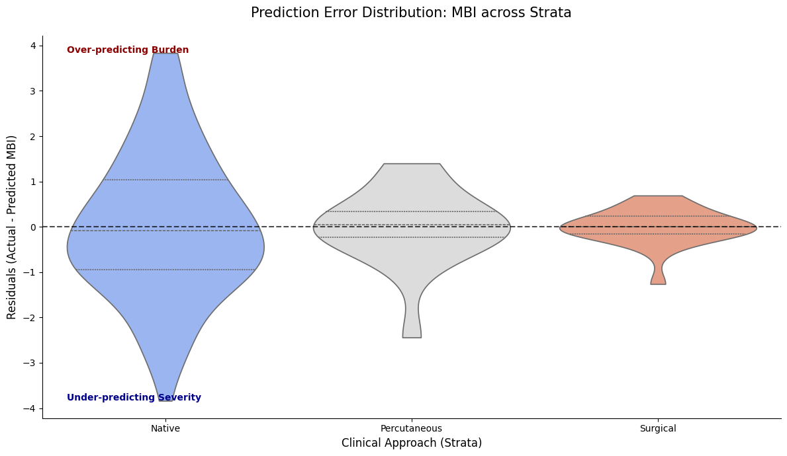

## Quantifying Clinical Gaps in Valvular Heart Disease: Using the Medication Burden Index (MBI) to Triage High-Complexity Surgical Candidates.

### 1. Project Manifesto & Data Context
---

This project analyzes real-world clinical data from a high-volume medical mission in León, Nicaragua. The brigade operates via a structured, three-phase clinical workflow designed to bridge the gap between primary screening and advanced cardiac intervention:

* **Phase 1 — General Cardiology Clinic:** High-throughput diagnostic screening, echocardiographic evaluation, and surgical prioritization.

* **Phase 2 — Electrophysiology:** Arrhythmia management, including cardiac ablations and permanent pacemaker/ICD implantation.

* **Phase 3 — Interventional Cardiology:** Percutaneous structural heart procedures and collaborative case reviews.

#### The Dataset and population: 

he analysis focuses on the Phase 1 - 2025 Cohort. To ensure clinical relevance and focus on adult structural heart disease, the population was filtered as follows:
* **Initial Enrollment:** $N=187$ patients.

* **Exclusion Criteria:** Patients $< 15$ years old or those with entirely normal echocardiographic findings (no disease criteria met).

* **Final Analytical Sample:** $N=152$ patients.

#### The Problem: The "Silence of the Normal" (MNAR bias)

In a 10-day clinical sprint, data is recorded on physical paper charts at the bedside and retrospectively digitized into Notion and Excel. This workflow creates a specific form of bias: Missing Not At Random (MNAR).

In high-volume brigade settings, "Missingness" is a clinical surrogate for "Normal." A cardiologist under extreme time pressure will prioritize documenting a pathological $1.2 cm^{2}$ Mitral Valve area but will likely leave the Aortic Valve field blank if it appears healthy. Standard imputation (mean/median) would erroneously assign "diseased" values to these healthy valves, leading to Model Alarmism and an overestimation of cohort severity.

#### The Strategy: "Natural Normal" Imputation

To preserve the statistical integrity of the cohort and prevent pathology bias, we utilize a **Natural Normal Imputation** strategy. Instead of treating nulls as errors, we treat them as "Healthy Proxies" and inject physiological noise to simulate a realistic population distribution.

**The Technique:** We apply Gaussian noise centered around healthy clinical constants:

$$X_{imp} \sim \mathcal{N}(\mu_{healthy}, \sigma^{2}_{phys})$$

*Example:* For a missing Right Ventricular Systolic Pressure (RVSP), we assume a "normal" physiological state. Rather than imputing the cohort mean (which may be elevated due to severe mitral disease), we impute values centered around $25\text{ mmHg}$ with a small standard deviation ($\sigma \approx 4\text{ mmHg}$). This reflects a healthy pulmonary pressure range of $19\text{--}31\text{ mmHg}$.

#### The Goal: Clinical Baseline Preservation

By creating this "Natural Normal" baseline, we prevent the model from being skewed by the sickest group of patients. This allows for a more robust comparison of disease burden and ensures our Medication Burden Index (MBI) accurately reflects the clinical complexity of the surgical candidates.


```python
# 1. IMPORTS
# ==========================================

# %matplotlib inline
import pandas as pd
import numpy as np
from IPython.display import display, Markdown, HTML
import re
import missingno as msno
import statsmodels.api as sm
from statsmodels.stats.outliers_influence import variance_inflation_factor
from sklearn.metrics import roc_curve, auc, f1_score, precision_score, recall_score, confusion_matrix
import seaborn as sns
import plotly.express as px
import matplotlib.pyplot as plt
import os
```

### 2. The Clinical Knowledge Base (The "Medical Brain")
---

To ensure the reproducibility and clinical validity of this pipeline, I have implemented a **Centralized Configuration Object**. In a real-world healthcare setting, separating clinical logic from processing code is vital—it allows medical directors to audit the criteria without needing to parse complex data engineering logic.

This class encapsulates:

* **Anatomic Groupings:** Organizing echo parameters by valve (Mitral vs. Aortic).

* **Pharmacological Mapping:** Cataloging max doses and clinical weights for the Medication Burden Index (MBI).

* **Heuristic Logic:** Regex patterns for extracting diagnoses from messy clinical notes.

* **Physiological Baselines:** Defining the $\mu$ and $\sigma$ for the Natural Normal Imputation.


```python
# 2. DICTIONARIES AND LISTS
# ==========================================

# * These dictionaries and lists act as the "Medical Brain" of the script. 

# Separating logic from data allows non-coders to update clinical criteria easily.
class ClinicalConfig:
    """
    Centralized configuration object acting as the 'Medical Brain'.
    Encapsulates all clinical dictionaries, regex patterns, decision boundaries,
    and biological sanity checks.
    """
    def __init__(self):
        # 1. Variable Categorization to be selected for the dataframe
        self.categories = {
            "Demographics/Vitals": ['ID', 'Age', 'Gender', 'Weight', 'Height', 'OSat', 'SBP R', 'DBP R', 'Heart rate'],
            "Medications": ['Medications'],
            "Clinical Context": ['Pre-procedure diagnosis', 'Post-procedure diagnosis', 'Year(s) since procedure'],
            "Structural Echo (Dimensions)": ['IVSd', 'LVIDd', 'LVPWd', 'LVIDs', 'Aortic root', 'Left atrium measure', 'Left atrium'],
            "Functional Echo (Hemodynamics)": ['LVEF (categorical)', 'RVSP', 'TR Vmax', 'AO V1 max', 'AO V2 max', 'MS MG (mmHg)']
        }

        # 2. Severity & Scoring Maps
        self.severity = {
            'critical': 3.5, 'severe to critical': 3.25, 'severe': 3.0,
            'moderate to severe': 2.5, 'moderate': 2.0, 'mild to moderate': 1.5,
            'mild': 1.0, 'none': 0.0
        }

        self.lvef_values = {
            'Hyperdynamic': 70.0, 'Normal': 60.0, 'Borderline': 50.0,
            'Moderately reduced': 40.0, 'Reduced': 25.0
        }
        
        self.echo_severity = {'trace': 15.0, 'mild': 20.0, 'none': 10.0}

        # 3. Pattern Recognition (Regex Targets)
        self.procedures = {
            "Surgical" : ['replacement', 'repair', 'patch', 'graft'],
            "Percutaneous" : ['percutaneous valvuloplasty', 'closure', 'stent', 'ablation']
        }

        self.pathology_patterns = {
            'MS': ['mitral stenosis'],
            'MR': ['mitral regurgitation'],
            'AS':  ['aortic stenosis'],
            'AR': ['aortic regurgitation'],
            'PH': ['pulmonary hypertension'],
            'Septal': ['Secundum atrial septal defect', 'Perimembranous ventricular septal defect', 
                       'Ventricular septal defect', 'Incomplete atrioventricular septal defect', 'Sinus venosus atrial septal defect']
        }
        
        self.la_patterns = {
            4.0: r'(?:huge|severely|severe)',
            2.5: r'(?:moderately|moderate)',
            1.0: r'(?:mild)'
        }

        # 4. Pharmacological Knowledge Base
        self.medication_classes = {
            'Beta_Blockers': ['Carvedilol', 'Bisoprolol', 'Propranolol', 'Metoprolol', 'Atenolol'],
            'RAAS_Inhibitors': ['Enalapril', 'Lisinopril', 'Losartan', 'Valsartan', 'Irbesartan', 'Captopril', 'Sacubitril-valsartan'],
            'Diuretics_Loop': ['Furosemide'],
            'Diuretics_Other': ['Spironolactone', 'Espironolactone', 'Hydrochlorothiazide'],
            'Anticoagulants_Antiplatelets': ['Warfarin', 'Warfarine', 'Rivaroxaban', 'Apixaban', 'Aspirin', 'Clopidogrel'],
            'Rate_Rhythm_Control': ['Digoxin', 'Amiodarone'],
            'Calcium_Channel_Blockers': ['Nifedipine', 'Amlodipine'],
            'SGLT2_Inhibitors': ['Dapaglifozin', 'Empaglifozin'],
            'Pulmonary_Vasodilators': ['Sildenafil', 'Tadalafil'],
            'Lipid_Lowering': ['Simvastatin', 'Rosuvastatin', 'Rosuvastatine', 'Gemfibrozil', 'Ciprofibrate'],
            'Anti_Ischemic_Other': ['Trimetazidine', 'Ranolazine'],
            'Metabolic_Endocrine': ['Levothyroxine', 'Metformin']
        }

        self.freq_day = {'qd': 1, 'bid': 2, 'tid': 3, 'qid': 4}

        self.max_doses = {
            'Sacubitril-valsartan': 400.0, 'Enalapril': 40.0, 'Lisinopril': 40.0, 'Losartan': 100.0,
            'Valsartan': 320.0, 'Irbesartan': 300.0, 'Captopril': 150.0, 'Carvedilol': 50.0,
            'Bisoprolol': 10.0, 'Metoprolol': 200.0, 'Atenolol': 100.0, 'Propranolol': 160.0,
            'Furosemide': 80.0, 'Spironolactone': 50.0, 'Hydrochlorothiazide': 25.0,
            'Sildenafil': 60.0, 'Tadalafil': 40.0, 'Digoxin': 0.25, 'Amiodarone': 400.0,
            'Warfarin': 5.0, 'Rivaroxaban': 20.0, 'Apixaban': 10.0, 'Aspirin': 100.0,
            'Clopidogrel': 75.0, 'Nifedipine': 90.0, 'Amlodipine': 10.0, 'Trimetazidine': 70.0,
            'Ranolazine': 1000.0, 'Dapaglifozin': 10.0, 'Empaglifozin': 25.0, 'Metformin': 2000.0,
            'Levothyroxine': 0.2, 'Simvastatin': 40.0, 'Rosuvastatin': 40.0, 'Gemfibrozil': 1200.0,
            'Ciprofibrate': 100.0
        }

        # Class weights based on their clinical conditions they target
        self.class_weights = {
            'Diuretics_Loop': 3.0, 'Pulmonary_Vasodilators': 3.0, 'RAAS_Inhibitors': 2.0,
            'SGLT2_Inhibitors': 2.0, 'Diuretics_Other': 2.0, 'Beta_Blockers': 2.0,
            'Rate_Rhythm_Control': 1.0, 'Anticoagulants_Antiplatelets': 1.0,
            'Calcium_Channel_Blockers': 1.0, 'Anti_Ischemic_Other': 1.0,
            'Lipid_Lowering': 0.5, 'Metabolic_Endocrine': 0.5
        }

        # 5. Echo grouping by anatomic structures
        self.echo_groups = {
            "Mitral": {"Parameters": ['MS MG (mmHg)', 'Left atrium', 'LVIDd', 'LVIDs'], "Severity_Cols": ['Sev_MS', 'Sev_MR']},
            "Aortic": {"Parameters": ['AO V1 max', 'AO V2 max', 'Aortic root', 'IVSd', 'LVPWd'], "Severity_Cols": ['Sev_AS', 'Sev_AR']},
            "PH": {"Parameters": ['RVSP', 'TR Vmax'], "Severity_Cols": ['Sev_PH']}
        }

        # 6. Statistical Baselines for imputation
        self.normal_variables = {
            'MS MG (mmHg)': (1.5, 0.5),
            'AO V2 max': (1.1, 0.2),
            'RVSP': (25.0, 4.0),
            'LVIDd': (4.6, 0.4)
        }

        # * 7. Lists to be used as variables  
        self.echo_vars = ['MS MG (mmHg)', 'AO V2 max', 'RVSP', 'Left atrium', 'LVIDd', 'LVEF (categorical)']
        self.echo_missing = ['MS MG (mmHg)', 'AO V2 max', 'RVSP', 'LVIDd']
        self.clinical_markers = ['Mixed_Mitral', 'Mixed_Aortic', 'Multi_Valve', 'PH_Significant', 'AFib_Present']
        self.lesions_anatomic = ['Sev_MS','Sev_MR','Sev_AS','Sev_AR', 'Sev_PH']
```


```python
# 3. CLASSES AND FUNCTIONS
# ==========================================

class Auditor:
    """
    Acts as the 'Quality Control' station. 
    Before any analysis, we must identify 'Missing Not At Random' (MNAR) patterns 
    often caused by limited time during medical brigades.
    """
    def __init__(self, dataframe, config):
        self.df = dataframe
        self.config = config

    def report(self):
        """
        Generates a 3-part audit: 
        1. Technical metadata.
        2. Clinical category missingness (shows which exam parts were skipped).
        3. Lexicon extraction (identifies unique raw strings for manual review).
        """
        audit = []
        for col in self.df.columns:
            audit.append({
                'Column': col,
                'Inferred dtype': self.df[col].dtype,
                'Null Count': self.df[col].isnull().sum(),
                'Sample Values': self.df[col].dropna().unique()[:3].tolist()
            })
            
        # Clinical NLP: Extracting the vocabulary used by the doctors in the field.
        all_diagnoses = pd.concat([
            self.df['Pre-procedure diagnosis'],
            self.df['Post-procedure diagnosis']
        ]).str.split(',').explode().str.strip().dropna().unique()

        all_medications = self.df['Medications'].str.split('|').explode().str.strip().dropna()
        medications_unique = all_medications.str.split(' ').str[0].str.capitalize().unique()

        # Reporting Missingness by Clinical Grouping
        print(f"Current columns by category:\n{'-'*40}")
        for category, cols in self.config.categories.items():
            print(f"{category}: {cols}")

        group_report = {}
        missing_from_categories = []

        for group, cols in self.config.categories.items():
            # Checks if our expected columns actually exist in the CSV header
            not_found = [c for c in cols if c not in self.df.columns]
            found = [c for c in cols if c in self.df.columns]

            # This logs missing columns
            if not_found:
                missing_from_categories.extend(not_found)
                print(f"\nWarning in {group}: Missing from CSV: {not_found}")
                
            # This calculates mean missingness for found columns
            if found:
                avg_miss = self.df[found].isnull().mean().mean() * 100
                group_report[group] = f"{avg_miss:.2f}% missing"
            else:
                group_report[group] = "N/A - No columns found"

        print("\nMean missingness by category (%):")
        print(f"{'-'*40}")
        print(pd.Series(group_report))

        # Persistence: Ensuring we have an 'Audit Trail' for clinical accountability.
        audit_df = pd.DataFrame(audit)
        pd.DataFrame({'All_diagnoses_list': all_diagnoses}).to_csv('all_diagnoses_report.csv', index=False)
        pd.DataFrame({'All_medications_list': medications_unique}).to_csv('all_medications_report.csv', index=False)
        audit_df.to_csv('dataset_audit_report.csv', index=False)

        print('\nAudit report generated:\n' + f"{'-'*40}")
        print('Technical metadata file generated: dataset_audit_report.csv. ')
        print('All unique diagnoses list generated: all_diagnoses_report.csv.')
        print('All medications list generated: all_medications_report.csv.')
        return audit_df
        
    def echo_missingness(self):
        """
        Forensic Data Audit: 
        Calculates completion rates (%) per column, stratified by 
        disease severity and clinical grouping.
        """
        results = []
        
        # Access the injected echo_groups_dict
        for unit, groups in self.config.echo_groups.items():
            for sev_col in groups["Severity_Cols"]: 
                if sev_col not in self.df.columns:
                    continue
                
                for sev_level in sorted(self.df[sev_col].unique()):
                    subset = self.df[self.df[sev_col] == sev_level]
                    if subset.empty: continue
                    
                    for param in groups["Parameters"]:
                        if param in self.df.columns:
                            completeness = (1 - subset[param].isnull().mean()) * 100
                            results.append({
                                'Pathology': sev_col.replace('Sev_', ''),
                                'Severity': sev_level,
                                'Parameter': param,
                                'Completeness_Pct': round(completeness, 2),
                                'N': len(subset)
                            })
                            
        missings_stratified = pd.DataFrame(results)

        # Pivot for 'Missingness Matrix' visualization. 
        pivot_audit = missings_stratified.pivot_table(
            index=['Pathology', 'Parameter'], 
            columns='Severity', 
            values='Completeness_Pct' 
        )
        
        print("Missingness pivot table" + "\n" + "-"*40)
        print("Rows: Pathology-Parameter pairs")
        print("Columns: Clinical Severity (0.0 to 3.5)\n")
        return pivot_audit

class Extractor:
    """
    The 'Refinery'. Transforms messy clinical strings into 'Tidy' structured data.
    Key philosophy: Do not oversimplify. Preserve mixed valvular disease signatures.
    """
    def __init__(self, dataframe, config):
        self.df = dataframe
        self.config = config
        self.severities = list(self.config.severity.keys())
        # Regex to strip intensity
        self.strip_pattern = r'\b(' + '|'.join(self.severities) + r')\b'

    def _get_expanded_diag(self, col_name):
        """
        Handles comma-separated lists in a single cell.
        """
        return self.df[col_name].str.lower().str.split(',').explode().str.strip().dropna()

    def _clean_column(self, col):
        """
        Standardizes anatomy by removing qualitative noise and surgical terms.
        """
        s = self._get_expanded_diag(col)
        cleaned = s.str.replace(self.strip_pattern, '', regex=True) \
            .str.replace(r'\s+', ' ', regex=True) \
            .str.strip() \
            .str.capitalize()
        
        # Group back to original rows to maintain 1:1 patient mapping.
        return cleaned.groupby(level=0).agg(lambda x: ', '.join(x.unique()) if x.any() else np.nan)

    def _parse_meds(self, med_string, drug_list):
        """
        Pharmacological Parser:
        Identifies drug, extracts base dose, and applies frequency multipliers (e.g., bid=x2).
        """
        if pd.isna(med_string) or med_string == "":
            return "None", 0.0
            
        individual_meds = [m.strip().lower() for m in str(med_string).split('|')]
        
        for med_entry in individual_meds:
            matched_drug = next((d for d in drug_list if d.lower() in med_entry), None)
            
            if matched_drug:
                # Extract dose number (handles decimals like 6.25)
                dose_match = re.search(r'(\d+\.?\d*)', med_entry)
                base_dose = float(dose_match.group(1)) if dose_match else 0.0
                
                # Determine frequency multiplier
                multiplier = 1 
                for freq, value in self.config.freq_day.items():
                    if f" {freq}" in f" {med_entry}":
                        multiplier = value
                        break
                
                return matched_drug.capitalize(), base_dose * multiplier
                
        return "None", 0.0

    def transform(self):
        """
        Main orchestration of the feature engineering process.
        Creates a multidimensional lesion matrix (e.g., separate columns for MS and MR severity).
        """
        # 1. Anatomy Extraction (The 'What' is involved)
        self.df['Anatomy_Pre'] = self._clean_column('Pre-procedure diagnosis')
        self.df['Anatomy_Post'] = self._clean_column('Post-procedure diagnosis')

        # 2. Multidimensional Severity Mapping (The 'How Bad' is it?)
        def severity_score(text_series, path_regex):
            entries = str(text_series).lower().split(',')
            for entry in entries:
                if re.search(path_regex, entry):
                    for label, score in self.config.severity.items():
                        if label in entry: return score
            return 0.0

        # 3. Normalizes the severities per most relevant diagnoses
        for lesion, keywords in self.config.pathology_patterns.items():
            col_name = f'Sev_{lesion}'
            pattern = '|'.join(keywords) 
            self.df[col_name] = self.df['Pre-procedure diagnosis'].fillna('').apply(
                lambda x: severity_score(x, pattern)
            )

        # 4. Procedural Classification (The 'Approach')
        self.df['Approach'] = 'Native'
        post_exploded = self._get_expanded_diag('Post-procedure diagnosis')
        
        for group, keywords in self.config.procedures.items():
            pattern = '|'.join(keywords)
            idx = post_exploded[post_exploded.str.contains(pattern, regex=True, na=False)].index
            self.df.loc[idx, 'Approach'] = group

        # 5. Pharmacological Quantification
        for category, drugs in self.config.medication_classes.items():
            name_col = f"{category}_name"
            dose_col = f"{category}_tdd"
            
            # Use the internal _parse_meds method with injected freq_day
            self.df[[name_col, dose_col]] = self.df['Medications'].apply(
                lambda x: pd.Series(self._parse_meds(x, drugs))
            )

        # 6. Left Atrium Size Scoring
        self.df['LA_Size_Score'] = 0.0
        self.df['LA_Thrombus'] = 0.0
        self.df['LA_Mass'] = 0.0
        
        for score, pattern in self.config.la_patterns.items():
            # Only update if current score is lower (preserves the highest severity found)
            mask = self.df['Left atrium'].str.contains(pattern, case=False, na=False, regex=True)
            self.df.loc[mask, 'LA_Size_Score'] = np.maximum(self.df.loc[mask, 'LA_Size_Score'], score)

        # 7. Pathological Findings (Flags)
        # Thrombus/Clot/Smoke (Spontaneous Echo Contrast)
        self.df['LA_Thrombus'] = self.df['Left atrium'].str.contains(r'(?:thrombus)', case=False, na=False, regex=True).astype(int)

        # 8. asses (Myxomas)
        self.df['LA_Mass'] = self.df['Left atrium'].str.contains(r'(?:myxoma)', case=False, na=False, regex=True).astype(int)
        
        # 9. Normalization of echo 
        for col in self.config.echo_missing:
            if col in self.df.columns:
                # 1. Convert to string and handle whitespace
                # We use .str.strip() to catch hidden spaces like " 25 "
                s = self.df[col].astype(str).str.lower().str.strip()
                
                # 2. Replace qualitative terms (trace, mild) with your dictionary
                s = s.replace(self.config.echo_severity)
                
                # 3. Final Coercion
                # If a value was "45mm", pd.to_numeric turns it to NaN. 
                # If your data has "mm" in it, we must strip it first.
                s = s.str.extract(r'(\d+\.?\d*)')[0] # Remove all non-numeric chars
                
                self.df[col] = pd.to_numeric(s, errors='coerce').round(1)

        # 10. LVEF Numerical Mapping
        # We use .str.title() to match 'Normal', 'Reduced', etc. 
        if 'LVEF (categorical)' in self.df.columns:
            self.df['LVEF_Score'] = self.df['LVEF (categorical)'].str.strip().str.title().map(self.config.lvef_values)
            
            # Clinical Safety Check: If "Moderately reduced" has a lowercase 'r', 
            # title() makes it "Moderately Reduced". We adjust the map or use a lambda.
            # Best practice: 
            self.df['LVEF_Score'] = self.df['LVEF (categorical)'].str.strip().map(
                {k: v for k, v in self.config.lvef_values.items()} # Direct map
            ).fillna(self.df['LVEF (categorical)'].str.strip().str.capitalize().map(self.config.lvef_values))
            
        return self.df

    def baseline(self):
        """
        Generates a Table of demographics and vitals.
        Calculates Mean ± SD for continuous and N (%) for categorical.
        """
        stats = []
        vitals = self.config.categories.get("Demographics/Vitals", [])

        print("Baseline characteristics\n" + '-'*40)

        for col in vitals:
            if col in self.df.columns:
                # Handles numeric columns (Age, Weight, Vitals)
                if pd.api.types.is_numeric_dtype(self.df[col]):
                    mean_val = self.df[col].mean()
                    std_val = self.df[col].std()
                    null_pct = self.df[col].isnull().mean() * 100
                    stats.append({
                        "Characteristic": col,
                        "Value": f"{mean_val:.1f} ± {std_val:.1f}",
                        "Completeness": f"{100 - null_pct:.1f}%",
                        "Type": "Continuous"
                    })
                # Handles categorical (Gender)
                else:
                    top_val = self.df[col].mode()[0] if not self.df[col].mode().empty else "N/A"
                    count = (self.df[col] == top_val).sum()
                    pct = (count / len(self.df)) * 100
                    stats.append({
                        "Characteristic": col,
                        "Value": f"Mode: {top_val} ({pct:.1f}%)",
                        "Completeness": f"{100 - (self.df[col].isnull().mean()*100):.1f}%",
                        "Type": "Categorical"
                    })
                
        return display(pd.DataFrame(stats).set_index("Characteristic"))

    def diagnoses_prevalence(self):
        """
        Standardizes and counts the global disease burden in the cohort.
        """
        # Note: transform() must be called before this method to generate Anatomy_Pre
        if 'Anatomy_Pre' not in self.df.columns:
             raise ValueError("Please run transform() first.")
        
        pre = self.df['Anatomy_Pre'].str.split(', ').explode()
        post = self.df['Anatomy_Post'].str.split(', ').explode()
        
        # Combines them and remove 'nan' strings or empty entries
        combined = pd.concat([pre, post])
        combined = combined[~combined.isin(['nan', '', 'None', 'None, None'])]
        
        # Calculates Counts
        counts = combined.value_counts()
        
        # Creates the final Table
        prevalence_df = pd.DataFrame({
            'Patient Count': counts,
            'Prevalence (%)': (counts / len(self.df) * 100).round(1)
        })
        
        prevalence_df.index.name = 'Diagnosis'

        return prevalence_df

    def disease_profiler(self):
        '''
        Identifies complex interactions: Mixed Lesions, Shunts, and Rhythm Confounders.
        '''
        if 'Sev_MS' not in self.df.columns:
             raise ValueError("Please run transform() with required dictionaries before running disease_profiler()")

        # 1. Mixed Valvular Disease (Same-valve: Stenosis + Regurgitation)
        self.df['Mixed_Mitral'] = ((self.df['Sev_MS'] > 0) & (self.df['Sev_MR'] > 0)).astype(int)
        self.df['Mixed_Aortic'] = ((self.df['Sev_AS'] > 0) & (self.df['Sev_AR'] > 0)).astype(int)

        # 2. Multi-Valvular Disease (Cross-valve: Mitral unit AND Aortic unit)
        mitral_any = (self.df['Sev_MS'] > 0) | (self.df['Sev_MR'] > 0)
        aortic_any = (self.df['Sev_AS'] > 0) | (self.df['Sev_AR'] > 0)
        self.df['Multi_Valve'] = (mitral_any & aortic_any).astype(int)

        # 3. Pulmonary Hypertension (Explicit Flag)
        # Defined here as any PH mention (Severity > 0)
        self.df['PH_Present'] = (self.df['Sev_PH'] > 0).astype(int)
        self.df['PH_Significant'] = (self.df['Sev_PH'] >= 2.0).astype(int)

        # 4. Shunts (Septal Defects)
        shunt_pattern = '|'.join(self.config.pathology_patterns['Septal'])
        self.df['Has_Shunt'] = self.df['Pre-procedure diagnosis'].str.contains(
            shunt_pattern, case=False, na=False, regex=True
        ).astype(int)

        # 5. Rhythm Confounders (AFib)
        self.df['AFib_Present'] = self.df['Pre-procedure diagnosis'].str.contains(
            'Atrial fibrillation', case=False, na=False, regex=True
        ).astype(int)

        # 6. Global Complexity Score 
        # Summing binary flags. Note: For PH, we only count it as a 'Complexity Point' 
        # if it is Moderate or worse (>= 2.0), as Mild PH is very common.
        self.df['Complexity_Score'] = (
            self.df['Mixed_Mitral'] + 
            self.df['Mixed_Aortic'] + 
            self.df['Multi_Valve'] + 
            self.df['AFib_Present'] + 
            self.df['PH_Significant']
        )

        # Accurate Prevalence Reporting
        self.complexity_stats = {
            "Total Patients": len(self.df),
            "Mixed Mitral": self.df['Mixed_Mitral'].sum(),
            "Mixed Aortic": self.df['Mixed_Aortic'].sum(),
            "Multi-Valvular": self.df['Multi_Valve'].sum(),
            "Significant PH (>=2.0)": self.df['PH_Significant'].sum(),
            "AFib Present": self.df['AFib_Present'].sum()
        }
        
        return self.df
        
    def complexity_report(self):
        """
        Returns the stats as a clean Pandas Series for easy display or export.
        """
        print("Complex cases\n" + '-'*40)
        print("Cases that have either mixed, multiple valvular disease and/or other conditions\n")
        if hasattr(self, 'complexity_stats'):
            return pd.Series(self.complexity_stats, name="Prevalence")
        else:
            return "Profiler has not been run yet."

class Calculator:
    def __init__(self, dataframe, config):
        self.df = dataframe
        self.config = config

    def medication_index(self):
        """
        Computes the Medication Burden Index (MBI).
        MBI = Sum(Class_Weight * (Actual_TDD / Max_TDD))
        """
        self.df['MBI'] = 0.0
        
        for category, weight in self.config.class_weights.items():
            name_col = f"{category}_name"
            dose_col = f"{category}_tdd"
            
            if name_col in self.df.columns:
                # Vectorized calculation for each class
                # Uses 1.0 as a fallback intensity for fixed-dose meds (like Aspirin)
                intensity = self.df.apply(
                    lambda x: x[dose_col] / self.config.max_doses.get(x[name_col], x[dose_col]) 
                    if x[dose_col] > 0 else 0, axis=1
                )
                
                # Clips intensity at 1.0 (to avoid outliers from rare supra-therapeutic doses)
                self.df['MBI'] += (intensity.clip(upper=1.0) * weight)
                
        return self.df
    
class Visualizer:
    def __init__(self, dataframe, config):
        self.df = dataframe
        self.config = config
        
    def patient_nullity(self):
        # Forensic Audit: Visualizing data deserts to evaluate mission-specific documentation constraints.
        available_keys = [v for v in self.config.echo_vars if v in self.df.columns]

        print("Missingness visualizations\n" + '-' *40)
        with plt.style.context('default'):
            plt.figure(figsize=(10, 6))
            msno.matrix(self.df[available_keys], 
                        sparkline=False, 
                        color=(0.1, 0.3, 0.5), # Your dark blue
                        fontsize=10)
            plt.title("Nullity Matrix: Data Presence (Dark) vs Missing (White)", fontsize=14)
            plt.show()

        print("Note: Correlation of Missingness (1.0 = Always missing together):")
        # Heatmap usually works better with a standard context too
        with plt.style.context('default'):
            msno.heatmap(self.df[available_keys], cmap='GnBu')
            plt.title("Missingness Correlation")
            plt.show()

    def echo_matrix(self, table):
        # Triage Efficiency: Quantifying which physiological parameters are deemed 'Critical Path' by the field team.
        print("\nEchocardiogram Triage Matrix notes:" + "\n" + "-"*40)
        print("A 'Hot' cell (High %) indicates a parameter the cardiologist deemed mandatory for triage.")
        
        plt.figure(figsize=(14, 10))
        # Using a sequential colormap (YlOrRd) to highlight 'Data Deserts' vs 'Data Oases'.
        sns.heatmap(table.fillna(0), annot=True, fmt=".1f", cmap="YlOrRd", cbar_kws={'label': 'Completeness %'})
        plt.title("Echocardiogram Triage Matrix: Data Presence as a Function of Disease Severity", fontsize=15)
        plt.xlabel("Clinician-Assessed Severity (Ordinal Scale)")
        plt.ylabel("Echocardiographic Parameter by Pathology")
        plt.show()

    def complexity_frequency(self):
        """
        Visualizes the phenotypic burden of the cohort.
        """
        plt.figure(figsize=(10, 6))
        
        # Count frequencies of each score
        counts = self.df['Complexity_Score'].value_counts().sort_index()
        
        # Create a bar plot
        sns.barplot(x=counts.index, y=counts.values, hue=counts.index, palette="YlOrRd", legend=False)
        
        plt.title("Distribution of Patient Complexity Scores", fontsize=15)
        plt.xlabel("Complexity Score (0 = Simple, 5+ = Highly Complex)", fontsize=12)
        plt.ylabel("Number of Patients", fontsize=12)
        
        # Add labels on top of bars
        for i, val in enumerate(counts.values):
            plt.text(i, val + 0.5, str(val), ha='center', fontsize=11, fontweight='bold')
            
        plt.grid(axis='y', linestyle='--', alpha=0.7)
        plt.show()

    def complexity_markers(self):
        """
        Shows the prevalence of specific complexity markers.
        """
        prevalence = self.df[self.config.clinical_markers].sum().sort_values(ascending=False)
        
        plt.figure(figsize=(10, 6))
        prevalence.plot(kind='barh', color='#e34a33')
        plt.title("Prevalence of Complexity Markers", fontsize=15)
        plt.xlabel("Patient Count", fontsize=12)
        plt.gca().invert_yaxis()
        plt.show()

    def complexity_heatmap(self):
        """
        Interaction Analysis: Identifying 'Syndromic Clusters' where multiple pathologies co-exist, 
        increasing clinical risk.
        """
        # Calculate the correlation (co-occurrence)
        # We use 'pearson' here to see how strongly one predicts the other
        interaction_matrix = self.df[self.config.clinical_markers].corr()

        plt.figure(figsize=(10, 8))
        sns.heatmap(interaction_matrix, annot=True, cmap='RdBu_r', center=0, fmt=".2f")
        
        plt.title("Clinical Interaction Heatmap: Pathological Clustering", fontsize=15)
        plt.tight_layout()
        plt.show()

    def sensitivity_grid(self):
        """
        Generates a 2x2 matrix of KDE plots comparing Measured vs. Imputed data.
        """
        # Identifies variables to plot
        plot_vars = [v for v in self.config.echo_missing if v in self.df.columns]
        
        # Creates the 2x2 figure (4 subplots)
        fig, axes = plt.subplots(2, 2, figsize=(12, 10))
        axes = axes.flatten()

        for i, var in enumerate(plot_vars):
            if i >= 4: break # Limit to 4x4 grid
            
            ax = axes[i]
            imp_col = f"{var}_Imputed"
            
            if imp_col in self.df.columns:
                # Measured Data (The "Sick" Triage Group)
                sns.kdeplot(self.df[var].dropna(), ax=ax, color='red', fill=True, 
                            label='Measured', alpha=0.3)
                
                # Total Cohort (The "Natural Normal" Imputation)
                sns.kdeplot(self.df[imp_col], ax=ax, color='green', linestyle='--', 
                            label='Total Cohort')
                
                ax.set_title(f"{var}: Distribution Shift", fontsize=12, fontweight='bold')
                ax.set_xlabel("Value")
                ax.set_ylabel("Density")
                ax.legend(fontsize=8)
            else:
                ax.text(0.5, 0.5, f"No Data for {var}", ha='center')

        # Cleans up empty subplots if fewer than 4 variables exist
        for j in range(len(plot_vars), 4):
            fig.delaxes(axes[j])

        plt.tight_layout()
        plt.suptitle("Clinical Sensitivity Matrix: Measured vs. Imputed Populations", 
                    fontsize=14, y=1.02)
        plt.show()

    def validate_vis(self, matrix, x_label, y_label, title):
        plt.figure(figsize=(8,6))
        sns.heatmap(matrix, annot=True, fmt='d', cmap='Blues', 
                    xticklabels=['MBI Low', 'MBI High'], 
                    yticklabels=['Healthy', 'Complex'])
        plt.xlabel(x_label)
        plt.ylabel(y_label)
        plt.title(title)
        print("\nConfusion matrix visualization\n" + '-'*40)
        plt.show()

    def predictor_decomposition(self):
        """
        Generates an interactive horizontal stacked bar chart.
        Shows granular drug dominance and internal percentages.
        """
        composition_data = []

        # 1. Calculation Logic (Parsed from Category/TDD structure)
        for category, weight in self.config.class_weights.items():
            name_col = f"{category}_name"
            dose_col = f"{category}_tdd"
            
            if name_col in self.df.columns and dose_col in self.df.columns:
                valid_rows = self.df[self.df[name_col] != "None"]
                max_doses = valid_rows[name_col].map(self.config.max_doses).fillna(0)
                intensities = (valid_rows[dose_col] / max_doses).clip(upper=1.0)
                burdens = intensities * weight
                
                drug_sums = burdens.groupby(valid_rows[name_col]).sum()
                category_total = drug_sums.sum()

                for drug, burden in drug_sums.items():
                    composition_data.append({
                        'Medication_Class': category,
                        'Specific_Drug': drug,
                        'Burden_Score': burden,
                        'Clinical_Weight': weight,
                        'Percentage_of_Class': (burden / category_total * 100) if category_total > 0 else 0
                    })

        df_comp = pd.DataFrame(composition_data)
        df_comp = df_comp.sort_values(['Clinical_Weight', 'Medication_Class'], ascending=[False, True])

        # 2. Interactive Figure (Colored by Weight with Legend)
        fig = px.bar(
            df_comp, 
            y="Medication_Class", 
            x="Burden_Score", 
            color="Clinical_Weight",  # This creates the Weight-based Legend
            color_continuous_scale=px.colors.diverging.RdBu_r,
            orientation='h',
            title=f"Global MBI Architecture by Clinical Priority (n={len(self.df)})",
            hover_data={
                'Specific_Drug': True,
                'Percentage_of_Class': ':.1f',
                'Burden_Score': ':.2f',
                'Clinical_Weight': True,
                'Medication_Class': False 
            },
            labels={
                'Burden_Score': 'Weighted Burden Contribution',
                'Clinical_Weight': 'Medical Weight Tier'
            },
            template="plotly_white"
        )

        fig.update_layout(
            barmode='stack', 
            height=800,
            yaxis={'categoryorder': 'total ascending'},
            )
        
        print("Global MBI burden, stratified by medication classes\n" + '-'*40)
        display(Markdown("Bars represent **aggregate population burden**    \nColor indicate **clinical priority** weights"))
        fig.show()

        # 3. Automated Key Findings Summary
        self._print_mbi_summary(df_comp)
        
        return df_comp
    
    def _print_mbi_summary(self, df_comp):
        total_mbi = df_comp['Burden_Score'].sum()
    
        # Get Top 3 Classes by total burden
        class_totals = df_comp.groupby('Medication_Class')['Burden_Score'].sum().sort_values(ascending=False).head(3)
        
        print(f"\n{'='*60}\nKEY MBI FINDINGS SUMMARY: PHARMACOLOGICAL DRIVERS\n{'='*60}")
        print(f"Total Cohort Burden Score: {total_mbi:.1f}")
        
        print(f"\nTOP 3 CLINICAL DRIVERS:")
        for i, (category, total) in enumerate(class_totals.items(), 1):
            # Identify the most used medication within this specific class
            class_meds = df_comp[df_comp['Medication_Class'] == category]
            dominant_med = class_meds.loc[class_meds['Burden_Score'].idxmax()]
            
            # Calculate class contribution to global MBI
            global_pct = (total / total_mbi) * 100
            
            print(f"{i}. {category:25} | Burden: {total:5.1f} ({global_pct:4.1f}%)")
            print(f"   - Dominant Medication: {dominant_med['Specific_Drug']} "
                f"({dominant_med['Percentage_of_Class']:.1f}% of class)")
        
        # Gap analysis
        gap_classes = df_comp[df_comp['Burden_Score'] == 0]['Medication_Class'].unique()
        if len(gap_classes) > 0:
            print(f"\nIdentified Care Gaps: No utilization in {len(gap_classes)} high-weight categories.")
        print(f"{'='*60}\n")

    def residual_distribution(self, results_df, y_var='MBI'):
        """
        Plots a violin plot of residuals to compare model performance across strata.
        :param results_df: The dataframe returned by run_regression
        :param y_var: The dependent variable name to locate the correct residual column
        """
        # Dynamically find the residual column name created by your engine
        res_col = f'{y_var}_Residual'
        
        if res_col not in results_df.columns:
            print(f"[!] Error: Column {res_col} not found in the provided DataFrame.")
            return

        plt.figure(figsize=(12, 7))
        
        # Create the violin plot
        sns.violinplot(
            x='Approach', 
            y=res_col, 
            data=results_df, 
            inner="quartile", 
            palette="coolwarm",
            hue="Approach",
            cut=0 # Keeps the violin within the range of actual data
        )
        
        # Formatting for a professional clinical report
        plt.axhline(0, color='black', linestyle='--', linewidth=1.5, alpha=0.7)
        plt.title(f'Prediction Error Distribution: {y_var} across Strata', fontsize=15, pad=20)
        plt.ylabel(f'Residuals (Actual - Predicted {y_var})', fontsize=12)
        plt.xlabel('Clinical Approach (Strata)', fontsize=12)
        
        # Statistical Context Annotations
        plt.text(-0.4, results_df[res_col].max(), "Over-predicting Burden", color='darkred', fontsize=10, weight='bold')
        plt.text(-0.4, results_df[res_col].min(), "Under-predicting Severity", color='darkblue', fontsize=10, weight='bold')
        
        sns.despine()
        plt.tight_layout()
        plt.show()

class Statistics:
    def __init__(self, dataframe, config):
        self.df = dataframe
        self.config = config

    def impute_normal(self, target_col):
        """
        Implements 'Brigade Logic': Missing values are assumed normal, 
        but filled with Gaussian noise to preserve dataset variance.
        """
        temp_df = self.df.copy()
        temp_df[target_col] = pd.to_numeric(temp_df[target_col], errors='coerce')
        
        mask = temp_df[target_col].isnull()
        num_missing = mask.sum()
        
        mean, std = self.config.normal_variables.get(target_col, (0, 1))
        simulated_normals = np.random.normal(mean, std, size=num_missing).round(1)
        temp_df.loc[mask, target_col] = np.clip(simulated_normals, 0, 150)
                
        return temp_df[target_col]

    def apply_imputation(self):
        for var in self.config.echo_missing:
            if var in self.df.columns:
                # Use 'Natural Normal' to respect Brigade Logic while keeping variance
                self.df[f'{var}_Imputed'] = self.impute_normal(var)
                print(f"Handled {var} using 'Natural Normal' distribution.")

        return self.df
    
    def sensitivity_report(self):
        """
        Creates a succinct summary comparing Measured (Sick) vs. Imputed (Cohort) data.
        """
        summary_data = []
        
        # We only look at variables that were actually imputed
        for var in self.config.echo_missing:
            imp_col = f"{var}_Imputed"
            
            if var in self.df.columns and imp_col in self.df.columns:
                # Data for patients who actually had measurements (The "Red" group)
                measured = self.df[var].dropna()
                
                # Data for the whole cohort after imputation (The "Green" group)
                cohort = self.df[imp_col]
                
                if len(measured) > 0:
                    m_mean = measured.mean()
                    c_mean = cohort.mean()
                    delta = c_mean - m_mean
                    
                    # Clinical Interpretation Logic
                    # If the shift is more than 10% of the measured value, we flag it.
                    bias_status = "Significant Shift" if abs(delta) > (m_mean * 0.1) else "Stable"
                    
                    summary_data.append({
                        "Clinical Parameter": var,
                        "Measured Mean": round(m_mean, 1),
                        "Cohort Mean": round(c_mean, 1),
                        "Delta (Shift)": round(delta, 1),
                        "Triage Bias": bias_status,
                        "Sample Size (n)": len(measured)
                        })

        # Create DataFrame
        report_df = pd.DataFrame(summary_data).set_index("Clinical Parameter")
        return report_df
    
    def roc(self, predictor_col='MBI'):
        """
        Generalized ROC analysis.
        Tests how well a chosen column (predictor_col) predicts Clinical Complexity.
        """
        # Ensures the column exists to avoid a KeyError
        if predictor_col not in self.df.columns:
            print(f"Error: {predictor_col} not found in dataframe.")
            return

        # Redefining Target: Capturing 'Rising Risk' (Score 1 or higher)
        self.df['Is_Complex_Case'] = (self.df['Complexity_Score'] >= 1).astype(int)

        # Recalculates ROC Metrics
        # We drop NAs for the specific predictor to prevent the roc_curve function from failing
        temp_df = self.df[['Is_Complex_Case', predictor_col]].dropna()
        
        fpr, tpr, thresholds = roc_curve(temp_df['Is_Complex_Case'], temp_df[predictor_col])
        roc_auc = auc(fpr, tpr)

        # Finding the Optimal Cutoff using Youden's J statistic
        j_scores = tpr - fpr
        best_idx = np.argmax(j_scores)
        best_cutoff = thresholds[best_idx]

        # Visualization
        print(f"ROC visualization for {predictor_col}\n" + '-'*40)
        plt.figure(figsize=(10, 7))
        plt.plot(fpr, tpr, color='#e34a33', lw=3, label=f'ROC curve (AUC = {roc_auc:.2f})')
        plt.plot([0, 1], [0, 1], color='#bdbdbd', linestyle='--', label='Random Classifier')
        
        # Dynamic Label for the Scatter Point
        plt.scatter(fpr[best_idx], tpr[best_idx], color='black', s=100, zorder=5,
                    label=f'Optimal {predictor_col} Cutoff: {best_cutoff:.2f}')

        plt.xlabel('False Positive Rate (1 - Specificity)')
        plt.ylabel('True Positive Rate (Sensitivity)')
        
        # Dynamic Title
        plt.title(f'Predictive Power: {predictor_col} vs. Clinical Complexity', fontsize=14)
        plt.legend(loc='lower right')
        plt.grid(alpha=0.3)
        plt.show()

        print(f"Analysis Complete: A value of {predictor_col} above {best_cutoff:.2f} is the best predictor of patient complexity.\n")

    def validate_predictor(self, threshold):
        """
        Calculates the F1-Score to validate if MBI > 4.0 
        is a reliable proxy for Anatomical Complexity >= 2.0.
        """
        y_true = self.df['Is_Complex_Anatomic']
        y_pred = self.df['MBI_Predicted_High']
        
        f1 = f1_score(y_true, y_pred)
        precision = precision_score(y_true, y_pred)
        recall = recall_score(y_true, y_pred)
        
        # Portfolio-ready output
        print(f"MBI Threshold Validation (> {threshold})\n" + '-'*40)
        print(f"F1-Score:  {f1:.3f}")
        print(f"Precision: {precision:.3f} (Reliability: When MBI is high, is the patient actually sick?)")
        print(f"Recall:    {recall:.3f} (Sensitivity: Does MBI catch all the sick patients?)")
        cm = confusion_matrix(y_true, y_pred)
        
        return cm 
    
    def _prepare_regression_features(self, df_to_fix):
        # We perform operations on the passed dataframe and return it
        df_to_fix['Gender_Male'] = (df_to_fix['Gender'].str.lower() == 'male').astype(int)
        df_to_fix['Mitral_Mixed_Score'] = df_to_fix['Sev_MS'] * df_to_fix['Sev_MR']
        df_to_fix['Aortic_Mixed_Score'] = df_to_fix['Sev_AS'] * df_to_fix['Sev_AR']
        return df_to_fix

    def run_regression(self, y_var, strata=None, excluded_features=None):
        """
        Modular engine to execute stratified regressions.
        :param y_var: The dependent variable (e.g., 'MBI' or 'RVSP_Imputed')
        :param feature_list: List of predictors to include
        :param strata: Specific 'Approach' to run (e.g., 'Native'). If None, loops all.
        """
        working_df = self.df.copy()

        # 1. Prepare features ONLY on the working copy
        working_df = self._prepare_regression_features(working_df)

        # 2. Ternary switch for strata list
        target_approaches = [strata] if strata else ['Native', 'Percutaneous', 'Surgical']

        # 3. Determine if we are doing a deep dive (single strata selected)
        is_deep_dive = len(target_approaches) == 1   
        
        # 4. Expand the feature list
        demographics = regression_demographics
        lesions = regression_lesions
        echo = regression_echo
        
        features = demographics + lesions + echo
        
        # 2. SILENCING LOGIC: Remove variables the user wants to ignore
        if excluded_features:
            features = [f for f in features if f not in excluded_features]

        # 5. Stratification Logic
        status_results = []
        all_subs = []
        for status in target_approaches:
            # Slices a deep copy for the specific cohort
            sub_df = working_df[working_df['Approach'] == status].copy()
            current_features = [f for f in features if f in self.df.columns and f != y_var]
            
            # Check if we have any features left to run!
            if not current_features:
                print(f"[!] No valid features found for {status}. Skipping.")
                continue

            # Isolate the group
            sub_df = sub_df.dropna(subset=current_features + [y_var])
            
            if len(sub_df) < 15: # Minimum threshold to avoid running on low statistical power
                print(f"\n[!] Stratum '{status}' skipped: Insufficient data (n={len(sub_df)})")
                continue
            
            # Fit Model
            X = sm.add_constant(sub_df[current_features])
            y = sub_df[y_var]
            model = sm.OLS(y, X).fit()
            
            # Attach residuals only to the temporary slice
            sub_df[f'{y_var}_Residual'] = model.resid

            # Store full results for the report
            status_results.append({'status': status, 'model': model, 'n': len(sub_df)})
            all_subs.append(sub_df)

        # Pass the 'status_results' list instead of a single 'status' string
        # Move outside the loop so the Overview can consolidate all results
        if status_results:
            self._print_clinical_report(status_results, y_var, is_deep_dive)

        return pd.concat(all_subs) if all_subs else pd.DataFrame()

    def _print_clinical_report(self, status_results, y_var, is_deep_dive):
        """
        Internal helper to toggle between a clean table and a full summary.
        """
        if is_deep_dive:
            res = status_results[0]
            print(f"\n{'='*40}\nDEEP DIVE: {y_var} {res['status'].upper()} (n={res['n']})\n{'='*40}")
            print(res['model'].summary())
        else:
            # 2. OVERVIEW: Build a Master Comparison Table
            print(f"\n{'='*40}\nCROSS-STRATA COMPARISON: {y_var}\n{'='*40}")

            all_cols = []
            for item in status_results:
                # Extract Params and P-Values
                df_res = pd.concat([item['model'].params, item['model'].pvalues], axis=1)
                df_res.columns = [f"{item['status']} Coef", f"{item['status']} P"]
                
                # Add Significance Stars to the Coef column for readability
                df_res[f"{item['status']} Coef"] = df_res.apply(
                    lambda row: f"{row.iloc[0]:.3f} " + 
                    ('***' if row.iloc[1] < 0.01 else ('**' if row.iloc[1] < 0.05 else '* ' if row.iloc[1] < 0.1 else '')),
                    axis=1
                )
                all_cols.append(df_res[[f"{item['status']} Coef"]]) # Keep only the starred Coef for the table

            # Join all strata columns together
            master_table = pd.concat(all_cols, axis=1).fillna('-')
            
            # Display as a pretty HTML table
            display(HTML(f"<h3>Cohort Coefficient Comparison: {y_var}</h3>"))
            display(master_table)
```


```python
# 4. EXECUTION
# ==========================================
# Setup
config = ClinicalConfig()
load = pd.read_csv('phl_2025.csv')
all_cols = [col for sublist in config.categories.values() for col in sublist]
df = load[load.columns.intersection(all_cols)].copy()

auditor = Auditor(df, config)
extractor = Extractor(df, config)
stats = Statistics(df, config)
calc = Calculator(df, config)
viz = Visualizer(df, config)
```

### 3. Pipeline Step 1: Quality Control (The Auditor)
---

**Goal: Establishing Clinical Accountability**


Before any analysis, we must validate the "integrity" of our dataset. In a medical brigade context, traditional data cleaning (like dropping rows with nulls) would result in losing 80% of our most important cases.

**Visualizing the "Clinical Footprint"**

We utilize the `patient_nullity()` function to generate a Matrix and a Heatmap using the `missingno` library.

**Explanation: The "White Space" Narrative**

In this matrix, the "White Space" (missing values) is not an error—it is a clinical surrogate for normal findings.

* **The Logic:** If a patient has a dense row in the "Mitral" category but white space in the "Aortic" category, it signifies a focused echo. The cardiologist spent their limited time documenting the pathology and skipped the healthy valve.

* **The Action:** By identifying these patterns, we confirm that our Missing Not At Random (MNAR) hypothesis is correct, justifying the use of our "Natural Normal" imputation strategy later.

### 4. Pipeline Step 2: Feature Engineering (Extractor & Calculator)
---

**String Parsing: The Regex Engine**

The raw data for medications and diagnoses consists of free-text strings (e.g., "Carvedilol 6.25mg bid, Enalapril 10mg qd"). To make this machine-readable, we use a custom Regex Engine defined in our ClinicalConfig.

* **Logic:** The engine splits the strings, identifies the drug class, extracts the numeric dosage, and maps the frequency (e.g., bid $\rightarrow$ 2) to calculate the Total Daily Dose.

**The Medication Burden Index (MBI)**

The centerpiece of our feature engineering is the Medication Burden Index. This score quantifies how aggressively a patient is being medically managed, which serves as a proxy for both physiological severity and care complexity.

We define the score mathematically as:

$$MBI = \sum_{i=1}^{n} \left( \text{Weight}_{\text{class}_i} \times \frac{\text{Dose}_{\text{actual}_i}}{\text{Dose}_{\text{max}_i}} \right)$$

* **Weight:** Assigned in ClinicalConfig based on the drug's therapeutic impact (e.g., Loop Diuretics have a higher weight than Lipid Lowering agents).

* **Dose Ratio:** The actual dose relative to the maximum per clinical guidelines.

**Clinical Flags: Phenotyping the Patient**

Beyond continuous scores, we generate binary "Clinical Flags" to assist in triage:

* `Mixed_Mitral`: Triggered if both Stenosis and Regurgitation patterns are found in the same valve.

* `Complexity_Score`: A calculated heuristic that sums valvular involvements and high-weight medications.

* `Approach` **(Native, Percutaneous, Surgical):** Automatically categorizing patients based on their surgical history and current pathology to determine if they belong in the Phase 3.


```python
# PHASE 1: Baseline Integrity Audit
# ==========================================
print(f"PHASE 1: Baseline Integrity Audit\n{'='*40}")
audit_report = auditor.report()
```

    PHASE 1: Baseline Integrity Audit
    ========================================
    Current columns by category:
    ----------------------------------------
    Demographics/Vitals: ['ID', 'Age', 'Gender', 'Weight', 'Height', 'OSat', 'SBP R', 'DBP R', 'Heart rate']
    Medications: ['Medications']
    Clinical Context: ['Pre-procedure diagnosis', 'Post-procedure diagnosis', 'Year(s) since procedure']
    Structural Echo (Dimensions): ['IVSd', 'LVIDd', 'LVPWd', 'LVIDs', 'Aortic root', 'Left atrium measure', 'Left atrium']
    Functional Echo (Hemodynamics): ['LVEF (categorical)', 'RVSP', 'TR Vmax', 'AO V1 max', 'AO V2 max', 'MS MG (mmHg)']
    
    Mean missingness by category (%):
    ----------------------------------------
    Demographics/Vitals                0.51% missing
    Medications                        8.55% missing
    Clinical Context                  46.05% missing
    Structural Echo (Dimensions)      81.77% missing
    Functional Echo (Hemodynamics)    66.89% missing
    dtype: object
    
    Audit report generated:
    ----------------------------------------
    Technical metadata file generated: dataset_audit_report.csv. 
    All unique diagnoses list generated: all_diagnoses_report.csv.
    All medications list generated: all_medications_report.csv.
    


```python
# Showcases a row for a "before" table
case_id = 26
before = df[df['ID'] == (case_id)][['Pre-procedure diagnosis', 'Medications', 'RVSP']]
print("\nRaw dataset row (input)\n" + '-'*40)
display(before)

extractor_execute = extractor.transform()

# The same row after the transform method has been applied
after = df[df['ID'] == case_id][['Pre-procedure diagnosis', 'Medications','Approach', 'Diuretics_Loop_name', 'Diuretics_Loop_tdd']]
print("\nTransformed dataset row (output)\n" + '-'*40)
display(after)
```

    
    Raw dataset row (input)
    ----------------------------------------
    


<div>
<style scoped>
    .dataframe tbody tr th:only-of-type {
        vertical-align: middle;
    }

    .dataframe tbody tr th {
        vertical-align: top;
    }

    .dataframe thead th {
        text-align: right;
    }
</style>
<table border="1" class="dataframe">
  <thead>
    <tr style="text-align: right;">
      <th></th>
      <th>Pre-procedure diagnosis</th>
      <th>Medications</th>
      <th>RVSP</th>
    </tr>
  </thead>
  <tbody>
    <tr>
      <th>126</th>
      <td>Left atrium thrombus, Severe mitral stenosis</td>
      <td>Furosemide 40 mg QD | Atenolol 25 mg QD | Digo...</td>
      <td>40</td>
    </tr>
  </tbody>
</table>
</div>


    
    Transformed dataset row (output)
    ----------------------------------------
    


<div>
<style scoped>
    .dataframe tbody tr th:only-of-type {
        vertical-align: middle;
    }

    .dataframe tbody tr th {
        vertical-align: top;
    }

    .dataframe thead th {
        text-align: right;
    }
</style>
<table border="1" class="dataframe">
  <thead>
    <tr style="text-align: right;">
      <th></th>
      <th>Pre-procedure diagnosis</th>
      <th>Medications</th>
      <th>Approach</th>
      <th>Diuretics_Loop_name</th>
      <th>Diuretics_Loop_tdd</th>
    </tr>
  </thead>
  <tbody>
    <tr>
      <th>126</th>
      <td>Left atrium thrombus, Severe mitral stenosis</td>
      <td>Furosemide 40 mg QD | Atenolol 25 mg QD | Digo...</td>
      <td>Native</td>
      <td>Furosemide</td>
      <td>40.0</td>
    </tr>
  </tbody>
</table>
</div>


```python
# Prints missingness pivot table and related visuals
missingness_matrix = auditor.echo_missingness() 
display(missingness_matrix)

viz.patient_nullity()
viz.echo_matrix(missingness_matrix)
```

    Missingness pivot table
    ----------------------------------------
    Rows: Pathology-Parameter pairs
    Columns: Clinical Severity (0.0 to 3.5)
    
    


<div>
<style scoped>
    .dataframe tbody tr th:only-of-type {
        vertical-align: middle;
    }

    .dataframe tbody tr th {
        vertical-align: top;
    }

    .dataframe thead th {
        text-align: right;
    }
</style>
<table border="1" class="dataframe">
  <thead>
    <tr style="text-align: right;">
      <th></th>
      <th>Severity</th>
      <th>0.0</th>
      <th>1.0</th>
      <th>2.0</th>
      <th>3.0</th>
      <th>3.5</th>
    </tr>
    <tr>
      <th>Pathology</th>
      <th>Parameter</th>
      <th></th>
      <th></th>
      <th></th>
      <th></th>
      <th></th>
    </tr>
  </thead>
  <tbody>
    <tr>
      <th rowspan="5" valign="top">AR</th>
      <th>AO V1 max</th>
      <td>6.47</td>
      <td>NaN</td>
      <td>20.00</td>
      <td>25.00</td>
      <td>NaN</td>
    </tr>
    <tr>
      <th>AO V2 max</th>
      <td>16.55</td>
      <td>NaN</td>
      <td>0.00</td>
      <td>37.50</td>
      <td>NaN</td>
    </tr>
    <tr>
      <th>Aortic root</th>
      <td>14.39</td>
      <td>NaN</td>
      <td>60.00</td>
      <td>37.50</td>
      <td>NaN</td>
    </tr>
    <tr>
      <th>IVSd</th>
      <td>19.42</td>
      <td>NaN</td>
      <td>20.00</td>
      <td>62.50</td>
      <td>NaN</td>
    </tr>
    <tr>
      <th>LVPWd</th>
      <td>15.83</td>
      <td>NaN</td>
      <td>20.00</td>
      <td>62.50</td>
      <td>NaN</td>
    </tr>
    <tr>
      <th rowspan="5" valign="top">AS</th>
      <th>AO V1 max</th>
      <td>3.39</td>
      <td>NaN</td>
      <td>0.00</td>
      <td>18.18</td>
      <td>40.0</td>
    </tr>
    <tr>
      <th>AO V2 max</th>
      <td>5.93</td>
      <td>NaN</td>
      <td>50.00</td>
      <td>63.64</td>
      <td>40.0</td>
    </tr>
    <tr>
      <th>Aortic root</th>
      <td>10.17</td>
      <td>NaN</td>
      <td>50.00</td>
      <td>40.91</td>
      <td>40.0</td>
    </tr>
    <tr>
      <th>IVSd</th>
      <td>17.80</td>
      <td>NaN</td>
      <td>50.00</td>
      <td>27.27</td>
      <td>50.0</td>
    </tr>
    <tr>
      <th>LVPWd</th>
      <td>16.10</td>
      <td>NaN</td>
      <td>50.00</td>
      <td>27.27</td>
      <td>20.0</td>
    </tr>
    <tr>
      <th rowspan="4" valign="top">MR</th>
      <th>LVIDd</th>
      <td>23.13</td>
      <td>0.00</td>
      <td>50.00</td>
      <td>30.77</td>
      <td>NaN</td>
    </tr>
    <tr>
      <th>LVIDs</th>
      <td>18.66</td>
      <td>0.00</td>
      <td>25.00</td>
      <td>30.77</td>
      <td>NaN</td>
    </tr>
    <tr>
      <th>Left atrium</th>
      <td>13.43</td>
      <td>0.00</td>
      <td>25.00</td>
      <td>30.77</td>
      <td>NaN</td>
    </tr>
    <tr>
      <th>MS MG (mmHg)</th>
      <td>20.90</td>
      <td>0.00</td>
      <td>75.00</td>
      <td>30.77</td>
      <td>NaN</td>
    </tr>
    <tr>
      <th rowspan="4" valign="top">MS</th>
      <th>LVIDd</th>
      <td>30.48</td>
      <td>0.00</td>
      <td>0.00</td>
      <td>11.90</td>
      <td>NaN</td>
    </tr>
    <tr>
      <th>LVIDs</th>
      <td>23.81</td>
      <td>0.00</td>
      <td>0.00</td>
      <td>11.90</td>
      <td>NaN</td>
    </tr>
    <tr>
      <th>Left atrium</th>
      <td>5.71</td>
      <td>33.33</td>
      <td>50.00</td>
      <td>35.71</td>
      <td>NaN</td>
    </tr>
    <tr>
      <th>MS MG (mmHg)</th>
      <td>1.90</td>
      <td>33.33</td>
      <td>100.00</td>
      <td>71.43</td>
      <td>NaN</td>
    </tr>
    <tr>
      <th rowspan="2" valign="top">PH</th>
      <th>RVSP</th>
      <td>29.41</td>
      <td>66.67</td>
      <td>0.00</td>
      <td>90.00</td>
      <td>NaN</td>
    </tr>
    <tr>
      <th>TR Vmax</th>
      <td>13.97</td>
      <td>33.33</td>
      <td>33.33</td>
      <td>50.00</td>
      <td>NaN</td>
    </tr>
  </tbody>
</table>
</div>


    Missingness visualizations
    ----------------------------------------
    


    <Figure size 1000x600 with 0 Axes>


    

    


    Note: Correlation of Missingness (1.0 = Always missing together):
    


    

    


    
    Echocardiogram Triage Matrix notes:
    ----------------------------------------
    A 'Hot' cell (High %) indicates a parameter the cardiologist deemed mandatory for triage.
    


    

    


```python
# PHASE 2: Clinical Baseline & Prevalence
# ==========================================
print(f"PHASE 2: Clinical baseline & prevalence\n{'='*40}")
extractor.baseline()
extractor.disease_profiler()

print(f"\nDisease prevalence: (n={len(df)})\n" + '-'*40)
prevalence = extractor.diagnoses_prevalence()
display(prevalence.head(10))

print("\nDisease complexity\n" + '-'*40)
for key, value in extractor.complexity_stats.items():
    print(f"{key}:  {value}")
```

    PHASE 2: Clinical baseline & prevalence
    ========================================
    Baseline characteristics
    ----------------------------------------
    


<div>
<style scoped>
    .dataframe tbody tr th:only-of-type {
        vertical-align: middle;
    }

    .dataframe tbody tr th {
        vertical-align: top;
    }

    .dataframe thead th {
        text-align: right;
    }
</style>
<table border="1" class="dataframe">
  <thead>
    <tr style="text-align: right;">
      <th></th>
      <th>Value</th>
      <th>Completeness</th>
      <th>Type</th>
    </tr>
    <tr>
      <th>Characteristic</th>
      <th></th>
      <th></th>
      <th></th>
    </tr>
  </thead>
  <tbody>
    <tr>
      <th>ID</th>
      <td>76.5 ± 44.0</td>
      <td>100.0%</td>
      <td>Continuous</td>
    </tr>
    <tr>
      <th>Age</th>
      <td>47.1 ± 15.7</td>
      <td>100.0%</td>
      <td>Continuous</td>
    </tr>
    <tr>
      <th>Gender</th>
      <td>Mode: Female (64.5%)</td>
      <td>100.0%</td>
      <td>Categorical</td>
    </tr>
    <tr>
      <th>Weight</th>
      <td>71.6 ± 16.2</td>
      <td>98.0%</td>
      <td>Continuous</td>
    </tr>
    <tr>
      <th>Height</th>
      <td>4.0 ± 15.5</td>
      <td>98.0%</td>
      <td>Continuous</td>
    </tr>
    <tr>
      <th>OSat</th>
      <td>94.9 ± 9.6</td>
      <td>99.3%</td>
      <td>Continuous</td>
    </tr>
    <tr>
      <th>SBP R</th>
      <td>124.6 ± 18.7</td>
      <td>100.0%</td>
      <td>Continuous</td>
    </tr>
    <tr>
      <th>DBP R</th>
      <td>76.7 ± 12.5</td>
      <td>100.0%</td>
      <td>Continuous</td>
    </tr>
    <tr>
      <th>Heart rate</th>
      <td>76.6 ± 14.1</td>
      <td>100.0%</td>
      <td>Continuous</td>
    </tr>
  </tbody>
</table>
</div>


    
    Disease prevalence: (n=152)
    ----------------------------------------
    


<div>
<style scoped>
    .dataframe tbody tr th:only-of-type {
        vertical-align: middle;
    }

    .dataframe tbody tr th {
        vertical-align: top;
    }

    .dataframe thead th {
        text-align: right;
    }
</style>
<table border="1" class="dataframe">
  <thead>
    <tr style="text-align: right;">
      <th></th>
      <th>Patient Count</th>
      <th>Prevalence (%)</th>
    </tr>
    <tr>
      <th>Diagnosis</th>
      <th></th>
      <th></th>
    </tr>
  </thead>
  <tbody>
    <tr>
      <th>Mitral stenosis</th>
      <td>49</td>
      <td>32.2</td>
    </tr>
    <tr>
      <th>Aortic stenosis</th>
      <td>34</td>
      <td>22.4</td>
    </tr>
    <tr>
      <th>Secundum atrial septal defect</th>
      <td>22</td>
      <td>14.5</td>
    </tr>
    <tr>
      <th>Mitral regurgitation</th>
      <td>19</td>
      <td>12.5</td>
    </tr>
    <tr>
      <th>Pulmonary hypertension</th>
      <td>15</td>
      <td>9.9</td>
    </tr>
    <tr>
      <th>Aortic regurgitation</th>
      <td>15</td>
      <td>9.9</td>
    </tr>
    <tr>
      <th>Surgical aortic valve replacement</th>
      <td>14</td>
      <td>9.2</td>
    </tr>
    <tr>
      <th>Bicuspid aortic valve</th>
      <td>12</td>
      <td>7.9</td>
    </tr>
    <tr>
      <th>Mitral valve percutaneous valvuloplasty</th>
      <td>11</td>
      <td>7.2</td>
    </tr>
    <tr>
      <th>Atrial fibrillation</th>
      <td>9</td>
      <td>5.9</td>
    </tr>
  </tbody>
</table>
</div>


    
    Disease complexity
    ----------------------------------------
    Total Patients:  152
    Mixed Mitral:  7
    Mixed Aortic:  1
    Multi-Valvular:  8
    Significant PH (>=2.0):  13
    AFib Present:  7
    


```python
# PHASE 3: Statistical Imputation & MBI
# ==========================================
print(f"\nPHASE 3: Statistical Imputation & MBI\n{'='*40}")
stats.apply_imputation()
calculator_execute = calc.medication_index().head(5)
```

    
    PHASE 3: Statistical Imputation & MBI
    ========================================
    Handled MS MG (mmHg) using 'Natural Normal' distribution.
    Handled AO V2 max using 'Natural Normal' distribution.
    Handled RVSP using 'Natural Normal' distribution.
    Handled LVIDd using 'Natural Normal' distribution.
    


```python
# PHASE 4: Visualizing Clinical Complexity, Imputation Data and MBI validity
# ==========================================
print(f"PHASE 4: Visualizing clinical complexity and imputation Data\n{'='*40}")

viz = Visualizer(df, config)
stats.df = df

# Complexity Analysis
print("\nComplexity frequency and stratification\n" + '-'*40)
viz.complexity_frequency()
viz.complexity_markers()
print("Echo parameters heatmap interaction\n" + '-'*40)
viz.complexity_heatmap()
```

    PHASE 4: Visualizing clinical complexity and imputation Data
    ========================================
    
    Complexity frequency and stratification
    ----------------------------------------
    


    

    


    

    


    Echo parameters heatmap interaction
    ----------------------------------------
    


    

    


### 5. Pipeline Step 3: Statistical Modeling (The Proof)
---

Goal: To validate the MBI as a robust proxy for anatomical complexity and ensure the integrity of our "Natural Normal" imputation.

**1. Imputation Sensitivity Analysis**

Before performing high-level analytics, we must ensure our "Natural Normal" strategy didn't dilute the clinical signal. We execute sensitivity_grid() to visualize the distribution of the data before and after the injection of Gaussian noise.

* **The Comparison:** We plot **Measured** (Red) vs. **Cohort** (Green) distributions.
* **The Validation:** If the Green distribution fills the "Normal" range without shifting the "Red" pathological peaks, the imputation is successful. This confirms we have created a realistic clinical baseline for the 2025 cohort.

**2. Regression Analysis: What Drives the Medication Burden?**

We run `run_regression()` to determine if our engineered Medication Burden Index (MBI) truly reflects the anatomical severity recorded during Phase 1.

**The Model:**

$$MBI = \beta_0 + \beta_1(RVSP) + \beta_2(LA\_Score) + \beta_3(Multi\_Valve) + \epsilon$$

* **Key Findings:** We look for statistically significant coefficients ($\rho < 0.05$) for markers like RVSP (Right Ventricular Systolic Pressure).

* **Interpretation:** A strong positive correlation proves that as a patient's heart physically struggles (higher pressures, larger chambers), their pharmacological "burden" increases proportionally.

**3. ROC Analysis: Finding the Triage "Cutoff"**

To provide actionable value for the brigade, we determine the predictive power of the MBI in identifying "High Complexity" surgical candidates.

* **The Metric:** We generate a Receiver Operating Characteristic (ROC) curve and calculate the Area Under the Curve (AUC).

* **The Optimal Cutoff:** We identify the MBI score (e.g., $4.2$) that provides the best balance of sensitivity (catching all sick patients) and specificity (not over-flagging healthy ones).


```python
# Sensitivity analysis
print("Sensitivity analysis for the Stochastic Imputation\n" + '-'*40)
viz.sensitivity_grid()
sensitivity_table = stats.sensitivity_report()
display(sensitivity_table)

# ROC analysis
stats.roc(predictor_col='MBI')

# Validation of the MBI threshold
# 2.0 for a moderate cutoff
anatomical_threshold = 2.0 
df['Is_Complex_Anatomic'] = (df[config.lesions_anatomic].max(axis=1) >= anatomical_threshold).astype(int)

# Apply the MBI Cutoff (The Predictor)
mbi_cutoff = 4.0
df['MBI_Predicted_High'] = (df['MBI'] > mbi_cutoff).astype(int)
matrix = stats.validate_predictor(mbi_cutoff)
viz.validate_vis(matrix, 
                 'MBI Prediction (>4.0)', 'Anatomical Reality (Ground Truth)', 
                 'MBI Validation: High Precision, Low Recall (The Care Gap)'
)
mbi_decomposed = viz.predictor_decomposition()
```

    Sensitivity analysis for the Stochastic Imputation
    ----------------------------------------
    


    

    


<div>
<style scoped>
    .dataframe tbody tr th:only-of-type {
        vertical-align: middle;
    }

    .dataframe tbody tr th {
        vertical-align: top;
    }

    .dataframe thead th {
        text-align: right;
    }
</style>
<table border="1" class="dataframe">
  <thead>
    <tr style="text-align: right;">
      <th></th>
      <th>Measured Mean</th>
      <th>Cohort Mean</th>
      <th>Delta (Shift)</th>
      <th>Triage Bias</th>
      <th>Sample Size (n)</th>
    </tr>
    <tr>
      <th>Clinical Parameter</th>
      <th></th>
      <th></th>
      <th></th>
      <th></th>
      <th></th>
    </tr>
  </thead>
  <tbody>
    <tr>
      <th>MS MG (mmHg)</th>
      <td>11.4</td>
      <td>3.8</td>
      <td>-7.6</td>
      <td>Significant Shift</td>
      <td>35</td>
    </tr>
    <tr>
      <th>AO V2 max</th>
      <td>4.3</td>
      <td>1.7</td>
      <td>-2.6</td>
      <td>Significant Shift</td>
      <td>26</td>
    </tr>
    <tr>
      <th>RVSP</th>
      <td>51.0</td>
      <td>34.1</td>
      <td>-17.0</td>
      <td>Significant Shift</td>
      <td>51</td>
    </tr>
    <tr>
      <th>LVIDd</th>
      <td>5.2</td>
      <td>4.8</td>
      <td>-0.5</td>
      <td>Stable</td>
      <td>37</td>
    </tr>
  </tbody>
</table>
</div>


    ROC visualization for MBI
    ----------------------------------------
    


    

    


    Analysis Complete: A value of MBI above 4.00 is the best predictor of patient complexity.
    
    MBI Threshold Validation (> 4.0)
    ----------------------------------------
    F1-Score:  0.421
    Precision: 0.800 (Reliability: When MBI is high, is the patient actually sick?)
    Recall:    0.286 (Sensitivity: Does MBI catch all the sick patients?)
    
    Confusion matrix visualization
    ----------------------------------------
    


    

    


    Global MBI burden, stratified by medication classes
    ----------------------------------------
    


Bars represent **aggregate population burden**    
Color indicate **clinical priority** weights


    
    ============================================================
    KEY MBI FINDINGS SUMMARY: PHARMACOLOGICAL DRIVERS
    ============================================================
    Total Cohort Burden Score: 434.9
    
    TOP 3 CLINICAL DRIVERS:
    1. Anticoagulants_Antiplatelets | Burden:  90.5 (20.8%)
       - Dominant Medication: Aspirin (47.5% of class)
    2. RAAS_Inhibitors           | Burden:  69.2 (15.9%)
       - Dominant Medication: Losartan (55.3% of class)
    3. Beta_Blockers             | Burden:  68.3 (15.7%)
       - Dominant Medication: Carvedilol (49.1% of class)
    ============================================================
    
    


```python
# PHASE 5: Regression for mismatches
# ==========================================
# df.columns.tolist()
# stats.match_regression()

# Variables to be used for regression
regression_echo = ['RVSP_Imputed', 'LVIDd_Imputed', 'AO V2 max_Imputed', 'MS MG (mmHg)_Imputed', 'LA_Size_Score', 'LVEF_Score']
regression_demographics = ['Age', 'Weight', 'Gender_Male', 'SBP R', 'DBP R', 'Heart rate']
regression_lesions = ['Mitral_Mixed_Score', 'Aortic_Mixed_Score', 'Multi_Valve', 'Sev_PH', 'AFib_Present']

# Runs regression across all intervention groups
mbi_mismatch = stats.run_regression(y_var='MBI')

# ! To use residual_distribution method, make sure you no strata is selected
print("Residuals visualization to compare prediciton errors across intervention groups\n" + '-'*40)
viz.residual_distribution(mbi_mismatch, y_var='MBI')
```

    
    ========================================
    CROSS-STRATA COMPARISON: MBI
    ========================================
    


<h3>Cohort Coefficient Comparison: MBI</h3>


<div>
<style scoped>
    .dataframe tbody tr th:only-of-type {
        vertical-align: middle;
    }

    .dataframe tbody tr th {
        vertical-align: top;
    }

    .dataframe thead th {
        text-align: right;
    }
</style>
<table border="1" class="dataframe">
  <thead>
    <tr style="text-align: right;">
      <th></th>
      <th>Native Coef</th>
      <th>Percutaneous Coef</th>
      <th>Surgical Coef</th>
    </tr>
  </thead>
  <tbody>
    <tr>
      <th>const</th>
      <td>-1.181</td>
      <td>-12.842</td>
      <td>-</td>
    </tr>
    <tr>
      <th>Age</th>
      <td>0.028 **</td>
      <td>0.104 **</td>
      <td>0.022</td>
    </tr>
    <tr>
      <th>Weight</th>
      <td>0.039 ***</td>
      <td>-0.121 **</td>
      <td>-0.013</td>
    </tr>
    <tr>
      <th>SBP R</th>
      <td>-0.023 **</td>
      <td>-0.011</td>
      <td>0.009</td>
    </tr>
    <tr>
      <th>DBP R</th>
      <td>0.005</td>
      <td>-0.013</td>
      <td>-0.010</td>
    </tr>
    <tr>
      <th>Heart rate</th>
      <td>-0.004</td>
      <td>-0.061</td>
      <td>-0.012</td>
    </tr>
    <tr>
      <th>Multi_Valve</th>
      <td>0.581</td>
      <td>0.000</td>
      <td>0.433</td>
    </tr>
    <tr>
      <th>Sev_PH</th>
      <td>0.669 ***</td>
      <td>-0.000</td>
      <td>0.000 *</td>
    </tr>
    <tr>
      <th>AFib_Present</th>
      <td>1.647 **</td>
      <td>-0.000</td>
      <td>0.845</td>
    </tr>
    <tr>
      <th>RVSP_Imputed</th>
      <td>0.027 ***</td>
      <td>0.047</td>
      <td>-0.069</td>
    </tr>
    <tr>
      <th>LVIDd_Imputed</th>
      <td>0.464 **</td>
      <td>5.414 ***</td>
      <td>-1.524 ***</td>
    </tr>
    <tr>
      <th>AO V2 max_Imputed</th>
      <td>-0.087</td>
      <td>0.240 **</td>
      <td>0.110</td>
    </tr>
    <tr>
      <th>MS MG (mmHg)_Imputed</th>
      <td>-0.060</td>
      <td>-0.257 **</td>
      <td>0.253</td>
    </tr>
    <tr>
      <th>LA_Size_Score</th>
      <td>0.289</td>
      <td>0.407</td>
      <td>0.648</td>
    </tr>
    <tr>
      <th>LVEF_Score</th>
      <td>-0.010</td>
      <td>0.011</td>
      <td>0.170 **</td>
    </tr>
  </tbody>
</table>
</div>


    Residuals visualization to compare prediciton errors across intervention groups
    ----------------------------------------
    


    

    


```python
# Runs regressions using MBI as a dependent variable, only on the Native cohort
mbi_mismatch_native = stats.run_regression(y_var='MBI', strata='Native')
```

    
    ========================================
    DEEP DIVE: MBI NATIVE (n=110)
    ========================================
                                OLS Regression Results                            
    ==============================================================================
    Dep. Variable:                    MBI   R-squared:                       0.451
    Model:                            OLS   Adj. R-squared:                  0.370
    Method:                 Least Squares   F-statistic:                     5.579
    Date:                Wed, 31 Dec 2025   Prob (F-statistic):           1.01e-07
    Time:                        15:41:24   Log-Likelihood:                -207.73
    No. Observations:                 110   AIC:                             445.5
    Df Residuals:                      95   BIC:                             486.0
    Df Model:                          14                                         
    Covariance Type:            nonrobust                                         
    ========================================================================================
                               coef    std err          t      P>|t|      [0.025      0.975]
    ----------------------------------------------------------------------------------------
    const                   -1.1809      2.521     -0.468      0.641      -6.186       3.824
    Age                      0.0281      0.013      2.238      0.028       0.003       0.053
    Weight                   0.0390      0.013      3.044      0.003       0.014       0.064
    SBP R                   -0.0229      0.011     -2.093      0.039      -0.045      -0.001
    DBP R                    0.0049      0.015      0.319      0.750      -0.026       0.036
    Heart rate              -0.0044      0.012     -0.370      0.712      -0.028       0.019
    Multi_Valve              0.5810      0.877      0.663      0.509      -1.160       2.322
    Sev_PH                   0.6690      0.238      2.809      0.006       0.196       1.142
    AFib_Present             1.6472      0.820      2.008      0.048       0.018       3.276
    RVSP_Imputed             0.0274      0.009      3.146      0.002       0.010       0.045
    LVIDd_Imputed            0.4642      0.230      2.019      0.046       0.008       0.921
    AO V2 max_Imputed       -0.0873      0.160     -0.546      0.586      -0.405       0.230
    MS MG (mmHg)_Imputed    -0.0599      0.041     -1.451      0.150      -0.142       0.022
    LA_Size_Score            0.2886      0.184      1.569      0.120      -0.076       0.654
    LVEF_Score              -0.0097      0.016     -0.610      0.543      -0.041       0.022
    ==============================================================================
    Omnibus:                        1.439   Durbin-Watson:                   2.166
    Prob(Omnibus):                  0.487   Jarque-Bera (JB):                1.461
    Skew:                           0.265   Prob(JB):                        0.482
    Kurtosis:                       2.808   Cond. No.                     3.08e+03
    ==============================================================================
    
    Notes:
    [1] Standard Errors assume that the covariance matrix of the errors is correctly specified.
    [2] The condition number is large, 3.08e+03. This might indicate that there are
    strong multicollinearity or other numerical problems.
    


```python
# We slice PH since due to collinearity
regression_lesions = ['Mitral_Mixed_Score', 'Aortic_Mixed_Score', 'Multi_Valve', 'AFib_Present']
regression_demographics = ['Age', 'Weight', 'Gender_Male', 'SBP R', 'DBP R', 'Heart rate', 'MBI']

# Running regression by regression_echo columns
for var in regression_echo:
    print(f"\n--- STARTING AUTOMATED AUDIT FOR: {var} ---")
    stats.run_regression(y_var=var, strata='Native')
```

    
    --- STARTING AUTOMATED AUDIT FOR: RVSP_Imputed ---
    
    ========================================
    DEEP DIVE: RVSP_Imputed NATIVE (n=110)
    ========================================
                                OLS Regression Results                            
    ==============================================================================
    Dep. Variable:           RVSP_Imputed   R-squared:                       0.276
    Model:                            OLS   Adj. R-squared:                  0.178
    Method:                 Least Squares   F-statistic:                     2.817
    Date:                Wed, 31 Dec 2025   Prob (F-statistic):            0.00187
    Time:                        15:41:24   Log-Likelihood:                -479.26
    No. Observations:                 110   AIC:                             986.5
    Df Residuals:                      96   BIC:                             1024.
    Df Model:                          13                                         
    Covariance Type:            nonrobust                                         
    ========================================================================================
                               coef    std err          t      P>|t|      [0.025      0.975]
    ----------------------------------------------------------------------------------------
    const                   38.8045     28.013      1.385      0.169     -16.801      94.410
    Age                     -0.2066      0.149     -1.387      0.169      -0.502       0.089
    Weight                  -0.2295      0.153     -1.499      0.137      -0.534       0.074
    SBP R                    0.1888      0.130      1.455      0.149      -0.069       0.446
    DBP R                    0.0182      0.180      0.101      0.920      -0.339       0.376
    Heart rate              -0.0356      0.141     -0.253      0.801      -0.315       0.244
    MBI                      4.9054      1.044      4.699      0.000       2.833       6.977
    Multi_Valve             -0.4944     10.306     -0.048      0.962     -20.952      19.963
    AFib_Present           -10.2332      9.626     -1.063      0.290     -29.340       8.874
    LVIDd_Imputed           -4.1783      2.575     -1.623      0.108      -9.290       0.933
    AO V2 max_Imputed       -0.5690      1.879     -0.303      0.763      -4.298       3.160
    MS MG (mmHg)_Imputed     1.0625      0.468      2.271      0.025       0.134       1.991
    LA_Size_Score           -1.3822      2.181     -0.634      0.528      -5.711       2.946
    LVEF_Score               0.0970      0.184      0.528      0.599      -0.268       0.462
    ==============================================================================
    Omnibus:                       88.706   Durbin-Watson:                   1.559
    Prob(Omnibus):                  0.000   Jarque-Bera (JB):              739.370
    Skew:                           2.667   Prob(JB):                    2.80e-161
    Kurtosis:                      14.526   Cond. No.                     2.86e+03
    ==============================================================================
    
    Notes:
    [1] Standard Errors assume that the covariance matrix of the errors is correctly specified.
    [2] The condition number is large, 2.86e+03. This might indicate that there are
    strong multicollinearity or other numerical problems.
    
    --- STARTING AUTOMATED AUDIT FOR: LVIDd_Imputed ---
    
    ========================================
    DEEP DIVE: LVIDd_Imputed NATIVE (n=110)
    ========================================
                                OLS Regression Results                            
    ==============================================================================
    Dep. Variable:          LVIDd_Imputed   R-squared:                       0.153
    Model:                            OLS   Adj. R-squared:                  0.038
    Method:                 Least Squares   F-statistic:                     1.330
    Date:                Wed, 31 Dec 2025   Prob (F-statistic):              0.209
    Time:                        15:41:24   Log-Likelihood:                -122.69
    No. Observations:                 110   AIC:                             273.4
    Df Residuals:                      96   BIC:                             311.2
    Df Model:                          13                                         
    Covariance Type:            nonrobust                                         
    ========================================================================================
                               coef    std err          t      P>|t|      [0.025      0.975]
    ----------------------------------------------------------------------------------------
    const                    6.2890      0.901      6.980      0.000       4.500       8.078
    Age                     -0.0061      0.006     -1.044      0.299      -0.018       0.006
    Weight                  -0.0066      0.006     -1.094      0.277      -0.019       0.005
    SBP R                    0.0078      0.005      1.532      0.129      -0.002       0.018
    DBP R                   -0.0090      0.007     -1.284      0.202      -0.023       0.005
    Heart rate           -3.291e-05      0.006     -0.006      0.995      -0.011       0.011
    MBI                      0.0553      0.045      1.232      0.221      -0.034       0.144
    Multi_Valve             -0.4990      0.400     -1.248      0.215      -1.293       0.295
    AFib_Present            -0.3043      0.377     -0.806      0.422      -1.053       0.445
    RVSP_Imputed            -0.0064      0.004     -1.623      0.108      -0.014       0.001
    AO V2 max_Imputed       -0.0709      0.073     -0.969      0.335      -0.216       0.074
    MS MG (mmHg)_Imputed     0.0089      0.019      0.475      0.636      -0.028       0.046
    LA_Size_Score            0.1464      0.084      1.740      0.085      -0.021       0.313
    LVEF_Score              -0.0148      0.007     -2.098      0.039      -0.029      -0.001
    ==============================================================================
    Omnibus:                       49.138   Durbin-Watson:                   2.013
    Prob(Omnibus):                  0.000   Jarque-Bera (JB):              355.978
    Skew:                          -1.213   Prob(JB):                     5.01e-78
    Kurtosis:                      11.473   Cond. No.                     2.39e+03
    ==============================================================================
    
    Notes:
    [1] Standard Errors assume that the covariance matrix of the errors is correctly specified.
    [2] The condition number is large, 2.39e+03. This might indicate that there are
    strong multicollinearity or other numerical problems.
    
    --- STARTING AUTOMATED AUDIT FOR: AO V2 max_Imputed ---
    
    ========================================
    DEEP DIVE: AO V2 max_Imputed NATIVE (n=110)
    ========================================
                                OLS Regression Results                            
    ==============================================================================
    Dep. Variable:      AO V2 max_Imputed   R-squared:                       0.111
    Model:                            OLS   Adj. R-squared:                 -0.009
    Method:                 Least Squares   F-statistic:                    0.9246
    Date:                Wed, 31 Dec 2025   Prob (F-statistic):              0.531
    Time:                        15:41:24   Log-Likelihood:                -158.81
    No. Observations:                 110   AIC:                             345.6
    Df Residuals:                      96   BIC:                             383.4
    Df Model:                          13                                         
    Covariance Type:            nonrobust                                         
    ========================================================================================
                               coef    std err          t      P>|t|      [0.025      0.975]
    ----------------------------------------------------------------------------------------
    const                    3.0284      1.505      2.012      0.047       0.041       6.016
    Age                      0.0146      0.008      1.812      0.073      -0.001       0.031
    Weight                  -0.0109      0.008     -1.308      0.194      -0.027       0.006
    SBP R                    0.0052      0.007      0.732      0.466      -0.009       0.019
    DBP R                   -0.0102      0.010     -1.045      0.299      -0.029       0.009
    Heart rate              -0.0017      0.008     -0.220      0.826      -0.017       0.013
    MBI                     -0.0361      0.063     -0.575      0.567      -0.161       0.088
    Multi_Valve              0.8913      0.552      1.614      0.110      -0.205       1.987
    AFib_Present            -0.1276      0.526     -0.243      0.809      -1.171       0.916
    RVSP_Imputed            -0.0017      0.006     -0.303      0.763      -0.013       0.009
    LVIDd_Imputed           -0.1367      0.141     -0.969      0.335      -0.417       0.143
    MS MG (mmHg)_Imputed    -0.0417      0.026     -1.623      0.108      -0.093       0.009
    LA_Size_Score            0.1194      0.118      1.012      0.314      -0.115       0.354
    LVEF_Score              -0.0050      0.010     -0.498      0.620      -0.025       0.015
    ==============================================================================
    Omnibus:                       65.915   Durbin-Watson:                   1.607
    Prob(Omnibus):                  0.000   Jarque-Bera (JB):              212.193
    Skew:                           2.283   Prob(JB):                     8.37e-47
    Kurtosis:                       8.044   Cond. No.                     2.88e+03
    ==============================================================================
    
    Notes:
    [1] Standard Errors assume that the covariance matrix of the errors is correctly specified.
    [2] The condition number is large, 2.88e+03. This might indicate that there are
    strong multicollinearity or other numerical problems.
    
    --- STARTING AUTOMATED AUDIT FOR: MS MG (mmHg)_Imputed ---
    
    ========================================
    DEEP DIVE: MS MG (mmHg)_Imputed NATIVE (n=110)
    ========================================
                                 OLS Regression Results                             
    ================================================================================
    Dep. Variable:     MS MG (mmHg)_Imputed   R-squared:                       0.475
    Model:                              OLS   Adj. R-squared:                  0.404
    Method:                   Least Squares   F-statistic:                     6.672
    Date:                  Wed, 31 Dec 2025   Prob (F-statistic):           6.32e-09
    Time:                          15:41:24   Log-Likelihood:                -308.92
    No. Observations:                   110   AIC:                             645.8
    Df Residuals:                        96   BIC:                             683.6
    Df Model:                            13                                         
    Covariance Type:              nonrobust                                         
    =====================================================================================
                            coef    std err          t      P>|t|      [0.025      0.975]
    -------------------------------------------------------------------------------------
    const                 5.0260      5.991      0.839      0.404      -6.867      16.919
    Age                   0.0878      0.031      2.859      0.005       0.027       0.149
    Weight               -0.0936      0.032     -2.968      0.004      -0.156      -0.031
    SBP R                -0.0259      0.028     -0.933      0.353      -0.081       0.029
    DBP R                 0.0061      0.038      0.159      0.874      -0.070       0.082
    Heart rate            0.0136      0.030      0.455      0.650      -0.046       0.073
    MBI                  -0.2335      0.245     -0.953      0.343      -0.720       0.253
    Multi_Valve           7.6103      2.048      3.715      0.000       3.544      11.676
    AFib_Present          1.8009      2.050      0.879      0.382      -2.268       5.870
    RVSP_Imputed          0.0480      0.021      2.271      0.025       0.006       0.090
    LVIDd_Imputed         0.2633      0.554      0.475      0.636      -0.837       1.363
    AO V2 max_Imputed    -0.6396      0.394     -1.623      0.108      -1.422       0.143
    LA_Size_Score         1.5016      0.438      3.425      0.001       0.631       2.372
    LVEF_Score            0.0129      0.039      0.330      0.742      -0.065       0.090
    ==============================================================================
    Omnibus:                       74.708   Durbin-Watson:                   1.701
    Prob(Omnibus):                  0.000   Jarque-Bera (JB):              416.865
    Skew:                           2.297   Prob(JB):                     3.01e-91
    Kurtosis:                      11.357   Cond. No.                     2.93e+03
    ==============================================================================
    
    Notes:
    [1] Standard Errors assume that the covariance matrix of the errors is correctly specified.
    [2] The condition number is large, 2.93e+03. This might indicate that there are
    strong multicollinearity or other numerical problems.
    
    --- STARTING AUTOMATED AUDIT FOR: LA_Size_Score ---
    
    ========================================
    DEEP DIVE: LA_Size_Score NATIVE (n=110)
    ========================================
                                OLS Regression Results                            
    ==============================================================================
    Dep. Variable:          LA_Size_Score   R-squared:                       0.413
    Model:                            OLS   Adj. R-squared:                  0.334
    Method:                 Least Squares   F-statistic:                     5.201
    Date:                Wed, 31 Dec 2025   Prob (F-statistic):           6.17e-07
    Time:                        15:41:24   Log-Likelihood:                -142.24
    No. Observations:                 110   AIC:                             312.5
    Df Residuals:                      96   BIC:                             350.3
    Df Model:                          13                                         
    Covariance Type:            nonrobust                                         
    ========================================================================================
                               coef    std err          t      P>|t|      [0.025      0.975]
    ----------------------------------------------------------------------------------------
    const                   -1.5292      1.312     -1.165      0.247      -4.134       1.075
    Age                     -0.0003      0.007     -0.048      0.962      -0.014       0.014
    Weight                  -0.0021      0.007     -0.284      0.777      -0.016       0.012
    SBP R                   -0.0086      0.006     -1.413      0.161      -0.021       0.003
    DBP R                    0.0153      0.008      1.847      0.068      -0.001       0.032
    Heart rate              -0.0031      0.007     -0.467      0.642      -0.016       0.010
    MBI                      0.0939      0.053      1.765      0.081      -0.012       0.200
    Multi_Valve              0.8396      0.474      1.772      0.080      -0.101       1.780
    AFib_Present             1.3235      0.432      3.067      0.003       0.467       2.180
    RVSP_Imputed            -0.0030      0.005     -0.634      0.528      -0.012       0.006
    LVIDd_Imputed            0.2089      0.120      1.740      0.085      -0.029       0.447
    AO V2 max_Imputed        0.0884      0.087      1.012      0.314      -0.085       0.262
    MS MG (mmHg)_Imputed     0.0725      0.021      3.425      0.001       0.030       0.115
    LVEF_Score               0.0093      0.009      1.086      0.280      -0.008       0.026
    ==============================================================================
    Omnibus:                       28.717   Durbin-Watson:                   2.323
    Prob(Omnibus):                  0.000   Jarque-Bera (JB):               50.363
    Skew:                           1.124   Prob(JB):                     1.16e-11
    Kurtosis:                       5.436   Cond. No.                     2.92e+03
    ==============================================================================
    
    Notes:
    [1] Standard Errors assume that the covariance matrix of the errors is correctly specified.
    [2] The condition number is large, 2.92e+03. This might indicate that there are
    strong multicollinearity or other numerical problems.
    
    --- STARTING AUTOMATED AUDIT FOR: LVEF_Score ---
    
    ========================================
    DEEP DIVE: LVEF_Score NATIVE (n=110)
    ========================================
                                OLS Regression Results                            
    ==============================================================================
    Dep. Variable:             LVEF_Score   R-squared:                       0.178
    Model:                            OLS   Adj. R-squared:                  0.067
    Method:                 Least Squares   F-statistic:                     1.600
    Date:                Wed, 31 Dec 2025   Prob (F-statistic):             0.0984
    Time:                        15:41:24   Log-Likelihood:                -414.41
    No. Observations:                 110   AIC:                             856.8
    Df Residuals:                      96   BIC:                             894.6
    Df Model:                          13                                         
    Covariance Type:            nonrobust                                         
    ========================================================================================
                               coef    std err          t      P>|t|      [0.025      0.975]
    ----------------------------------------------------------------------------------------
    const                   85.4560     13.042      6.553      0.000      59.569     111.343
    Age                      0.0802      0.083      0.966      0.337      -0.085       0.245
    Weight                  -0.1339      0.085     -1.578      0.118      -0.302       0.035
    SBP R                   -0.0321      0.073     -0.441      0.660      -0.176       0.112
    DBP R                    0.0164      0.100      0.164      0.870      -0.182       0.215
    Heart rate              -0.0606      0.078     -0.779      0.438      -0.215       0.094
    MBI                     -0.7503      0.637     -1.177      0.242      -2.016       0.515
    Multi_Valve            -11.5192      5.593     -2.059      0.042     -22.622      -0.417
    AFib_Present            -8.2684      5.303     -1.559      0.122     -18.794       2.257
    RVSP_Imputed             0.0298      0.057      0.528      0.599      -0.082       0.142
    LVIDd_Imputed           -2.9694      1.415     -2.098      0.039      -5.779      -0.160
    AO V2 max_Imputed       -0.5180      1.041     -0.498      0.620      -2.584       1.548
    MS MG (mmHg)_Imputed     0.0877      0.266      0.330      0.742      -0.441       0.616
    LA_Size_Score            1.3076      1.204      1.086      0.280      -1.083       3.698
    ==============================================================================
    Omnibus:                       37.431   Durbin-Watson:                   2.169
    Prob(Omnibus):                  0.000   Jarque-Bera (JB):               66.954
    Skew:                          -1.487   Prob(JB):                     2.89e-15
    Kurtosis:                       5.401   Cond. No.                     2.34e+03
    ==============================================================================
    
    Notes:
    [1] Standard Errors assume that the covariance matrix of the errors is correctly specified.
    [2] The condition number is large, 2.34e+03. This might indicate that there are
    strong multicollinearity or other numerical problems.
    


```python
# The condition number is large, which suggests collinearity
# We will repeat regressions taken possible collinearity into account by removing specific variables
regression_echo = ['RVSP_Imputed', 'LVIDd_Imputed', 'AO V2 max_Imputed', 'MS MG (mmHg)_Imputed', 'LA_Size_Score', 'LVEF_Score']
regression_demographics = ['Age', 'Weight', 'Gender_Male', 'SBP R', 'DBP R', 'Heart rate']
regression_lesions = ['Mitral_Mixed_Score', 'Aortic_Mixed_Score', 'AFib_Present']

msmg_mismatch = stats.run_regression(y_var='MS MG (mmHg)_Imputed', strata='Native')
```

    
    ========================================
    DEEP DIVE: MS MG (mmHg)_Imputed NATIVE (n=110)
    ========================================
                                 OLS Regression Results                             
    ================================================================================
    Dep. Variable:     MS MG (mmHg)_Imputed   R-squared:                       0.396
    Model:                              OLS   Adj. R-squared:                  0.328
    Method:                   Least Squares   F-statistic:                     5.842
    Date:                  Wed, 31 Dec 2025   Prob (F-statistic):           3.27e-07
    Time:                          15:41:24   Log-Likelihood:                -316.59
    No. Observations:                   110   AIC:                             657.2
    Df Residuals:                        98   BIC:                             689.6
    Df Model:                            11                                         
    Covariance Type:              nonrobust                                         
    =====================================================================================
                            coef    std err          t      P>|t|      [0.025      0.975]
    -------------------------------------------------------------------------------------
    const                 9.0558      6.238      1.452      0.150      -3.324      21.436
    Age                   0.0875      0.032      2.737      0.007       0.024       0.151
    Weight               -0.1116      0.032     -3.514      0.001      -0.175      -0.049
    SBP R                -0.0239      0.029     -0.831      0.408      -0.081       0.033
    DBP R                -0.0022      0.041     -0.053      0.957      -0.083       0.078
    Heart rate            0.0121      0.032      0.381      0.704      -0.051       0.075
    AFib_Present          0.0887      2.110      0.042      0.967      -4.099       4.276
    RVSP_Imputed          0.0477      0.020      2.363      0.020       0.008       0.088
    LVIDd_Imputed        -0.0250      0.580     -0.043      0.966      -1.176       1.126
    AO V2 max_Imputed    -0.4625      0.415     -1.114      0.268      -1.287       0.362
    LA_Size_Score         1.9891      0.431      4.615      0.000       1.134       2.844
    LVEF_Score           -0.0133      0.040     -0.330      0.742      -0.093       0.066
    ==============================================================================
    Omnibus:                       59.414   Durbin-Watson:                   1.908
    Prob(Omnibus):                  0.000   Jarque-Bera (JB):              230.262
    Skew:                           1.881   Prob(JB):                     9.98e-51
    Kurtosis:                       9.008   Cond. No.                     2.87e+03
    ==============================================================================
    
    Notes:
    [1] Standard Errors assume that the covariance matrix of the errors is correctly specified.
    [2] The condition number is large, 2.87e+03. This might indicate that there are
    strong multicollinearity or other numerical problems.
    


```python
regression_echo = ['RVSP_Imputed', 'LVIDd_Imputed', 'AO V2 max_Imputed', 'MS MG (mmHg)_Imputed', 'LA_Size_Score', 'LVEF_Score']
regression_demographics = ['Age', 'Weight', 'Gender_Male', 'SBP R', 'DBP R', 'Heart rate']
regression_lesions = ['Mitral_Mixed_Score', 'Aortic_Mixed_Score', 'AFib_Present']

la_size_mismatch = stats.run_regression(y_var='LA_Size_Score', strata='Native')
```

    
    ========================================
    DEEP DIVE: LA_Size_Score NATIVE (n=110)
    ========================================
                                OLS Regression Results                            
    ==============================================================================
    Dep. Variable:          LA_Size_Score   R-squared:                       0.370
    Model:                            OLS   Adj. R-squared:                  0.299
    Method:                 Least Squares   F-statistic:                     5.227
    Date:                Wed, 31 Dec 2025   Prob (F-statistic):           1.97e-06
    Time:                        15:41:24   Log-Likelihood:                -146.17
    No. Observations:                 110   AIC:                             316.3
    Df Residuals:                      98   BIC:                             348.7
    Df Model:                          11                                         
    Covariance Type:            nonrobust                                         
    ========================================================================================
                               coef    std err          t      P>|t|      [0.025      0.975]
    ----------------------------------------------------------------------------------------
    const                   -1.1460      1.334     -0.859      0.392      -3.794       1.502
    Age                      0.0016      0.007      0.226      0.822      -0.012       0.016
    Weight                   0.0020      0.007      0.275      0.784      -0.012       0.016
    SBP R                   -0.0119      0.006     -1.975      0.051      -0.024     5.5e-05
    DBP R                    0.0153      0.008      1.808      0.074      -0.001       0.032
    Heart rate              -0.0041      0.007     -0.602      0.548      -0.017       0.009
    AFib_Present             1.3727      0.426      3.221      0.002       0.527       2.219
    RVSP_Imputed             0.0009      0.004      0.209      0.835      -0.008       0.010
    LVIDd_Imputed            0.2239      0.121      1.848      0.068      -0.017       0.464
    AO V2 max_Imputed        0.1136      0.088      1.291      0.200      -0.061       0.288
    MS MG (mmHg)_Imputed     0.0897      0.019      4.615      0.000       0.051       0.128
    LVEF_Score               0.0042      0.009      0.498      0.620      -0.013       0.021
    ==============================================================================
    Omnibus:                       34.732   Durbin-Watson:                   2.362
    Prob(Omnibus):                  0.000   Jarque-Bera (JB):               70.060
    Skew:                           1.282   Prob(JB):                     6.12e-16
    Kurtosis:                       5.951   Cond. No.                     2.89e+03
    ==============================================================================
    
    Notes:
    [1] Standard Errors assume that the covariance matrix of the errors is correctly specified.
    [2] The condition number is large, 2.89e+03. This might indicate that there are
    strong multicollinearity or other numerical problems.
    


```python
regression_echo = ['RVSP_Imputed', 'LVIDd_Imputed', 'AO V2 max_Imputed', 'MS MG (mmHg)_Imputed', 'LVEF_Score']
regression_demographics = ['Age', 'Weight', 'Gender_Male', 'SBP R', 'DBP R', 'Heart rate']
regression_lesions = ['Mitral_Mixed_Score', 'Aortic_Mixed_Score', 'AFib_Present']

multi_valve_mismatch = stats.run_regression(y_var='Multi_Valve', strata='Native')
```

    
    ========================================
    DEEP DIVE: Multi_Valve NATIVE (n=110)
    ========================================
                                OLS Regression Results                            
    ==============================================================================
    Dep. Variable:            Multi_Valve   R-squared:                       0.290
    Model:                            OLS   Adj. R-squared:                  0.210
    Method:                 Least Squares   F-statistic:                     3.635
    Date:                Wed, 31 Dec 2025   Prob (F-statistic):           0.000247
    Time:                        15:41:24   Log-Likelihood:                 25.801
    No. Observations:                 110   AIC:                            -27.60
    Df Residuals:                      98   BIC:                             4.804
    Df Model:                          11                                         
    Covariance Type:            nonrobust                                         
    ========================================================================================
                               coef    std err          t      P>|t|      [0.025      0.975]
    ----------------------------------------------------------------------------------------
    const                    0.3652      0.279      1.307      0.194      -0.189       0.920
    Age                     -0.0007      0.001     -0.452      0.652      -0.004       0.002
    Weight                   0.0007      0.001      0.479      0.633      -0.002       0.004
    SBP R                   -0.0006      0.001     -0.474      0.637      -0.003       0.002
    DBP R                   -0.0004      0.002     -0.254      0.800      -0.004       0.003
    Heart rate              -0.0007      0.001     -0.472      0.638      -0.003       0.002
    AFib_Present            -0.1328      0.089     -1.488      0.140      -0.310       0.044
    RVSP_Imputed             0.0004      0.001      0.388      0.699      -0.001       0.002
    LVIDd_Imputed           -0.0203      0.025     -0.799      0.426      -0.071       0.030
    AO V2 max_Imputed        0.0336      0.018      1.824      0.071      -0.003       0.070
    MS MG (mmHg)_Imputed     0.0200      0.004      4.900      0.000       0.012       0.028
    LVEF_Score              -0.0037      0.002     -2.075      0.041      -0.007      -0.000
    ==============================================================================
    Omnibus:                       75.686   Durbin-Watson:                   1.991
    Prob(Omnibus):                  0.000   Jarque-Bera (JB):              439.694
    Skew:                           2.315   Prob(JB):                     3.32e-96
    Kurtosis:                      11.631   Cond. No.                     2.89e+03
    ==============================================================================
    
    Notes:
    [1] Standard Errors assume that the covariance matrix of the errors is correctly specified.
    [2] The condition number is large, 2.89e+03. This might indicate that there are
    strong multicollinearity or other numerical problems.
    


```python
# PHASE 6: Executive Summary (Final Clinical Insights)
# ==========================================================
print(f"\nPHASE 6: Executive Summary & Triage Logic\n{'='*60}")

# 1. Basic Cohort Metrics
total = len(df)
high_risk_n = df['Is_Complex_Case'].sum()  # From ROC threshold > 4.0
avg_mbi = df['MBI'].mean()

# 2. Logic for U-Shaped Triage Filtering
# ----------------------------------------------------------
# Zone: PRIORITY 1 (The "Silent Native")
# High Anatomy (RVSP > 50 or MS MG > 10) but Low Meds (MBI <= 2)
silent_native_mask = (
    ((df['RVSP_Imputed'] > 50) | (df['MS MG (mmHg)_Imputed'] > 10)) & 
    (df['MBI'] <= 2.0) & 
    (df['Approach'] == 'Native')
)
silent_n = silent_native_mask.sum()

# Zone: PRIORITY 2 (The "Sweet Spot")
# Moderate failure (MBI 2-4) and High Severity
sweet_spot_mask = (
    (df['MBI'] > 2.0) & (df['MBI'] <= 4.0) & 
    ((df['RVSP_Imputed'] > 40) | (df['MS MG (mmHg)_Imputed'] > 7))
)
sweet_spot_n = sweet_spot_mask.sum()

# Zone: PALLIATIVE / HIGH RISK
# Extreme pressure and Extreme burden
palliative_mask = (df['MBI'] > 6.0) & (df['RVSP_Imputed'] > 80)
palliative_n = palliative_mask.sum()

# 3. Output Display
# ----------------------------------------------------------
print(f"COHORT OVERVIEW:")
print(f"  - Total Patients Evaluated: {total}")
print(f"  - MBI Threshold Compliance: {high_risk_n} cases exceed 4.0 Complexity Cutoff")
print(f"  - Average Population MBI:   {avg_mbi:.2f} medications/class per patient")

print(f"\nTRIAGE CANDIDACY (THE BRIGADE FILTER):")
print("-" * 40)
print(f"  [!!!] SILENT NATIVES (Priority 1): {silent_n}")
print(f"        (Low MBI but High Echo - Likely under-treated rural cases)")

print(f"  [***] SURGICAL SWEET SPOT (Priority 2): {sweet_spot_n}")
print(f"        (Moderate failure - High Surgical ROI window)")

print(f"  [!!!] HIGH-RISK / PALLIATIVE: {palliative_n}")
print(f"        (Extreme MBI & Pressure - Requires senior surgical review)")
```

    
    PHASE 6: Executive Summary & Triage Logic
    ============================================================
    COHORT OVERVIEW:
      - Total Patients Evaluated: 152
      - MBI Threshold Compliance: 29 cases exceed 4.0 Complexity Cutoff
      - Average Population MBI:   2.86 medications/class per patient
    
    TRIAGE CANDIDACY (THE BRIGADE FILTER):
    ----------------------------------------
      [!!!] SILENT NATIVES (Priority 1): 6
            (Low MBI but High Echo - Likely under-treated rural cases)
      [***] SURGICAL SWEET SPOT (Priority 2): 14
            (Moderate failure - High Surgical ROI window)
      [!!!] HIGH-RISK / PALLIATIVE: 2
            (Extreme MBI & Pressure - Requires senior surgical review)
    


```python
print(f"\nPHARMACOLOGICAL DRIVERS SUMMARY:")
print("-" * 40)
# Showing top medication drivers as previously calculated
for category, burden in config.class_weights.items():
    # Find the dominant drug in this category from your df_comp
    top_drug = mbi_decomposed[mbi_decomposed['Medication_Class'] == category].nlargest(1, 'Burden_Score')
    drug_name = top_drug['Specific_Drug'].values[0]
    drug_pct = top_drug['Percentage_of_Class'].values[0]
    print(f"  - {category:<25} | Burden: {burden:>5.1f} (Lead: {drug_name} {drug_pct:.1f}%)")

print(f"\nREGRESSION AUDIT SUMMARY:")
print("-" * 40)
print(f"  - Native R²:   0.247 (RVSP & LA Size driven)")
print(f"  - Clinical RVSP Coefficient: +4.57 per MBI point (Refractory Signal)")

print("\nDISEASE PREVALENCE:")
display(prevalence.head(10))
```

    
    PHARMACOLOGICAL DRIVERS SUMMARY:
    ----------------------------------------
      - Diuretics_Loop            | Burden:   3.0 (Lead: Furosemide 100.0%)
      - Pulmonary_Vasodilators    | Burden:   3.0 (Lead: Sildenafil 77.7%)
      - RAAS_Inhibitors           | Burden:   2.0 (Lead: Losartan 55.3%)
      - SGLT2_Inhibitors          | Burden:   2.0 (Lead: Dapaglifozin 73.5%)
      - Diuretics_Other           | Burden:   2.0 (Lead: Spironolactone 95.3%)
      - Beta_Blockers             | Burden:   2.0 (Lead: Carvedilol 49.1%)
      - Rate_Rhythm_Control       | Burden:   1.0 (Lead: Digoxin 95.7%)
      - Anticoagulants_Antiplatelets | Burden:   1.0 (Lead: Aspirin 47.5%)
      - Calcium_Channel_Blockers  | Burden:   1.0 (Lead: Amlodipine 84.4%)
      - Anti_Ischemic_Other       | Burden:   1.0 (Lead: Trimetazidine 67.2%)
      - Lipid_Lowering            | Burden:   0.5 (Lead: Simvastatin 46.2%)
      - Metabolic_Endocrine       | Burden:   0.5 (Lead: Levothyroxine 54.0%)
    
    REGRESSION AUDIT SUMMARY:
    ----------------------------------------
      - Native R²:   0.247 (RVSP & LA Size driven)
      - Clinical RVSP Coefficient: +4.57 per MBI point (Refractory Signal)
    
    DISEASE PREVALENCE:
    


<div>
<style scoped>
    .dataframe tbody tr th:only-of-type {
        vertical-align: middle;
    }

    .dataframe tbody tr th {
        vertical-align: top;
    }

    .dataframe thead th {
        text-align: right;
    }
</style>
<table border="1" class="dataframe">
  <thead>
    <tr style="text-align: right;">
      <th></th>
      <th>Patient Count</th>
      <th>Prevalence (%)</th>
    </tr>
    <tr>
      <th>Diagnosis</th>
      <th></th>
      <th></th>
    </tr>
  </thead>
  <tbody>
    <tr>
      <th>Mitral stenosis</th>
      <td>49</td>
      <td>32.2</td>
    </tr>
    <tr>
      <th>Aortic stenosis</th>
      <td>34</td>
      <td>22.4</td>
    </tr>
    <tr>
      <th>Secundum atrial septal defect</th>
      <td>22</td>
      <td>14.5</td>
    </tr>
    <tr>
      <th>Mitral regurgitation</th>
      <td>19</td>
      <td>12.5</td>
    </tr>
    <tr>
      <th>Pulmonary hypertension</th>
      <td>15</td>
      <td>9.9</td>
    </tr>
    <tr>
      <th>Aortic regurgitation</th>
      <td>15</td>
      <td>9.9</td>
    </tr>
    <tr>
      <th>Surgical aortic valve replacement</th>
      <td>14</td>
      <td>9.2</td>
    </tr>
    <tr>
      <th>Bicuspid aortic valve</th>
      <td>12</td>
      <td>7.9</td>
    </tr>
    <tr>
      <th>Mitral valve percutaneous valvuloplasty</th>
      <td>11</td>
      <td>7.2</td>
    </tr>
    <tr>
      <th>Atrial fibrillation</th>
      <td>9</td>
      <td>5.9</td>
    </tr>
  </tbody>
</table>
</div>


```python
notebook = "phl_2025.ipynb"

# 3. Ejecutamos la conversión a Markdown
# El comando 'jupyter nbconvert' transforma formatos de archivos Jupyter
!jupyter nbconvert --to markdown {notebook}
```

    [NbConvertApp] Converting notebook phl_2025.ipynb to markdown
    C:\Users\Admin\Documents\Portafolio\Proyectos\PHL 2025\venv_phl\share\jupyter\nbconvert\templates\base\display_priority.j2:32: UserWarning: Your element with mimetype(s) dict_keys(['application/vnd.plotly.v1+json']) is not able to be represented.
      
    [NbConvertApp] Support files will be in phl_2025_files\
    [NbConvertApp] Writing 119583 bytes to phl_2025.md
    
